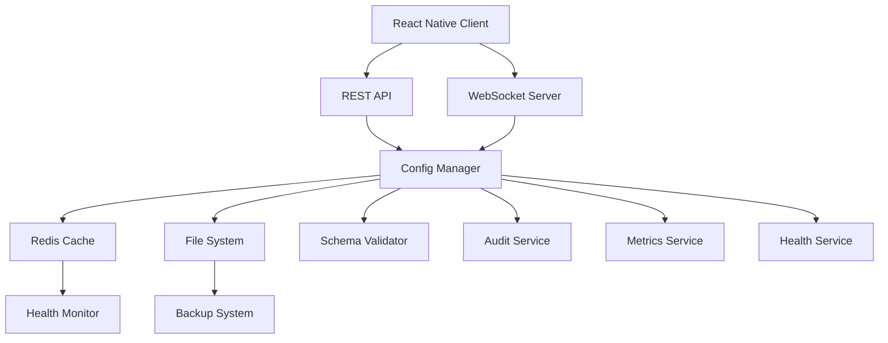

# 🚀 **Remote Configuration System - Comprehensive Guide**

## 📋 **Table of Contents**

1. [Overview](#overview)
2. [Architecture](#architecture)
3. [Features](#features)
4. [Setup & Installation](#setup--installation)
5. [API Documentation](#api-documentation)
6. [Frontend Integration](#frontend-integration)
7. [Configuration Management](#configuration-management)
8. [Real-World Usage Examples](#real-world-usage-examples)
9. [Security & Authentication](#security--authentication)
10. [Monitoring & Health Checks](#monitoring--health-checks)
11. [Best Practices](#best-practices)
12. [Troubleshooting](#troubleshooting)
13. [Advanced Features](#advanced-features)

---

## 🌟 **Overview**

The Remote Configuration System is a production-ready, enterprise-grade solution for dynamic application configuration management. It enables real-time updates to your application's UI, behavior, and content without requiring app store deployments.

### **Key Capabilities**

- **Backend-Driven UI**: Complete component trees defined in backend
- **Real-time Updates**: WebSocket-based instant configuration changes
- **Schema Validation**: JSON Schema validation for configuration integrity
- **Multi-tenancy**: Support for different environments and user segments
- **Fallback Mechanisms**: Multiple fallback strategies for resilience
- **Comprehensive Monitoring**: Health checks, metrics, and audit trails
- **Security**: Enterprise-grade authentication and authorization

---

## 🏗️ **Architecture**

### **System Components**



### **Core Modules**

1. **Configuration Manager** (`configManager.js`)

   - Central configuration orchestrator
   - File system and cache management
   - Schema validation and template processing
   - Circuit breaker implementation

2. **WebSocket Server** (`websocketServer.js`)

   - Real-time configuration broadcasts
   - Client connection management
   - Health monitoring and diagnostics

3. **REST API** (`routes.js`)

   - HTTP endpoints for configuration management
   - Authentication and authorization
   - Performance monitoring

4. **Services Layer**
   - **Audit Service**: Comprehensive logging and compliance
   - **Metrics Service**: Prometheus-compatible metrics
   - **Health Service**: System health monitoring and alerting

---

## 🎯 **Features**

### **Configuration Management**

- ✅ Dynamic configuration loading
- ✅ Template-based configuration generation
- ✅ Multi-environment support
- ✅ Version control and rollback
- ✅ Bulk updates and batch operations

### **Real-Time Updates**

- ✅ WebSocket-based live updates
- ✅ Client connection management
- ✅ Automatic reconnection handling
- ✅ Connection health monitoring

### **Security & Compliance**

- ✅ JWT and API key authentication
- ✅ Role-based access control
- ✅ Input sanitization and validation
- ✅ Comprehensive audit logging
- ✅ Rate limiting and DDoS protection

### **Monitoring & Observability**

- ✅ Prometheus metrics integration
- ✅ Health check endpoints
- ✅ Performance monitoring
- ✅ Error tracking and alerting

### **Resilience & Reliability**

- ✅ Circuit breaker pattern
- ✅ Retry mechanisms with exponential backoff
- ✅ Multiple fallback strategies
- ✅ Distributed caching with Redis
- ✅ Graceful degradation

---

## 🛠️ **Setup & Installation**

### **Prerequisites**

```bash
# Required dependencies
npm install express socket.io redis ajv ajv-formats
npm install winston morgan helmet cors compression
npm install express-validator express-rate-limit
npm install jsonwebtoken crypto
```

### **Environment Configuration**

Create `.env` file:

```env
# Server Configuration
NODE_ENV=production
PORT=5002

# Database
MONGODB_URI=mongodb://localhost:27017/labor2hire
REDIS_URL=redis://localhost:6379

# Security
JWT_SECRET=your-super-secret-jwt-key
CONFIG_API_KEYS=api-key-1,api-key-2,api-key-3

# Remote Config
ALLOWED_ORIGINS=http://localhost:3000,https://yourdomain.com
ADDITIONAL_SCREENS=CustomScreen1,CustomScreen2

# Monitoring
ENABLE_METRICS=true
ENABLE_HEALTH_CHECKS=true
ALERT_WEBHOOK_URL=https://hooks.slack.com/your-webhook
```

### **Directory Structure Setup**

```bash
src/modules/remote-config/
├── configManager.js          # Core configuration manager
├── websocketServer.js        # WebSocket server
├── routes.js                 # REST API routes
├── index.js                  # Module entry point
├── client-example.js         # Client implementation example
├── configs/                  # Configuration files
│   ├── Auth.json
│   ├── Home.json
│   └── ChooseLanguage.json
├── schemas/                  # JSON schemas
│   ├── Auth.schema.json
│   ├── Home.schema.json
│   └── Choose.language.schema.json
├── templates/                # Configuration templates
│   ├── Auth.template.json
│   ├── Home.template.json
│   └── ChooseLanguage.template.json
├── middleware/               # Authentication & security
│   └── configAuth.js
└── services/                 # Support services
    ├── auditService.js       # Audit logging
    ├── metricsService.js     # Metrics collection
    └── healthService.js      # Health monitoring
```

### **Module Integration**

In your main application file (`app.js`):

```javascript
import {
  configRoutes,
  initializeRemoteConfigModule,
} from "./modules/remote-config/index.js";

// Initialize the remote config module
async function setupApplication() {
  // ... other setup code

  // Setup remote configuration
  await setupRemoteConfig();

  // Register routes
  app.use("/api/config", configRoutes);
}

async function setupRemoteConfig() {
  try {
    const configModule = await initializeRemoteConfigModule(server);

    console.log("✅ Remote Configuration Module initialized");

    // Optional: Setup health check endpoint
    app.get("/health/config", async (req, res) => {
      const health = await configModule.configManager.getConfigStats();
      res.json({ success: true, data: health });
    });
  } catch (error) {
    console.error("❌ Remote config setup failed:", error);
    // App can continue without remote config
  }
}
```

---

## 📚 **API Documentation**

### **Authentication**

All configuration endpoints require authentication via:

1. **JWT Token** (for admin users):

   ```
   Authorization: Bearer <jwt-token>
   ```

2. **API Key** (for service-to-service):
   ```
   X-Config-API-Key: <api-key>
   ```

### **Core Endpoints**

#### **Health Check**

```http
GET /api/config/health
```

**Response:**

```json
{
  "success": true,
  "data": {
    "service": "remote-config",
    "status": "healthy",
    "version": "2.0.0",
    "configuration": {
      "totalScreens": 5,
      "loadedScreens": ["Auth", "Home", "ChooseLanguage"],
      "availableScreens": [
        "Auth",
        "Home",
        "ChooseLanguage",
        "Profile",
        "Settings"
      ]
    },
    "websocket": {
      "status": "active",
      "connectedClients": 12,
      "totalConnections": 45,
      "totalBroadcasts": 128
    }
  }
}
```

#### **Get All Configurations**

```http
GET /api/config/all
```

**Response:**

```json
{
  "success": true,
  "data": {
    "Auth": {
      /* Auth screen config */
    },
    "Home": {
      /* Home screen config */
    },
    "ChooseLanguage": {
      /* Language selection config */
    }
  },
  "metadata": {
    "totalScreens": 3,
    "lastUpdated": "2025-07-27T10:00:00.000Z"
  }
}
```

#### **Get Screen Configuration**

```http
GET /api/config/screen/:screenName
```

**Example:**

```http
GET /api/config/screen/Auth
```

**Response:**

```json
{
  "success": true,
  "data": {
    "screenType": "Auth",
    "metadata": {
      "screenTitle": "Authentication",
      "version": "1.0.0",
      "lastUpdated": "2025-07-27T09:52:29.415Z"
    },
    "components": [
      /* Component tree */
    ]
  }
}
```

#### **Update Configuration**

```http
POST /api/config/update
```

**Request Body:**

```json
{
  "screen": "Auth",
  "key": "primaryColor",
  "value": "#007bff"
}
```

**Response:**

```json
{
  "success": true,
  "message": "Configuration updated successfully",
  "data": {
    "screen": "Auth",
    "key": "primaryColor",
    "value": "#007bff",
    "version": "1.0.1",
    "updatedAt": "2025-07-27T10:15:00.000Z"
  }
}
```

#### **Bulk Update Configurations**

```http
POST /api/config/update-bulk
```

**Request Body:**

```json
{
  "screen": "Auth",
  "updates": {
    "primaryColor": "#007bff",
    "backgroundColor": "#ffffff",
    "screenTitle": "Welcome Back"
  }
}
```

#### **Reload Screen Configuration**

```http
POST /api/config/reload/:screenName
```

**Example:**

```http
POST /api/config/reload/Auth
```

### **Monitoring Endpoints**

#### **System Metrics**

```http
GET /api/config/metrics
Content-Type: text/plain
```

**Response (Prometheus format):**

```
# HELP config_requests_total Total number of configuration requests
# TYPE config_requests_total counter
config_requests_total 1234

# HELP config_active_connections Number of active WebSocket connections
# TYPE config_active_connections gauge
config_active_connections 12
```

#### **Metrics Summary**

```http
GET /api/config/metrics/summary
```

**Response:**

```json
{
  "success": true,
  "data": {
    "requests": {
      "total": 1234,
      "averageDuration": 0.245
    },
    "cache": {
      "hits": 890,
      "misses": 123,
      "hitRate": 0.878
    },
    "errors": {
      "total": 5
    }
  }
}
```

---

## 📱 **Frontend Integration**

### **React Native Client Setup**

1. **Install Dependencies**

```bash
npm install socket.io-client @react-native-async-storage/async-storage
```

2. **Create Configuration Store** (Redux/Zustand)

```typescript
// store/configSlice.ts
import { createSlice, PayloadAction } from "@reduxjs/toolkit";

interface ConfigState {
  configs: Record<string, any>;
  loading: boolean;
  connected: boolean;
  error: string | null;
}

const initialState: ConfigState = {
  configs: {},
  loading: false,
  connected: false,
  error: null,
};

const configSlice = createSlice({
  name: "config",
  initialState,
  reducers: {
    setConfigs: (state, action: PayloadAction<Record<string, any>>) => {
      state.configs = action.payload;
      state.loading = false;
      state.error = null;
    },
    updateScreenConfig: (
      state,
      action: PayloadAction<{ screen: string; config: any }>
    ) => {
      state.configs[action.payload.screen] = action.payload.config;
    },
    setConnectionStatus: (state, action: PayloadAction<boolean>) => {
      state.connected = action.payload;
    },
    setError: (state, action: PayloadAction<string>) => {
      state.error = action.payload;
      state.loading = false;
    },
    setLoading: (state, action: PayloadAction<boolean>) => {
      state.loading = action.payload;
    },
  },
});

export const {
  setConfigs,
  updateScreenConfig,
  setConnectionStatus,
  setError,
  setLoading,
} = configSlice.actions;

export default configSlice.reducer;

// Selectors
export const selectScreenConfig = (screenName: string) => (state: any) =>
  state.config.configs[screenName];
export const selectAllConfigs = (state: any) => state.config.configs;
export const selectConnectionStatus = (state: any) => state.config.connected;
```

3. **Initialize Configuration Client**

```typescript
// services/configService.ts
import { ConfigClient } from "./ConfigClient";
import { store } from "../store";
import {
  setConfigs,
  updateScreenConfig,
  setConnectionStatus,
  setError,
} from "../store/configSlice";

class ConfigService {
  private client: ConfigClient;

  constructor() {
    this.client = new ConfigClient({
      serverUrl: "http://your-backend-url:5002",
      onConfigUpdate: this.handleConfigUpdate.bind(this),
      onFullConfigSync: this.handleFullConfigSync.bind(this),
      onConnectionChange: this.handleConnectionChange.bind(this),
      onError: this.handleError.bind(this),
      autoReconnect: true,
    });
  }

  connect() {
    this.client.connect();
  }

  private handleConfigUpdate(screen: string, config: any) {
    store.dispatch(updateScreenConfig({ screen, config }));
  }

  private handleFullConfigSync(configs: Record<string, any>) {
    store.dispatch(setConfigs(configs));
  }

  private handleConnectionChange(connected: boolean) {
    store.dispatch(setConnectionStatus(connected));
  }

  private handleError(type: string, error: any) {
    console.error(`Config service error (${type}):`, error);
    store.dispatch(setError(`Configuration error: ${type}`));
  }

  getScreenConfig(screenName: string) {
    return this.client.getScreenConfig(screenName);
  }

  getAllConfigs() {
    return this.client.getAllConfigs();
  }

  isConnected() {
    return this.client.isClientConnected();
  }
}

export const configService = new ConfigService();
```

4. **Setup in App Component**

```tsx
// App.tsx
import React, { useEffect } from "react";
import { Provider } from "react-redux";
import { store } from "./store";
import { configService } from "./services/configService";
import { MainApp } from "./components/MainApp";

export default function App() {
  useEffect(() => {
    // Initialize configuration service
    configService.connect();

    return () => {
      // Cleanup on app unmount
      configService.disconnect?.();
    };
  }, []);

  return (
    <Provider store={store}>
      <MainApp />
    </Provider>
  );
}
```

### **Dynamic Component Rendering**

```tsx
// components/DynamicRenderer.tsx
import React from "react";
import {
  View,
  Text,
  TouchableOpacity,
  TextInput,
  Image,
  ScrollView,
  SafeAreaView,
  ActivityIndicator,
} from "react-native";

interface ComponentDefinition {
  type: string;
  props?: Record<string, any>;
  style?: Record<string, any>;
  children?: ComponentDefinition[];
  actions?: Record<string, any>;
  conditions?: {
    show?: any;
    hide?: any;
  };
}

interface DynamicRendererProps {
  componentTree: ComponentDefinition[];
  globalData?: Record<string, any>;
  onAction?: (action: any, context?: any) => void;
}

const COMPONENT_MAP = {
  View,
  Text,
  TouchableOpacity,
  TextInput,
  Image,
  ScrollView,
  SafeAreaView,
  ActivityIndicator,
};

export const DynamicRenderer: React.FC<DynamicRendererProps> = ({
  componentTree,
  globalData = {},
  onAction,
}) => {
  const renderComponent = (
    component: ComponentDefinition,
    index: number
  ): React.ReactNode => {
    // Check conditions
    if (!shouldRenderComponent(component, globalData)) {
      return null;
    }

    const Component =
      COMPONENT_MAP[component.type as keyof typeof COMPONENT_MAP];
    if (!Component) {
      console.warn(`Unknown component type: ${component.type}`);
      return null;
    }

    // Process props
    const processedProps = processProps(component.props, globalData);

    // Process actions
    const actions = processActions(component.actions, onAction);

    // Render children
    const children = component.children?.map((child, childIndex) =>
      renderComponent(child, childIndex)
    );

    return (
      <Component
        key={index}
        style={component.style}
        {...processedProps}
        {...actions}
      >
        {children}
      </Component>
    );
  };

  return (
    <>
      {componentTree.map((component, index) =>
        renderComponent(component, index)
      )}
    </>
  );
};

function shouldRenderComponent(
  component: ComponentDefinition,
  globalData: any
): boolean {
  const { conditions } = component;
  if (!conditions) return true;

  // Check show condition
  if (conditions.show && !evaluateCondition(conditions.show, globalData)) {
    return false;
  }

  // Check hide condition
  if (conditions.hide && evaluateCondition(conditions.hide, globalData)) {
    return false;
  }

  return true;
}

function evaluateCondition(condition: any, globalData: any): boolean {
  // Simple condition evaluation
  if (condition.operator === "equals") {
    const value = getNestedValue(globalData, condition.field);
    return value === condition.value;
  }

  // Add more operators as needed
  return true;
}

function getNestedValue(obj: any, path: string): any {
  return path.split(".").reduce((current, key) => current?.[key], obj);
}

function processProps(props: any, globalData: any): any {
  if (!props) return {};

  const processed = { ...props };

  // Process text interpolation
  if (processed.text && typeof processed.text === "string") {
    processed.text = processed.text.replace(/\{\{(.+?)\}\}/g, (match, path) => {
      return getNestedValue(globalData, path.trim()) || match;
    });
  }

  return processed;
}

function processActions(actions: any, onAction?: (action: any) => void): any {
  if (!actions || !onAction) return {};

  const processed: any = {};

  Object.entries(actions).forEach(([eventName, action]) => {
    processed[eventName] = () => onAction(action);
  });

  return processed;
}
```

---

## 🎛️ **Configuration Management**

### **Configuration Structure**

Every screen configuration follows this structure:

```json
{
  "screenType": "ScreenName",
  "metadata": {
    "screenTitle": "Human Readable Title",
    "description": "Screen description",
    "version": "1.0.0",
    "lastUpdated": "2025-07-27T10:00:00.000Z",
    "tags": ["auth", "login"],
    "environment": "production"
  },
  "globalStyles": {
    "backgroundColor": "#ffffff",
    "statusBar": {
      "barStyle": "dark-content",
      "backgroundColor": "#ffffff"
    }
  },
  "components": [
    {
      "type": "SafeAreaView",
      "style": { "flex": 1 },
      "children": [
        {
          "type": "Text",
          "props": { "text": "Hello {{user.name}}" },
          "style": { "fontSize": 18 },
          "conditions": {
            "show": {
              "operator": "equals",
              "field": "user.isLoggedIn",
              "value": true
            }
          }
        }
      ]
    }
  ],
  "loadingState": {
    "type": "SafeAreaView",
    "style": { "flex": 1, "justifyContent": "center" },
    "children": [{ "type": "ActivityIndicator", "props": { "size": "large" } }]
  },
  "errorState": {
    "type": "SafeAreaView",
    "style": { "flex": 1, "justifyContent": "center" },
    "children": [
      { "type": "Text", "props": { "text": "Error loading screen" } }
    ]
  },
  "_metadata": {
    "source": "file",
    "loadedAt": "2025-07-27T10:00:00.000Z",
    "templatePath": "/path/to/template.json"
  }
}
```

### **Schema Validation**

Each screen type has a corresponding JSON schema:

```json
{
  "$schema": "http://json-schema.org/draft-07/schema#",
  "title": "Auth Screen Configuration Schema",
  "type": "object",
  "properties": {
    "screenTitle": {
      "type": "string",
      "minLength": 1,
      "maxLength": 100
    },
    "backgroundColor": {
      "type": "string",
      "pattern": "^#([A-Fa-f0-9]{6}|[A-Fa-f0-9]{3})$"
    },
    "components": {
      "type": "array",
      "items": { "$ref": "#/definitions/component" }
    }
  },
  "required": ["screenTitle", "backgroundColor", "components"],
  "definitions": {
    "component": {
      "type": "object",
      "properties": {
        "type": { "type": "string" },
        "props": { "type": "object" },
        "style": { "type": "object" },
        "children": {
          "type": "array",
          "items": { "$ref": "#/definitions/component" }
        }
      },
      "required": ["type"]
    }
  }
}
```

### **Template System**

Templates enable dynamic configuration generation:

```json
{
  "screenType": "{{SCREEN_NAME}}",
  "metadata": {
    "screenTitle": "{{SCREEN_TITLE}}",
    "version": "{{VERSION}}",
    "lastUpdated": "{{TIMESTAMP}}",
    "environment": "{{ENVIRONMENT}}"
  },
  "globalStyles": {
    "backgroundColor": "{{PRIMARY_BACKGROUND_COLOR}}",
    "primaryColor": "{{PRIMARY_COLOR}}"
  },
  "components": [
    {
      "type": "SafeAreaView",
      "style": {
        "flex": 1,
        "backgroundColor": "{{SECONDARY_BACKGROUND_COLOR}}"
      },
      "children": [
        {
          "type": "Text",
          "props": {
            "text": "Welcome to {{APP_NAME}}"
          },
          "style": {
            "fontSize": "{{TITLE_FONT_SIZE}}",
            "color": "{{TEXT_COLOR}}"
          }
        }
      ]
    }
  ]
}
```

---

## 🌍 **Real-World Usage Examples**

### **Example 1: E-commerce Product Screen**

```json
{
  "screenType": "ProductDetail",
  "metadata": {
    "screenTitle": "Product Details",
    "version": "2.1.0"
  },
  "components": [
    {
      "type": "ScrollView",
      "style": { "flex": 1 },
      "children": [
        {
          "type": "Image",
          "props": {
            "source": { "uri": "{{product.imageUrl}}" }
          },
          "style": {
            "width": "100%",
            "height": 300,
            "resizeMode": "cover"
          }
        },
        {
          "type": "View",
          "style": { "padding": 16 },
          "children": [
            {
              "type": "Text",
              "props": { "text": "{{product.name}}" },
              "style": {
                "fontSize": 24,
                "fontWeight": "bold",
                "marginBottom": 8
              }
            },
            {
              "type": "Text",
              "props": { "text": "${{product.price}}" },
              "style": {
                "fontSize": 20,
                "color": "#007bff",
                "marginBottom": 16
              }
            },
            {
              "type": "TouchableOpacity",
              "style": {
                "backgroundColor": "#28a745",
                "padding": 16,
                "borderRadius": 8,
                "alignItems": "center"
              },
              "actions": {
                "onPress": {
                  "type": "addToCart",
                  "payload": {
                    "productId": "{{product.id}}",
                    "quantity": 1
                  }
                }
              },
              "children": [
                {
                  "type": "Text",
                  "props": { "text": "Add to Cart" },
                  "style": {
                    "color": "#ffffff",
                    "fontSize": 16,
                    "fontWeight": "bold"
                  }
                }
              ]
            }
          ]
        }
      ]
    }
  ]
}
```

### **Example 2: Dynamic Form Screen**

```json
{
  "screenType": "UserProfile",
  "metadata": {
    "screenTitle": "User Profile",
    "version": "1.5.0"
  },
  "components": [
    {
      "type": "SafeAreaView",
      "style": { "flex": 1, "padding": 16 },
      "children": [
        {
          "type": "Text",
          "props": { "text": "Edit Profile" },
          "style": {
            "fontSize": 24,
            "fontWeight": "bold",
            "marginBottom": 24
          }
        },
        {
          "type": "TextInput",
          "props": {
            "placeholder": "Full Name",
            "value": "{{user.fullName}}"
          },
          "style": {
            "borderWidth": 1,
            "borderColor": "#ccc",
            "borderRadius": 8,
            "padding": 12,
            "marginBottom": 16
          },
          "state": {
            "value": "user.fullName"
          }
        },
        {
          "type": "TextInput",
          "props": {
            "placeholder": "Email Address",
            "value": "{{user.email}}",
            "keyboardType": "email-address"
          },
          "style": {
            "borderWidth": 1,
            "borderColor": "#ccc",
            "borderRadius": 8,
            "padding": 12,
            "marginBottom": 16
          },
          "state": {
            "value": "user.email"
          }
        },
        {
          "type": "TouchableOpacity",
          "style": {
            "backgroundColor": "#007bff",
            "padding": 16,
            "borderRadius": 8,
            "alignItems": "center"
          },
          "actions": {
            "onPress": {
              "type": "updateProfile",
              "payload": {
                "fullName": "{{form.fullName}}",
                "email": "{{form.email}}"
              }
            }
          },
          "children": [
            {
              "type": "Text",
              "props": { "text": "Update Profile" },
              "style": {
                "color": "#ffffff",
                "fontSize": 16,
                "fontWeight": "bold"
              }
            }
          ]
        }
      ]
    }
  ]
}
```

### **Example 3: A/B Testing Configuration**

```json
{
  "screenType": "Home",
  "metadata": {
    "screenTitle": "Home Screen",
    "version": "3.0.0",
    "abTest": {
      "name": "homepage_layout_test",
      "variant": "B",
      "startDate": "2025-07-01",
      "endDate": "2025-08-01"
    }
  },
  "components": [
    {
      "type": "SafeAreaView",
      "style": { "flex": 1 },
      "children": [
        {
          "type": "Text",
          "props": { "text": "Welcome {{user.firstName}}!" },
          "style": {
            "fontSize": 28,
            "fontWeight": "bold",
            "textAlign": "center",
            "marginVertical": 20
          },
          "conditions": {
            "show": {
              "operator": "equals",
              "field": "abTest.variant",
              "value": "A"
            }
          }
        },
        {
          "type": "Text",
          "props": { "text": "Hey {{user.firstName}}, ready to work?" },
          "style": {
            "fontSize": 24,
            "fontWeight": "600",
            "textAlign": "center",
            "marginVertical": 20,
            "color": "#007bff"
          },
          "conditions": {
            "show": {
              "operator": "equals",
              "field": "abTest.variant",
              "value": "B"
            }
          }
        }
      ]
    }
  ]
}
```

### **Example 4: Feature Flag Implementation**

```json
{
  "screenType": "Settings",
  "metadata": {
    "screenTitle": "Settings",
    "version": "2.0.0",
    "featureFlags": {
      "darkMode": true,
      "socialLogin": false,
      "premiumFeatures": true
    }
  },
  "components": [
    {
      "type": "ScrollView",
      "style": { "flex": 1, "padding": 16 },
      "children": [
        {
          "type": "View",
          "style": {
            "flexDirection": "row",
            "justifyContent": "space-between",
            "alignItems": "center",
            "paddingVertical": 12
          },
          "conditions": {
            "show": {
              "operator": "equals",
              "field": "featureFlags.darkMode",
              "value": true
            }
          },
          "children": [
            {
              "type": "Text",
              "props": { "text": "Dark Mode" },
              "style": { "fontSize": 16 }
            },
            {
              "type": "Switch",
              "props": {
                "value": "{{user.preferences.darkMode}}"
              },
              "actions": {
                "onValueChange": {
                  "type": "toggleDarkMode"
                }
              }
            }
          ]
        },
        {
          "type": "TouchableOpacity",
          "style": {
            "backgroundColor": "#ff6b35",
            "padding": 16,
            "borderRadius": 8,
            "alignItems": "center",
            "marginTop": 20
          },
          "conditions": {
            "show": {
              "operator": "equals",
              "field": "featureFlags.premiumFeatures",
              "value": true
            }
          },
          "actions": {
            "onPress": {
              "type": "navigate",
              "payload": { "screen": "Premium" }
            }
          },
          "children": [
            {
              "type": "Text",
              "props": { "text": "Upgrade to Premium" },
              "style": {
                "color": "#ffffff",
                "fontSize": 16,
                "fontWeight": "bold"
              }
            }
          ]
        }
      ]
    }
  ]
}
```

---

## 🔐 **Security & Authentication**

### **Authentication Methods**

#### **1. JWT Token Authentication**

```javascript
// For admin users and authenticated API access
const token = jwt.sign(
  {
    id: user.id,
    role: "admin",
    phoneNumber: user.phoneNumber,
    permissions: ["read", "write", "admin"],
  },
  process.env.JWT_SECRET,
  { expiresIn: "24h" }
);
```

#### **2. API Key Authentication**

```javascript
// For service-to-service communication
const apiKey = crypto.randomBytes(32).toString("hex");

// Usage in requests
fetch("/api/config/all", {
  headers: {
    "X-Config-API-Key": apiKey,
    "Content-Type": "application/json",
  },
});
```

### **Authorization Levels**

| Role             | Permissions                                 | Description               |
| ---------------- | ------------------------------------------- | ------------------------- |
| `admin`          | `read`, `write`, `admin`, `reload`, `stats` | Full system access        |
| `config-manager` | `read`, `write`, `reload`                   | Configuration management  |
| `config-viewer`  | `read`, `stats`                             | Read-only access          |
| `api-service`    | `read`, `write`                             | Service-to-service access |

### **Security Middleware Stack**

```javascript
// Rate limiting
app.use(
  "/api/config",
  rateLimit({
    windowMs: 15 * 60 * 1000, // 15 minutes
    max: 100, // 100 requests per window
    message: "Too many requests from this IP",
  })
);

// Input sanitization
app.use(sanitizeConfigInput);

// Authentication
app.use(authenticateConfigAccess);

// Authorization (per endpoint)
app.use(authorizeConfigOperation(["read", "write"]));
```

### **Security Best Practices**

1. **Input Validation**

   - All inputs are sanitized and validated
   - XSS protection through content filtering
   - SQL injection prevention (although using NoSQL)

2. **Rate Limiting**

   - Different limits for different user types
   - API key-based rate limiting
   - DDoS protection mechanisms

3. **Audit Logging**

   - All configuration changes are logged
   - User actions are tracked with context
   - Security events trigger alerts

4. **Secure Communication**
   - HTTPS enforcement in production
   - WebSocket connections over WSS
   - Token rotation and expiration

---

## 📊 **Monitoring & Health Checks**

### **Health Check System**

The system includes comprehensive health monitoring:

```javascript
// Health check categories
const healthChecks = {
  memory: "Memory Usage",
  response_time: "Response Time",
  error_rate: "Error Rate",
  cache_hit_rate: "Cache Hit Rate",
  websocket: "WebSocket Health",
  config_consistency: "Configuration Consistency",
  redis: "Redis Connectivity",
};
```

### **Prometheus Metrics**

Available metrics include:

| Metric                            | Type      | Description                   |
| --------------------------------- | --------- | ----------------------------- |
| `config_requests_total`           | Counter   | Total configuration requests  |
| `config_updates_total`            | Counter   | Total configuration updates   |
| `config_errors_total`             | Counter   | Total configuration errors    |
| `config_active_connections`       | Gauge     | Active WebSocket connections  |
| `config_request_duration_seconds` | Histogram | Request duration distribution |
| `config_cache_hits_total`         | Counter   | Cache hit count               |
| `config_memory_usage_bytes`       | Gauge     | Memory usage in bytes         |

### **Alerting System**

```javascript
// Alert thresholds
const alertThresholds = {
  memory: { warning: 0.7, critical: 0.9 },
  response_time: { warning: 2, critical: 5 },
  error_rate: { warning: 0.05, critical: 0.15 },
  cache_hit_rate: { warning: 0.8, critical: 0.6 },
};
```

### **Dashboard Integration**

Example Grafana dashboard queries:

```promql
# Request rate
rate(config_requests_total[5m])

# Error rate
rate(config_errors_total[5m]) / rate(config_requests_total[5m])

# Response time percentiles
histogram_quantile(0.95, rate(config_request_duration_seconds_bucket[5m]))

# Active connections
config_active_connections

# Cache hit rate
rate(config_cache_hits_total[5m]) / (rate(config_cache_hits_total[5m]) + rate(config_cache_misses_total[5m]))
```

---

## 🏆 **Best Practices**

### **Configuration Design**

1. **Keep Components Atomic**

   ```json
   // ✅ Good - Atomic component
   {
     "type": "Button",
     "props": { "text": "Submit" },
     "actions": { "onPress": { "type": "submitForm" } }
   }

   // ❌ Bad - Too much responsibility
   {
     "type": "ComplexFormWithValidationAndSubmission"
   }
   ```

2. **Use Semantic Component Names**

   ```json
   // ✅ Good
   { "type": "SafeAreaView" }
   { "type": "TouchableOpacity" }

   // ❌ Bad
   { "type": "Container" }
   { "type": "Clickable" }
   ```

3. **Design for Accessibility**
   ```json
   {
     "type": "TouchableOpacity",
     "props": {
       "accessibilityLabel": "Submit form",
       "accessibilityHint": "Submits the user registration form"
     }
   }
   ```

### **Performance Optimization**

1. **Minimize Component Tree Depth**

   ```json
   // ✅ Good - Flat structure
   {
     "type": "View",
     "children": [
       { "type": "Text", "props": { "text": "Title" } },
       { "type": "Text", "props": { "text": "Subtitle" } }
     ]
   }

   // ❌ Bad - Unnecessary nesting
   {
     "type": "View",
     "children": [
       {
         "type": "View",
         "children": [
           {
             "type": "View",
             "children": [
               { "type": "Text", "props": { "text": "Title" } }
             ]
           }
         ]
       }
     ]
   }
   ```

2. **Use Conditional Rendering Wisely**

   ```json
   // ✅ Good - Simple condition
   {
     "type": "Text",
     "conditions": {
       "show": {
         "operator": "equals",
         "field": "user.isLoggedIn",
         "value": true
       }
     }
   }

   // ❌ Bad - Complex nested conditions
   {
     "conditions": {
       "show": {
         "operator": "and",
         "conditions": [
           { "operator": "or", "conditions": [...] },
           { "operator": "not", "conditions": [...] }
         ]
       }
     }
   }
   ```

3. **Implement Proper Loading States**
   ```json
   {
     "loadingState": {
       "type": "SafeAreaView",
       "style": { "flex": 1, "justifyContent": "center" },
       "children": [
         { "type": "ActivityIndicator", "props": { "size": "large" } },
         { "type": "Text", "props": { "text": "Loading..." } }
       ]
     }
   }
   ```

### **Error Handling**

1. **Always Provide Error States**

   ```json
   {
     "errorState": {
       "type": "SafeAreaView",
       "style": { "flex": 1, "justifyContent": "center", "padding": 20 },
       "children": [
         {
           "type": "Text",
           "props": { "text": "Something went wrong" },
           "style": { "textAlign": "center", "marginBottom": 16 }
         },
         {
           "type": "TouchableOpacity",
           "actions": { "onPress": { "type": "retry" } },
           "children": [{ "type": "Text", "props": { "text": "Retry" } }]
         }
       ]
     }
   }
   ```

2. **Graceful Degradation**
   ```javascript
   // Client-side fallback
   const getScreenConfig = (screenName) => {
     const config = configClient.getScreenConfig(screenName);

     if (!config) {
       // Return minimal fallback configuration
       return {
         components: [
           {
             type: "SafeAreaView",
             style: { flex: 1, justifyContent: "center" },
             children: [
               {
                 type: "Text",
                 props: { text: `${screenName} screen loading...` },
               },
             ],
           },
         ],
       };
     }

     return config;
   };
   ```

### **Version Management**

1. **Semantic Versioning**

   ```json
   {
     "metadata": {
       "version": "2.1.3", // MAJOR.MINOR.PATCH
       "breaking": false,
       "changeLog": [
         "2.1.3: Fixed button alignment issue",
         "2.1.2: Added new color scheme",
         "2.1.0: Added social login buttons"
       ]
     }
   }
   ```

2. **Backward Compatibility**
   ```javascript
   // Migration strategy
   const migrateConfig = (config, fromVersion, toVersion) => {
     if (fromVersion < "2.0.0" && toVersion >= "2.0.0") {
       // Handle breaking changes
       config.components = migrateComponentsV2(config.components);
     }

     return config;
   };
   ```

---

## 🔧 **Troubleshooting**

### **Common Issues & Solutions**

#### **1. WebSocket Connection Issues**

**Problem**: Client cannot connect to WebSocket server

**Debugging Steps**:

```javascript
// Enable debug logging
const client = new ConfigClient({
  serverUrl: "http://localhost:5002",
  debug: true,
  onError: (type, error) => {
    console.error(`WebSocket error [${type}]:`, error);
  },
});

// Check connection status
if (!client.isClientConnected()) {
  console.log("Connection status:", {
    serverUrl: client.options.serverUrl,
    lastError: client.lastError,
    reconnectAttempts: client.reconnectAttempts,
  });
}
```

**Solutions**:

- Verify server URL and port
- Check firewall and network connectivity
- Ensure WebSocket path is correct (`/config-socket`)
- Verify CORS settings for client domain

#### **2. Configuration Not Loading**

**Problem**: Screen configurations return empty or null

**Debugging Steps**:

```javascript
// Check backend logs
GET /api/config/health

// Verify specific screen
GET /api/config/screen/Auth

// Check Redis cache
const cacheKey = 'config:Auth';
redis.get(cacheKey);

// Verify file system
ls -la src/modules/remote-config/configs/
```

**Solutions**:

- Ensure configuration files exist in `configs/` directory
- Verify Redis connection
- Check file permissions
- Validate JSON syntax in configuration files

#### **3. Schema Validation Errors**

**Problem**: Configuration updates fail with validation errors

**Example Error**:

```json
{
  "success": false,
  "message": "Configuration validation failed",
  "errors": [
    {
      "instancePath": "/backgroundColor",
      "schemaPath": "#/properties/backgroundColor/pattern",
      "keyword": "pattern",
      "params": { "pattern": "^#([A-Fa-f0-9]{6}|[A-Fa-f0-9]{3})$" },
      "message": "must match pattern \"^#([A-Fa-f0-9]{6}|[A-Fa-f0-9]{3})$\""
    }
  ]
}
```

**Solution**:

```javascript
// Fix the color value
{
  "backgroundColor": "#ffffff", // ✅ Valid hex color
  // not "white" or "invalid-color"
}
```

#### **4. Performance Issues**

**Problem**: Slow configuration loading or updates

**Debugging**:

```javascript
// Check metrics
GET /api/config/metrics/summary

// Monitor specific endpoints
curl -w "Time: %{time_total}s\n" http://localhost:5002/api/config/all
```

**Solutions**:

- Enable Redis caching
- Optimize component tree depth
- Implement proper indexing
- Use connection pooling

### **Diagnostic Commands**

```bash
# Check service health
curl http://localhost:5002/api/config/health

# Test WebSocket connection
wscat -c ws://localhost:5002/config-socket

# Verify Redis connection
redis-cli ping

# Check file permissions
ls -la src/modules/remote-config/configs/

# Monitor logs
tail -f logs/application-$(date +%Y-%m-%d).log

# Test configuration update
curl -X POST http://localhost:5002/api/config/update \
  -H "Content-Type: application/json" \
  -H "Authorization: Bearer YOUR_JWT_TOKEN" \
  -d '{"screen": "Auth", "key": "backgroundColor", "value": "#ffffff"}'
```

### **Performance Monitoring**

```javascript
// Custom health check endpoint
app.get("/api/config/debug", async (req, res) => {
  const health = await configHealthService.getHealthStatus();
  const metrics = configMetricsService.getMetricsSummary();
  const stats = await configManager.getConfigStats();

  res.json({
    health,
    metrics,
    stats,
    redis: {
      connected: cache.isConnected(),
      memory: await cache.memory(),
    },
    system: {
      uptime: process.uptime(),
      memory: process.memoryUsage(),
      cpu: process.cpuUsage(),
    },
  });
});
```

---

## 🚀 **Advanced Features**

### **Multi-tenancy Support**

```javascript
// Tenant-specific configurations
const getTenantConfig = async (tenantId, screenName) => {
  // Try tenant-specific config first
  const tenantConfigPath = `configs/tenants/${tenantId}/${screenName}.json`;

  try {
    const tenantConfig = await fs.readFile(tenantConfigPath, "utf8");
    return JSON.parse(tenantConfig);
  } catch (error) {
    // Fallback to default config
    return await getDefaultConfig(screenName);
  }
};
```

### **Configuration Inheritance**

```json
{
  "extends": "BaseAuthScreen",
  "overrides": {
    "primaryColor": "#custom-color",
    "components": [
      {
        "type": "Text",
        "props": { "text": "Custom welcome message" }
      }
    ]
  }
}
```

### **Dynamic Component Registration**

```javascript
// Register custom components
const customComponents = {
  CustomCard: require('./components/CustomCard'),
  AdvancedForm: require('./components/AdvancedForm'),
  MapView: require('./components/MapView')
};

// Use in configuration
{
  "type": "CustomCard",
  "props": {
    "title": "Special Offer",
    "description": "Limited time deal"
  }
}
```

### **Real-time A/B Testing**

```javascript
// A/B test configuration
const abTestConfig = {
  testId: "homepage_layout_v2",
  variants: {
    A: {
      /* Original config */
    },
    B: {
      /* New config */
    },
  },
  distribution: { A: 50, B: 50 },
  targetAudience: {
    country: ["US", "CA"],
    userType: "premium",
  },
};

// Client-side variant assignment
const getVariantConfig = (userId, testConfig) => {
  const hash = hashUserId(userId);
  const variant = hash % 100 < 50 ? "A" : "B";
  return testConfig.variants[variant];
};
```

### **Configuration Analytics**

```javascript
// Track configuration usage
const trackConfigUsage = (screenName, componentType, action) => {
  analytics.track("config_interaction", {
    screen: screenName,
    component: componentType,
    action: action,
    timestamp: Date.now(),
    userId: getCurrentUserId(),
    sessionId: getSessionId(),
  });
};
```

---

## 📈 **Scaling Considerations**

### **Horizontal Scaling**

1. **Load Balancing**

   ```nginx
   upstream config_backend {
     server backend1:5002;
     server backend2:5002;
     server backend3:5002;
   }

   server {
     location /api/config {
       proxy_pass http://config_backend;
     }
   }
   ```

2. **Redis Clustering**

   ```javascript
   const Redis = require("ioredis");

   const cluster = new Redis.Cluster([
     { host: "redis-node-1", port: 6379 },
     { host: "redis-node-2", port: 6379 },
     { host: "redis-node-3", port: 6379 },
   ]);
   ```

### **CDN Integration**

```javascript
// Serve static configurations via CDN
const getCDNConfigUrl = (screenName, version) => {
  return `https://cdn.yourapp.com/configs/${version}/${screenName}.json`;
};

// Fallback to API if CDN fails
const getConfigWithFallback = async (screenName) => {
  try {
    const response = await fetch(getCDNConfigUrl(screenName, "latest"));
    return await response.json();
  } catch (error) {
    // Fallback to WebSocket/API
    return await configClient.getScreenConfig(screenName);
  }
};
```

### **Database Persistence**

```javascript
// Store configurations in MongoDB for persistence
const ConfigSchema = new mongoose.Schema({
  screenName: { type: String, required: true, unique: true },
  config: { type: Object, required: true },
  version: { type: String, required: true },
  environment: { type: String, default: "production" },
  createdAt: { type: Date, default: Date.now },
  updatedAt: { type: Date, default: Date.now },
});

const Config = mongoose.model("Config", ConfigSchema);
```

---

## 🎯 **Production Deployment**

### **Environment Configuration**

```yaml
# docker-compose.yml
version: "3.8"
services:
  config-service:
    build: .
    environment:
      - NODE_ENV=production
      - PORT=5002
      - REDIS_URL=redis://redis:6379
      - MONGODB_URI=mongodb://mongo:27017/labor2hire
    depends_on:
      - redis
      - mongo

  redis:
    image: redis:7-alpine
    command: redis-server --appendonly yes
    volumes:
      - redis-data:/data

  mongo:
    image: mongo:6
    volumes:
      - mongo-data:/data/db

volumes:
  redis-data:
  mongo-data:
```

### **Health Check Configuration**

```yaml
# kubernetes health checks
livenessProbe:
  httpGet:
    path: /api/config/health
    port: 5002
  initialDelaySeconds: 30
  periodSeconds: 10

readinessProbe:
  httpGet:
    path: /api/config/health
    port: 5002
  initialDelaySeconds: 5
  periodSeconds: 5
```

### **Monitoring Setup**

```yaml
# prometheus.yml
scrape_configs:
  - job_name: "config-service"
    static_configs:
      - targets: ["config-service:5002"]
    metrics_path: "/api/config/metrics"
    scrape_interval: 15s
```

---

This comprehensive guide provides everything your team needs to understand, implement, and maintain the remote configuration system. The system is production-ready with proper error handling, security, monitoring, and real-world usage patterns.
