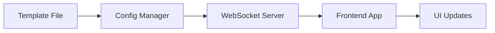

# 🚀 Quick Start Guide

Get your remote configuration system up and running in 5 minutes!

## ⚡ Prerequisites

- Node.js 18+ installed
- Redis server running
- Basic knowledge of JSON and React Native

## 🏁 1. Start the System

### Backend Server

```bash
cd labor2Hire-Backend
npm run dev
```

### Frontend App

```bash
cd Labor2Hire
npm start
```

## 📱 2. Your First Configuration Change

Let's change a button text to see the system in action!

### Step 1: Open Configuration File

Navigate to: `remote-config/templates/Auth.template.json`

### Step 2: Find the Login Button

```json
{
  "type": "Button",
  "props": {
    "text": "Login"
  }
}
```

### Step 3: Change the Text

```json
{
  "type": "Button",
  "props": {
    "text": "Sign In Now"
  }
}
```

### Step 4: See Live Update

The change appears instantly in your app! 🎉

## 🔄 3. How It Works



1. **Template** → Configuration template with variables
2. **Config Manager** → Processes and validates configuration
3. **WebSocket Server** → Broadcasts changes in real-time
4. **Frontend App** → Receives and renders dynamic UI
5. **UI Updates** → Instant visual changes

## 🎯 4. Key Concepts

### Components

Everything is a component:

```json
{
  "type": "Button",
  "props": { "text": "Click Me" },
  "style": { "backgroundColor": "#007bff" }
}
```

### Actions

Components can trigger actions:

```json
{
  "type": "Button",
  "props": { "text": "Navigate" },
  "actions": {
    "onPress": {
      "type": "navigate",
      "target": "Home"
    }
  }
}
```

### Screens

Screens are collections of components:

```json
{
  "screenType": "Auth",
  "components": [
    { "type": "Text", "props": { "text": "Welcome" } },
    { "type": "Button", "props": { "text": "Login" } }
  ]
}
```

## 📁 5. File Structure

```
remote-config/
├── templates/          # Configuration templates
│   ├── Auth.template.json
│   ├── Home.template.json
│   └── ...
├── schemas/           # Validation schemas
│   ├── Auth.schema.json
│   └── ...
├── configs/           # Generated configurations
└── doc/              # Documentation (you are here!)
```

## 🛠️ 6. Essential Commands

### API Testing

```bash
# Get all configurations
curl http://localhost:5001/api/config/all

# Get specific screen config
curl http://localhost:5001/api/config/screen/Auth

# Update configuration
curl -X POST http://localhost:5001/api/config/update \
  -H "Content-Type: application/json" \
  -d '{"screen":"Auth","key":"title","value":"New Title"}'
```

### File Management

```bash
# Watch for file changes
npm run watch

# Validate all schemas
npm run validate

# Test configuration
npm run test:config
```

## 🎨 7. Quick Customizations

### Change a Color

```json
{
  "style": {
    "backgroundColor": "#ff6b6b", // Red
    "color": "#ffffff" // White text
  }
}
```

### Add a New Button

```json
{
  "type": "Button",
  "props": {
    "text": "My New Button"
  },
  "actions": {
    "onPress": {
      "type": "alert",
      "message": "Button clicked!"
    }
  },
  "style": {
    "backgroundColor": "#28a745",
    "color": "#ffffff",
    "padding": 15,
    "borderRadius": 8
  }
}
```

### Modify Screen Layout

```json
{
  "type": "View",
  "style": {
    "flexDirection": "column", // Vertical layout
    "justifyContent": "center", // Center vertically
    "alignItems": "center", // Center horizontally
    "padding": 20
  },
  "children": [
    { "type": "Text", "props": { "text": "Title" } },
    { "type": "Button", "props": { "text": "Action" } }
  ]
}
```

## 🚀 8. Next Steps

Now that you have the basics:

1. **🎯 Learn Components** → [Component System Guide](./04-component-system.md)
2. **📝 Create Your First Screen** → [Creating Screens Guide](./07-creating-screens.md)
3. **🎨 Master Styling** → [Styling Guide](./09-styling-theming.md)
4. **⚡ Add Interactions** → [Actions Guide](./10-actions-navigation.md)

## 🆘 Need Help?

- **🐛 Something broken?** → [Troubleshooting](./16-troubleshooting.md)
- **❓ How do I...?** → [Common Workflows](./15-common-workflows.md)
- **📚 Want to learn more?** → [System Overview](./02-system-overview.md)

---

**You're ready to build dynamic UIs! 🎉**

_Next: [System Overview](./02-system-overview.md)_
