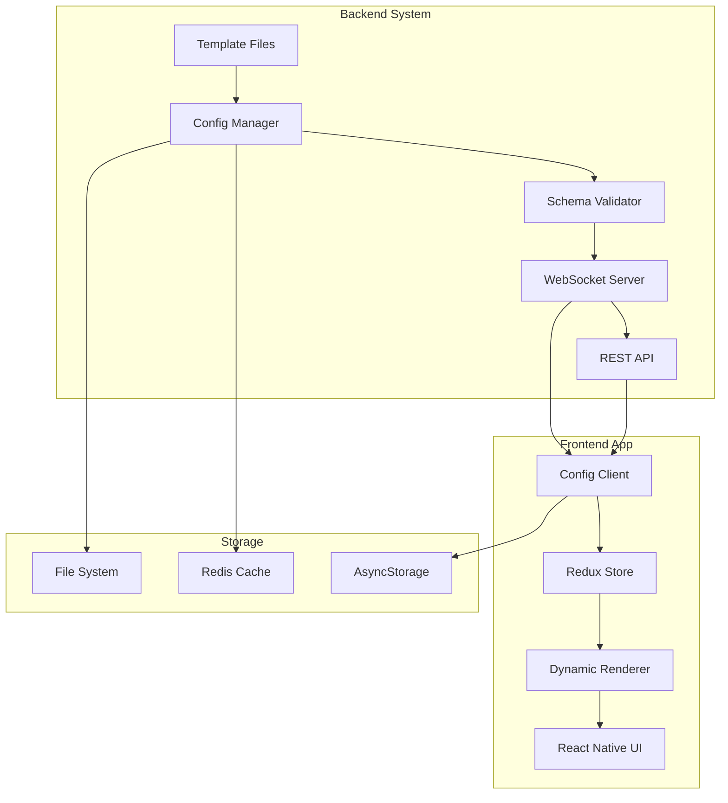
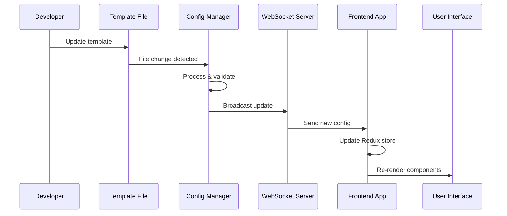
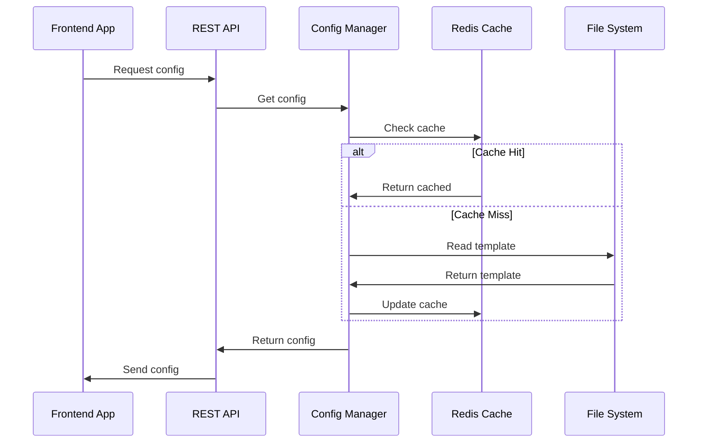
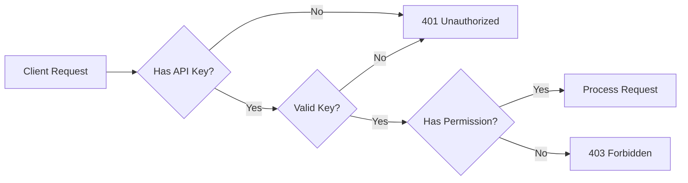

# 🏗️ System Overview

Understanding the Remote Configuration System architecture and core concepts.

## 🎯 What is Remote Configuration?

Remote Configuration enables **Backend-Driven UI** - the ability to control your app's user interface, behavior, and content from the backend without requiring app store deployments.

### Key Benefits

- ✅ **Instant Updates**: Change UI without app store approval
- ✅ **A/B Testing**: Test different UI variations
- ✅ **Feature Flags**: Enable/disable features remotely
- ✅ **Personalization**: Customize UI per user/segment
- ✅ **Emergency Fixes**: Fix critical issues immediately

## 🏛️ System Architecture



## 🔧 Core Components

### 1. **Configuration Manager** (`configManager.js`)

- **Purpose**: Central configuration management
- **Features**:
  - File watching for auto-reload
  - Template processing with variables
  - Configuration caching
  - Version management

```javascript
// Example usage
const config = await configManager.getScreenConfig("Auth");
await configManager.updateConfig("Auth", "button.text", "New Text");
```

### 2. **WebSocket Server** (`websocketServer.js`)

- **Purpose**: Real-time configuration broadcasting
- **Features**:
  - Live configuration updates
  - Client connection management
  - Event handling
  - Connection statistics

```javascript
// Broadcasts to all connected clients
configWebSocketServer.broadcastConfigUpdate("Auth", updatedConfig);
```

### 3. **Schema Validator** (`schemas/*.json`)

- **Purpose**: Configuration validation
- **Features**:
  - JSON Schema validation
  - Type checking
  - Required field validation
  - Custom validation rules

```json
{
  "$schema": "http://json-schema.org/draft-07/schema#",
  "type": "object",
  "required": ["screenType", "components"],
  "properties": {
    "screenType": { "type": "string" },
    "components": { "type": "array" }
  }
}
```

### 4. **Template Engine** (`templates/*.json`)

- **Purpose**: Dynamic configuration generation
- **Features**:
  - Variable substitution
  - Environment-specific configs
  - Conditional logic
  - Default values

```json
{
  "title": "Welcome {{USER_NAME}}",
  "apiUrl": "{{API_BASE_URL}}/auth",
  "version": "{{VERSION}}"
}
```

### 5. **Frontend Client** (`ConfigClient.ts`)

- **Purpose**: Frontend configuration consumer
- **Features**:
  - WebSocket connection management
  - Configuration caching
  - Offline support
  - Automatic reconnection

```typescript
const client = new ConfigClient({
  serverUrl: "ws://localhost:5001",
  autoReconnect: true,
});
```

## 📊 Data Flow

### Configuration Update Flow



### Configuration Request Flow



## 🎭 Component System

### Component Hierarchy

```
Screen (Root)
├── SafeAreaView
│   ├── ScrollView
│   │   ├── View (Container)
│   │   │   ├── Text (Title)
│   │   │   ├── TextInput (Email)
│   │   │   ├── TextInput (Password)
│   │   │   └── Button (Login)
│   │   └── View (Footer)
│   │       └── Button (Register)
│   └── StatusBar
```

### Component Definition

```json
{
  "type": "Button",
  "props": {
    "text": "Login",
    "disabled": false
  },
  "style": {
    "backgroundColor": "#007bff",
    "color": "#ffffff",
    "padding": 15,
    "borderRadius": 8
  },
  "actions": {
    "onPress": {
      "type": "navigate",
      "target": "Home"
    }
  },
  "conditions": {
    "if": {
      "operator": "equals",
      "field": "user.isLoggedIn",
      "value": false
    }
  }
}
```

## 🔄 State Management

### Frontend State (Redux)

```typescript
interface RemoteConfigState {
  configs: Record<string, any>;
  loading: boolean;
  error: string | null;
  connected: boolean;
  connectionStatus: "connected" | "disconnected" | "reconnecting";
  lastUpdated: string | null;
}
```

### Backend State (Memory + Redis)

```javascript
{
  configs: Map<string, ConfigObject>,
  connectedClients: Map<string, ClientInfo>,
  configStats: ConfigStatistics,
  fileWatchers: Map<string, FileWatcher>
}
```

## 🛡️ Security & Validation

### Multi-Layer Validation

1. **Schema Validation**: JSON Schema compliance
2. **Type Checking**: Component prop validation
3. **Permission Checking**: User authorization
4. **Sanitization**: Input cleaning
5. **Rate Limiting**: Request throttling

### Authentication Flow



## 📈 Performance Features

### Caching Strategy

- **Level 1**: In-memory cache (fastest)
- **Level 2**: Redis cache (shared)
- **Level 3**: File system (persistent)
- **Level 4**: Frontend cache (offline)

### Optimization Techniques

- ⚡ **Lazy Loading**: Load configs on demand
- 🗜️ **Compression**: Gzip WebSocket messages
- 📦 **Bundling**: Batch configuration updates
- 🎯 **Targeting**: Send only relevant configs
- 🔄 **Debouncing**: Prevent rapid updates

## 🔌 Integration Points

### Backend Integration

```javascript
// Express.js integration
app.use("/api/config", configRoutes);

// WebSocket integration
configWebSocketServer.initialize(server);

// Middleware integration
app.use(authenticateConfigAccess);
```

### Frontend Integration

```typescript
// Redux integration
const store = configureStore({
  reducer: {
    remoteConfig: remoteConfigReducer
  }
});

// Component integration
const DynamicScreen = () => {
  const config = useSelector(selectScreenConfig('Auth'));
  return <DynamicRenderer config={config} />;
};
```

## 🌍 Environment Support

### Multi-Environment Setup

```json
{
  "development": {
    "apiUrl": "http://localhost:5001",
    "debug": true
  },
  "staging": {
    "apiUrl": "https://staging-api.example.com",
    "debug": false
  },
  "production": {
    "apiUrl": "https://api.example.com",
    "debug": false
  }
}
```

## 📊 Monitoring & Analytics

### Health Checks

- ✅ Configuration file integrity
- ✅ WebSocket connection status
- ✅ Redis connectivity
- ✅ Memory usage
- ✅ Response times

### Metrics Collection

- 📈 Configuration requests
- 📈 Update frequency
- 📈 Client connections
- 📈 Error rates
- 📈 Performance metrics

## 🚀 Scalability Features

### Horizontal Scaling

- **Load Balancing**: Multiple server instances
- **Session Stickiness**: WebSocket connection persistence
- **Redis Clustering**: Distributed caching
- **CDN Integration**: Static asset delivery

### Performance Optimization

- **Connection Pooling**: Efficient resource usage
- **Batch Processing**: Bulk operations
- **Incremental Updates**: Delta synchronization
- **Background Processing**: Async operations

---

## 🎯 Key Takeaways

1. **📱 Everything is a Component**: UI is built from component trees
2. **⚡ Real-time Updates**: Changes propagate instantly via WebSocket
3. **🔒 Security First**: Multi-layer validation and authentication
4. **📊 Performance Optimized**: Multiple caching layers and optimizations
5. **🛠️ Developer Friendly**: Clear separation of concerns and tools

---

_Next: [Installation & Setup](./03-installation-setup.md)_
