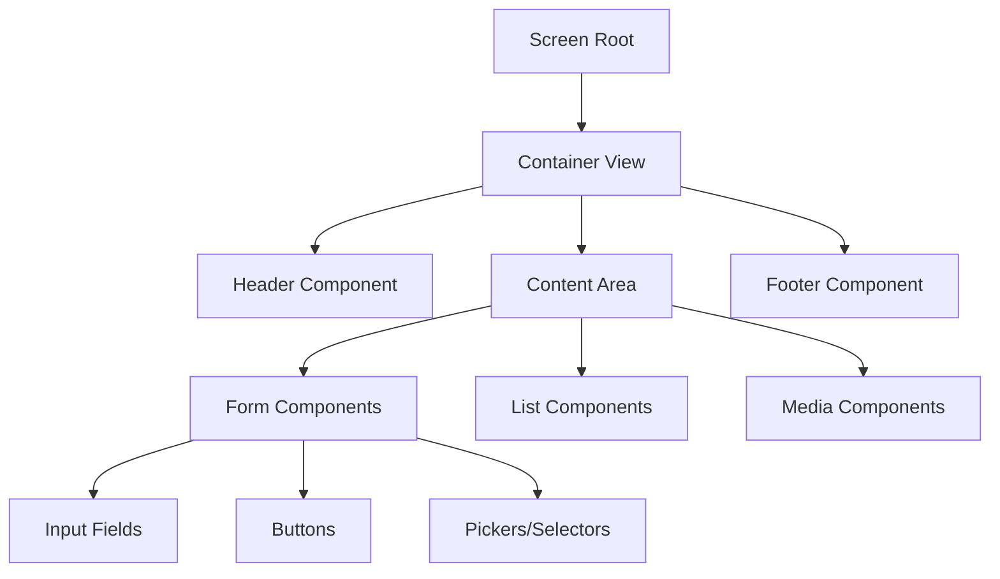

# 🧩 Component System - Understanding Dynamic Components

Complete guide to the dynamic component system that powers backend-driven UI.

## 🎯 What is the Component System?

The Component System is the heart of our backend-driven UI architecture. It allows you to define complete React Native component trees in JSON configuration files on the backend, which are then dynamically rendered in the frontend application.

### Key Benefits

- ✅ **Dynamic UI Creation**: Build entire screens without app updates
- ✅ **Real-time Changes**: Modify UI instantly across all devices
- ✅ **Component Reusability**: Share components across multiple screens
- ✅ **Type Safety**: JSON Schema validation ensures component integrity
- ✅ **Performance Optimized**: Efficient rendering and caching

## 🏗️ Component Architecture

### Component Structure

Every component follows a consistent structure:

```json
{
  "type": "ComponentType", // Required: Component to render
  "props": {}, // Optional: Component properties
  "style": {}, // Optional: Styling object
  "children": [], // Optional: Child components
  "actions": {}, // Optional: User interactions
  "conditions": {}, // Optional: Conditional rendering
  "state": {}, // Optional: State binding
  "metadata": {} // Optional: Component metadata
}
```

### Component Hierarchy



## 📱 Supported Components

### Layout Components

#### SafeAreaView

Provides safe area boundaries for iOS devices.

```json
{
  "type": "SafeAreaView",
  "style": {
    "flex": 1,
    "backgroundColor": "#ffffff"
  },
  "children": [
    // Child components
  ]
}
```

#### View

Basic container component for layout.

```json
{
  "type": "View",
  "style": {
    "flex": 1,
    "flexDirection": "column",
    "justifyContent": "center",
    "alignItems": "center",
    "padding": 20
  },
  "children": [
    // Child components
  ]
}
```

#### ScrollView

Scrollable container for long content.

```json
{
  "type": "ScrollView",
  "props": {
    "showsVerticalScrollIndicator": false,
    "contentContainerStyle": {
      "paddingBottom": 20
    }
  },
  "style": {
    "flex": 1
  },
  "children": [
    // Scrollable content
  ]
}
```

#### KeyboardAvoidingView

Handles keyboard appearance on mobile devices.

```json
{
  "type": "KeyboardAvoidingView",
  "props": {
    "behavior": "padding",
    "enabled": true
  },
  "style": {
    "flex": 1
  },
  "children": [
    // Components that need keyboard handling
  ]
}
```

### Text Components

#### Text

Basic text display component.

```json
{
  "type": "Text",
  "props": {
    "text": "Welcome to Labor2Hire",
    "numberOfLines": 2,
    "ellipsizeMode": "tail"
  },
  "style": {
    "fontSize": 24,
    "fontWeight": "bold",
    "color": "#333333",
    "textAlign": "center",
    "marginBottom": 16
  }
}
```

#### Dynamic Text with Variables

```json
{
  "type": "Text",
  "props": {
    "text": "Hello {{user.name}}, you have {{notifications.count}} new messages"
  },
  "style": {
    "fontSize": 16,
    "color": "#666666"
  },
  "state": {
    "user.name": "John Doe",
    "notifications.count": 5
  }
}
```

### Input Components

#### TextInput

Text input field for user data entry.

```json
{
  "type": "TextInput",
  "props": {
    "placeholder": "Enter your email",
    "placeholderTextColor": "#999999",
    "keyboardType": "email-address",
    "autoCapitalize": "none",
    "autoCorrect": false,
    "secureTextEntry": false
  },
  "style": {
    "borderWidth": 1,
    "borderColor": "#ddd",
    "borderRadius": 8,
    "padding": 12,
    "fontSize": 16,
    "marginBottom": 16
  },
  "state": {
    "value": "user.email"
  },
  "actions": {
    "onChangeText": {
      "type": "updateState",
      "target": "user.email"
    }
  }
}
```

#### Password Input

```json
{
  "type": "TextInput",
  "props": {
    "placeholder": "Enter your password",
    "secureTextEntry": true,
    "autoCapitalize": "none"
  },
  "style": {
    "borderWidth": 1,
    "borderColor": "#ddd",
    "borderRadius": 8,
    "padding": 12,
    "fontSize": 16
  },
  "state": {
    "value": "user.password"
  }
}
```

### Interactive Components

#### Button

Touchable button component.

```json
{
  "type": "Button",
  "props": {
    "title": "Sign In",
    "disabled": false
  },
  "style": {
    "backgroundColor": "#007bff",
    "paddingVertical": 12,
    "paddingHorizontal": 24,
    "borderRadius": 8,
    "alignItems": "center",
    "marginTop": 16
  },
  "actions": {
    "onPress": {
      "type": "navigate",
      "target": "Home",
      "params": {
        "userId": "{{user.id}}"
      }
    }
  }
}
```

#### TouchableOpacity

Custom touchable container.

```json
{
  "type": "TouchableOpacity",
  "props": {
    "activeOpacity": 0.7
  },
  "style": {
    "backgroundColor": "#f8f9fa",
    "padding": 16,
    "borderRadius": 8,
    "flexDirection": "row",
    "alignItems": "center"
  },
  "actions": {
    "onPress": {
      "type": "showModal",
      "content": "UserProfile"
    }
  },
  "children": [
    {
      "type": "Text",
      "props": {
        "text": "View Profile"
      }
    }
  ]
}
```

### Media Components

#### Image

Display images from various sources.

```json
{
  "type": "Image",
  "props": {
    "source": {
      "uri": "https://example.com/logo.png"
    },
    "resizeMode": "contain"
  },
  "style": {
    "width": 100,
    "height": 100,
    "marginBottom": 20
  }
}
```

#### Local Image

```json
{
  "type": "Image",
  "props": {
    "source": "logo",
    "resizeMode": "cover"
  },
  "style": {
    "width": "100%",
    "height": 200,
    "borderRadius": 8
  }
}
```

### List Components

#### FlatList

Efficient list rendering for large datasets.

```json
{
  "type": "FlatList",
  "props": {
    "data": "{{jobs.list}}",
    "keyExtractor": "id",
    "showsVerticalScrollIndicator": false,
    "numColumns": 1
  },
  "style": {
    "flex": 1
  },
  "itemTemplate": {
    "type": "View",
    "style": {
      "padding": 16,
      "borderBottomWidth": 1,
      "borderBottomColor": "#eee"
    },
    "children": [
      {
        "type": "Text",
        "props": {
          "text": "{{item.title}}"
        },
        "style": {
          "fontSize": 18,
          "fontWeight": "bold"
        }
      },
      {
        "type": "Text",
        "props": {
          "text": "{{item.description}}"
        },
        "style": {
          "fontSize": 14,
          "color": "#666"
        }
      }
    ]
  }
}
```

#### Grid List

```json
{
  "type": "FlatList",
  "props": {
    "data": "{{categories.list}}",
    "numColumns": 2,
    "columnWrapperStyle": {
      "justifyContent": "space-between"
    }
  },
  "itemTemplate": {
    "type": "TouchableOpacity",
    "style": {
      "width": "48%",
      "aspectRatio": 1,
      "backgroundColor": "#f8f9fa",
      "borderRadius": 8,
      "padding": 16,
      "marginBottom": 16,
      "alignItems": "center",
      "justifyContent": "center"
    },
    "children": [
      {
        "type": "Text",
        "props": {
          "text": "{{item.name}}"
        },
        "style": {
          "fontSize": 16,
          "fontWeight": "bold",
          "textAlign": "center"
        }
      }
    ]
  }
}
```

### Navigation Components

#### StatusBar

Control the status bar appearance.

```json
{
  "type": "StatusBar",
  "props": {
    "barStyle": "dark-content",
    "backgroundColor": "#ffffff",
    "translucent": false
  }
}
```

### Loading Components

#### ActivityIndicator

Show loading spinner.

```json
{
  "type": "ActivityIndicator",
  "props": {
    "size": "large",
    "color": "#007bff"
  },
  "style": {
    "marginVertical": 20
  }
}
```

## 🔧 Advanced Component Features

### Conditional Rendering

Show/hide components based on conditions:

```json
{
  "type": "Text",
  "props": {
    "text": "Welcome back!"
  },
  "conditions": {
    "show": {
      "operator": "equals",
      "left": "{{user.isLoggedIn}}",
      "right": true
    }
  }
}
```

### Complex Conditions

```json
{
  "type": "Button",
  "props": {
    "title": "Premium Feature"
  },
  "conditions": {
    "show": {
      "operator": "and",
      "conditions": [
        {
          "operator": "equals",
          "left": "{{user.isLoggedIn}}",
          "right": true
        },
        {
          "operator": "equals",
          "left": "{{user.subscription}}",
          "right": "premium"
        }
      ]
    }
  }
}
```

### State Binding

Bind component properties to application state:

```json
{
  "type": "TextInput",
  "props": {
    "placeholder": "Search jobs..."
  },
  "state": {
    "value": "search.query",
    "editable": "user.canSearch"
  },
  "actions": {
    "onChangeText": {
      "type": "updateState",
      "target": "search.query"
    }
  }
}
```

### Dynamic Props

Use variables in component properties:

```json
{
  "type": "Text",
  "props": {
    "text": "Hello {{user.firstName}} {{user.lastName}}!",
    "style": {
      "color": "{{theme.primaryColor}}",
      "fontSize": "{{theme.baseFontSize}}"
    }
  }
}
```

## 🎨 Component Styling

### Style Inheritance

Child components inherit styles from parent components:

```json
{
  "type": "View",
  "style": {
    "backgroundColor": "#f8f9fa",
    "padding": 20
  },
  "children": [
    {
      "type": "Text",
      "props": {
        "text": "This inherits background color"
      },
      "style": {
        "fontSize": 16
      }
    }
  ]
}
```

### Global Styles

Define reusable styles at the screen level:

```json
{
  "screenType": "JobSearch",
  "globalStyles": {
    "primaryButton": {
      "backgroundColor": "#007bff",
      "padding": 12,
      "borderRadius": 8,
      "alignItems": "center"
    },
    "cardContainer": {
      "backgroundColor": "#ffffff",
      "borderRadius": 8,
      "padding": 16,
      "marginBottom": 16,
      "shadowColor": "#000",
      "shadowOffset": { "width": 0, "height": 2 },
      "shadowOpacity": 0.1,
      "shadowRadius": 4,
      "elevation": 3
    }
  },
  "components": [
    {
      "type": "TouchableOpacity",
      "style": "@primaryButton",
      "children": [
        {
          "type": "Text",
          "props": {
            "text": "Search Jobs"
          }
        }
      ]
    }
  ]
}
```

## 🧪 Component Validation

### Schema Validation

Every component is validated against JSON Schema:

```json
{
  "$schema": "http://json-schema.org/draft-07/schema#",
  "definitions": {
    "Component": {
      "type": "object",
      "required": ["type"],
      "properties": {
        "type": {
          "type": "string",
          "enum": [
            "View",
            "Text",
            "TextInput",
            "Button",
            "TouchableOpacity",
            "Image",
            "FlatList",
            "ScrollView",
            "SafeAreaView",
            "StatusBar"
          ]
        },
        "props": {
          "type": "object"
        },
        "style": {
          "type": "object"
        },
        "children": {
          "type": "array",
          "items": { "$ref": "#/definitions/Component" }
        }
      }
    }
  }
}
```

### Runtime Validation

Components are validated at runtime:

```javascript
// Example validation error
{
  "error": "Invalid component type",
  "component": "UnknownComponent",
  "validTypes": ["View", "Text", "Button", "..."],
  "location": "components[0].children[1]"
}
```

## 📊 Performance Optimization

### Lazy Loading

Load components only when needed:

```json
{
  "type": "LazyComponent",
  "props": {
    "componentType": "ExpensiveChart",
    "loadWhen": "{{tab.active}}"
  },
  "fallback": {
    "type": "ActivityIndicator",
    "props": {
      "size": "large"
    }
  }
}
```

### Memoization

Cache component trees for better performance:

```json
{
  "type": "MemoizedList",
  "props": {
    "data": "{{jobs.list}}",
    "cacheKey": "jobs-{{user.id}}-{{page.number}}"
  },
  "memoize": true
}
```

## 🔍 Debugging Components

### Debug Mode

Enable debug information in development:

```json
{
  "type": "Text",
  "props": {
    "text": "Debug: {{debug.componentInfo}}"
  },
  "debug": {
    "enabled": true,
    "showBoundaries": true,
    "logProps": true
  }
}
```

### Component Inspector

View component tree in development:

```javascript
// Enable component inspector
{
  "debugMode": true,
  "inspector": {
    "enabled": true,
    "showHierarchy": true,
    "highlightSelected": true
  }
}
```

## 🎯 Best Practices

### Component Organization

1. **Keep components small and focused**
2. **Use meaningful component types**
3. **Group related components**
4. **Reuse common patterns**

### Performance Guidelines

1. **Minimize nesting depth**
2. **Use FlatList for large lists**
3. **Implement lazy loading for heavy components**
4. **Cache frequently used components**

### Naming Conventions

```json
{
  "type": "UserProfileCard", // PascalCase for custom components
  "className": "profile-card", // kebab-case for CSS classes
  "testId": "user_profile_card" // snake_case for test IDs
}
```

## 🔗 Related Documentation

- [Creating New Screens](./07-creating-screens.md) - Using components in screens
- [Styling & Theming](./09-styling-theming.md) - Advanced styling techniques
- [Actions & Navigation](./10-actions-navigation.md) - Adding interactivity
- [Schema & Validation](./05-schema-validation.md) - Component validation

---

**Master the Component System! 🎉**

With these components, you can build any UI imaginable through backend configuration.
