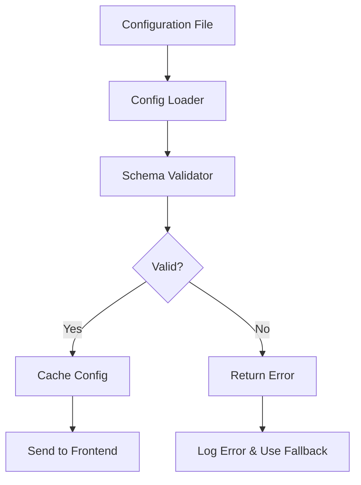

# 🔒 Schema & Validation - Configuration Validation System

Comprehensive guide to JSON Schema validation system that ensures configuration integrity and prevents runtime errors.

## 🎯 What is Schema Validation?

Schema validation is a critical safety mechanism that validates all configuration data against predefined JSON Schema definitions before it's processed or sent to the frontend. This ensures:

- ✅ **Type Safety**: All data types are correct
- ✅ **Required Fields**: Essential properties are present
- ✅ **Data Integrity**: Values meet expected constraints
- ✅ **Runtime Safety**: Prevents crashes from invalid configurations
- ✅ **Development Speed**: Catch errors early in development

## 🏗️ Schema Architecture

### Validation Flow



### Schema Structure

Every schema follows the JSON Schema Draft 07 specification:

```json
{
  "$schema": "http://json-schema.org/draft-07/schema#",
  "title": "Screen Configuration Schema",
  "type": "object",
  "required": ["screenType", "components"],
  "properties": {
    "screenType": {
      "type": "string",
      "description": "Unique identifier for the screen type"
    },
    "components": {
      "type": "array",
      "description": "Array of UI components",
      "items": { "$ref": "#/definitions/Component" }
    }
  },
  "definitions": {
    "Component": {
      "type": "object",
      "required": ["type"],
      "properties": {
        "type": { "type": "string" },
        "props": { "type": "object" },
        "style": { "type": "object" }
      }
    }
  }
}
```

## 📋 Schema Files Structure

### File Organization

```
schemas/
├── Auth.schema.json              # Authentication screen
├── Home.schema.json              # Home screen
├── Profile.schema.json           # Profile screen
├── App.schema.json               # Main app configuration
├── Choose.language.schema.json   # Language selection
├── common/                       # Shared schemas
│   ├── Component.schema.json     # Component definition
│   ├── Style.schema.json         # Style properties
│   └── Action.schema.json        # Action definitions
└── utils/                        # Utility schemas
    ├── Navigation.schema.json    # Navigation definitions
    └── State.schema.json         # State management
```

## 🧩 Component Schema Definitions

### Basic Component Schema

```json
{
  "$schema": "http://json-schema.org/draft-07/schema#",
  "title": "Dynamic Component Schema",
  "type": "object",
  "required": ["type"],
  "properties": {
    "type": {
      "type": "string",
      "enum": [
        "View",
        "Text",
        "TextInput",
        "Button",
        "TouchableOpacity",
        "Image",
        "FlatList",
        "ScrollView",
        "SafeAreaView",
        "StatusBar",
        "KeyboardAvoidingView",
        "ActivityIndicator"
      ],
      "description": "The React Native component type to render"
    },
    "props": {
      "type": "object",
      "description": "Component-specific properties",
      "additionalProperties": true
    },
    "style": {
      "$ref": "#/definitions/Style",
      "description": "React Native style object"
    },
    "children": {
      "type": "array",
      "description": "Child components",
      "items": { "$ref": "#/definitions/Component" }
    },
    "actions": {
      "$ref": "#/definitions/Actions",
      "description": "User interaction handlers"
    },
    "conditions": {
      "$ref": "#/definitions/Conditions",
      "description": "Conditional rendering rules"
    },
    "state": {
      "type": "object",
      "description": "State bindings",
      "additionalProperties": true
    }
  },
  "additionalProperties": false
}
```

### Style Schema Definition

```json
{
  "definitions": {
    "Style": {
      "type": "object",
      "description": "React Native style properties",
      "properties": {
        "flex": { "type": "number" },
        "flexDirection": {
          "type": "string",
          "enum": ["row", "column", "row-reverse", "column-reverse"]
        },
        "justifyContent": {
          "type": "string",
          "enum": [
            "flex-start",
            "flex-end",
            "center",
            "space-between",
            "space-around",
            "space-evenly"
          ]
        },
        "alignItems": {
          "type": "string",
          "enum": ["flex-start", "flex-end", "center", "stretch", "baseline"]
        },
        "backgroundColor": {
          "type": "string",
          "pattern": "^#([A-Fa-f0-9]{6}|[A-Fa-f0-9]{3})$|^rgba\\(\\d+,\\s*\\d+,\\s*\\d+,\\s*[01](\\.\\d+)?\\)$"
        },
        "color": {
          "type": "string",
          "pattern": "^#([A-Fa-f0-9]{6}|[A-Fa-f0-9]{3})$"
        },
        "fontSize": {
          "type": "number",
          "minimum": 8,
          "maximum": 72
        },
        "fontWeight": {
          "type": "string",
          "enum": [
            "normal",
            "bold",
            "100",
            "200",
            "300",
            "400",
            "500",
            "600",
            "700",
            "800",
            "900"
          ]
        },
        "textAlign": {
          "type": "string",
          "enum": ["auto", "left", "right", "center", "justify"]
        },
        "padding": { "type": "number", "minimum": 0 },
        "paddingTop": { "type": "number", "minimum": 0 },
        "paddingRight": { "type": "number", "minimum": 0 },
        "paddingBottom": { "type": "number", "minimum": 0 },
        "paddingLeft": { "type": "number", "minimum": 0 },
        "paddingHorizontal": { "type": "number", "minimum": 0 },
        "paddingVertical": { "type": "number", "minimum": 0 },
        "margin": { "type": "number" },
        "marginTop": { "type": "number" },
        "marginRight": { "type": "number" },
        "marginBottom": { "type": "number" },
        "marginLeft": { "type": "number" },
        "marginHorizontal": { "type": "number" },
        "marginVertical": { "type": "number" },
        "width": {
          "oneOf": [
            { "type": "number", "minimum": 0 },
            { "type": "string", "pattern": "^\\d+%$" }
          ]
        },
        "height": {
          "oneOf": [
            { "type": "number", "minimum": 0 },
            { "type": "string", "pattern": "^\\d+%$" }
          ]
        },
        "borderWidth": { "type": "number", "minimum": 0 },
        "borderColor": {
          "type": "string",
          "pattern": "^#([A-Fa-f0-9]{6}|[A-Fa-f0-9]{3})$"
        },
        "borderRadius": { "type": "number", "minimum": 0 },
        "opacity": {
          "type": "number",
          "minimum": 0,
          "maximum": 1
        },
        "shadowColor": {
          "type": "string",
          "pattern": "^#([A-Fa-f0-9]{6}|[A-Fa-f0-9]{3})$"
        },
        "shadowOffset": {
          "type": "object",
          "properties": {
            "width": { "type": "number" },
            "height": { "type": "number" }
          },
          "required": ["width", "height"]
        },
        "shadowOpacity": {
          "type": "number",
          "minimum": 0,
          "maximum": 1
        },
        "shadowRadius": { "type": "number", "minimum": 0 },
        "elevation": { "type": "number", "minimum": 0 }
      },
      "additionalProperties": false
    }
  }
}
```

### Actions Schema Definition

```json
{
  "definitions": {
    "Actions": {
      "type": "object",
      "description": "Component action handlers",
      "properties": {
        "onPress": { "$ref": "#/definitions/Action" },
        "onLongPress": { "$ref": "#/definitions/Action" },
        "onChangeText": { "$ref": "#/definitions/Action" },
        "onSubmit": { "$ref": "#/definitions/Action" },
        "onFocus": { "$ref": "#/definitions/Action" },
        "onBlur": { "$ref": "#/definitions/Action" }
      },
      "additionalProperties": false
    },
    "Action": {
      "type": "object",
      "required": ["type"],
      "properties": {
        "type": {
          "type": "string",
          "enum": [
            "navigate",
            "replace",
            "goBack",
            "reset",
            "updateState",
            "apiCall",
            "showModal",
            "hideModal",
            "showToast",
            "showAlert",
            "openUrl",
            "share",
            "callPhone",
            "sendEmail",
            "openCamera",
            "openGallery"
          ]
        },
        "target": {
          "type": "string",
          "description": "Target screen, URL, or state path"
        },
        "params": {
          "type": "object",
          "description": "Parameters to pass with the action"
        },
        "payload": {
          "type": "object",
          "description": "Data payload for API calls or state updates"
        },
        "validation": {
          "type": "object",
          "description": "Validation rules before executing action"
        }
      },
      "additionalProperties": false
    }
  }
}
```

## 📖 Screen-Specific Schemas

### Authentication Screen Schema

**File:** `schemas/Auth.schema.json`

```json
{
  "$schema": "http://json-schema.org/draft-07/schema#",
  "title": "Authentication Screen Configuration Schema",
  "type": "object",
  "required": ["screenType", "metadata", "components"],
  "properties": {
    "screenType": {
      "type": "string",
      "enum": ["Auth"],
      "description": "Must be 'Auth' for authentication screens"
    },
    "metadata": {
      "type": "object",
      "required": ["screenTitle", "description", "version", "lastUpdated"],
      "properties": {
        "screenTitle": {
          "type": "string",
          "minLength": 1,
          "maxLength": 100
        },
        "description": {
          "type": "string",
          "minLength": 1,
          "maxLength": 500
        },
        "version": {
          "type": "string",
          "pattern": "^\\d+\\.\\d+\\.\\d+$"
        },
        "lastUpdated": {
          "type": "string",
          "format": "date-time"
        }
      }
    },
    "globalStyles": {
      "type": "object",
      "description": "Global styles for the screen",
      "additionalProperties": { "$ref": "#/definitions/Style" }
    },
    "components": {
      "type": "array",
      "description": "Screen component tree",
      "minItems": 1,
      "items": { "$ref": "#/definitions/Component" }
    },
    "loadingState": {
      "$ref": "#/definitions/Component",
      "description": "Component to show during loading"
    },
    "errorState": {
      "$ref": "#/definitions/Component",
      "description": "Component to show on error"
    },
    "features": {
      "type": "object",
      "properties": {
        "socialLogin": { "type": "boolean" },
        "biometricAuth": { "type": "boolean" },
        "rememberMe": { "type": "boolean" },
        "forgotPassword": { "type": "boolean" }
      }
    }
  },
  "additionalProperties": false,
  "definitions": {
    // Include common definitions here
  }
}
```

### Home Screen Schema

**File:** `schemas/Home.schema.json`

```json
{
  "$schema": "http://json-schema.org/draft-07/schema#",
  "title": "Home Screen Configuration Schema",
  "type": "object",
  "required": ["screenType", "metadata", "components"],
  "properties": {
    "screenType": {
      "type": "string",
      "enum": ["Home"]
    },
    "metadata": {
      "type": "object",
      "required": ["screenTitle", "description"],
      "properties": {
        "screenTitle": { "type": "string" },
        "description": { "type": "string" },
        "version": { "type": "string" },
        "lastUpdated": { "type": "string" }
      }
    },
    "navigation": {
      "type": "object",
      "properties": {
        "headerShown": { "type": "boolean" },
        "headerTitle": { "type": "string" },
        "headerStyle": { "$ref": "#/definitions/Style" }
      }
    },
    "components": {
      "type": "array",
      "items": { "$ref": "#/definitions/Component" }
    },
    "features": {
      "type": "object",
      "properties": {
        "refreshControl": { "type": "boolean" },
        "searchEnabled": { "type": "boolean" },
        "filterEnabled": { "type": "boolean" },
        "notifications": { "type": "boolean" }
      }
    },
    "widgets": {
      "type": "array",
      "description": "Dashboard widgets configuration",
      "items": {
        "type": "object",
        "required": ["type", "title"],
        "properties": {
          "type": {
            "type": "string",
            "enum": ["stats", "chart", "list", "banner", "quickActions"]
          },
          "title": { "type": "string" },
          "dataSource": { "type": "string" },
          "refreshInterval": { "type": "number" }
        }
      }
    }
  }
}
```

## 🔧 Advanced Validation Features

### Custom Validation Rules

```json
{
  "properties": {
    "phoneNumber": {
      "type": "string",
      "pattern": "^\\+?[1-9]\\d{1,14}$",
      "description": "Must be a valid international phone number"
    },
    "email": {
      "type": "string",
      "format": "email",
      "description": "Must be a valid email address"
    },
    "password": {
      "type": "string",
      "minLength": 8,
      "pattern": "^(?=.*[a-z])(?=.*[A-Z])(?=.*\\d)(?=.*[@$!%*?&])[A-Za-z\\d@$!%*?&]",
      "description": "Must contain uppercase, lowercase, number, and special character"
    },
    "url": {
      "type": "string",
      "format": "uri",
      "pattern": "^https?://",
      "description": "Must be a valid HTTP/HTTPS URL"
    }
  }
}
```

### Conditional Validation

```json
{
  "if": {
    "properties": {
      "type": { "const": "TextInput" }
    }
  },
  "then": {
    "properties": {
      "props": {
        "required": ["placeholder"],
        "properties": {
          "placeholder": { "type": "string" },
          "keyboardType": {
            "type": "string",
            "enum": ["default", "email-address", "numeric", "phone-pad"]
          }
        }
      }
    }
  }
}
```

### Array Validation

```json
{
  "properties": {
    "menuItems": {
      "type": "array",
      "minItems": 1,
      "maxItems": 10,
      "uniqueItems": true,
      "items": {
        "type": "object",
        "required": ["id", "title", "action"],
        "properties": {
          "id": {
            "type": "string",
            "pattern": "^[a-zA-Z0-9_-]+$"
          },
          "title": {
            "type": "string",
            "minLength": 1,
            "maxLength": 50
          },
          "action": { "$ref": "#/definitions/Action" },
          "icon": { "type": "string" },
          "enabled": { "type": "boolean", "default": true }
        }
      }
    }
  }
}
```

## 🛠️ Validation Implementation

### Backend Validation

The backend uses AJV (Another JSON Schema Validator) for validation:

```javascript
import Ajv from "ajv";
import addFormats from "ajv-formats";

class SchemaValidator {
  constructor() {
    this.ajv = new Ajv({
      allErrors: true,
      verbose: true,
      strict: false,
    });

    // Add format support
    addFormats(this.ajv);

    // Add custom keywords
    this.addCustomKeywords();
  }

  addCustomKeywords() {
    // Custom validation for component types
    this.ajv.addKeyword({
      keyword: "validComponentType",
      type: "string",
      compile: () => (data) => {
        const validTypes = [
          "View",
          "Text",
          "TextInput",
          "Button",
          "TouchableOpacity",
          "Image",
          "FlatList",
        ];
        return validTypes.includes(data);
      },
    });

    // Custom validation for color formats
    this.ajv.addKeyword({
      keyword: "colorFormat",
      type: "string",
      compile: () => (data) => {
        return (
          /^#([A-Fa-f0-9]{6}|[A-Fa-f0-9]{3})$/.test(data) ||
          /^rgba\(\d+,\s*\d+,\s*\d+,\s*[01](\.\d+)?\)$/.test(data)
        );
      },
    });
  }

  validateConfiguration(schema, config) {
    const validate = this.ajv.compile(schema);
    const valid = validate(config);

    if (!valid) {
      return {
        valid: false,
        errors: this.formatErrors(validate.errors),
      };
    }

    return { valid: true };
  }

  formatErrors(errors) {
    return errors.map((error) => ({
      path: error.instancePath,
      message: error.message,
      allowedValues: error.params?.allowedValues,
      receivedValue: error.data,
    }));
  }
}
```

### Validation Error Handling

```javascript
// Example validation error response
{
  "success": false,
  "message": "Configuration validation failed",
  "errors": [
    {
      "path": "/components/0/type",
      "message": "must be equal to one of the allowed values",
      "allowedValues": ["View", "Text", "Button"],
      "receivedValue": "InvalidComponent"
    },
    {
      "path": "/components/1/style/backgroundColor",
      "message": "must match color format",
      "receivedValue": "not-a-color"
    }
  ],
  "validationDetails": {
    "totalErrors": 2,
    "schema": "Auth.schema.json",
    "configFile": "Auth.template.json"
  }
}
```

## 🔍 Schema Testing

### Unit Tests for Schemas

```javascript
describe("Auth Schema Validation", () => {
  let validator;

  beforeEach(() => {
    validator = new SchemaValidator();
  });

  test("should validate valid auth configuration", () => {
    const validConfig = {
      screenType: "Auth",
      metadata: {
        screenTitle: "Login",
        description: "User authentication screen",
        version: "1.0.0",
        lastUpdated: "2025-08-10T10:00:00Z",
      },
      components: [
        {
          type: "SafeAreaView",
          style: { flex: 1 },
          children: [],
        },
      ],
    };

    const result = validator.validateConfiguration(authSchema, validConfig);
    expect(result.valid).toBe(true);
  });

  test("should reject invalid component type", () => {
    const invalidConfig = {
      screenType: "Auth",
      metadata: {
        /* valid metadata */
      },
      components: [
        {
          type: "InvalidComponent",
          style: { flex: 1 },
        },
      ],
    };

    const result = validator.validateConfiguration(authSchema, invalidConfig);
    expect(result.valid).toBe(false);
    expect(result.errors[0].path).toBe("/components/0/type");
  });
});
```

## 📊 Validation Metrics

### Tracking Validation Performance

```javascript
class ValidationMetrics {
  constructor() {
    this.metrics = {
      totalValidations: 0,
      successfulValidations: 0,
      failedValidations: 0,
      averageValidationTime: 0,
      errorsByType: {},
    };
  }

  recordValidation(duration, success, errors = []) {
    this.metrics.totalValidations++;

    if (success) {
      this.metrics.successfulValidations++;
    } else {
      this.metrics.failedValidations++;
      this.recordErrors(errors);
    }

    this.updateAverageTime(duration);
  }

  recordErrors(errors) {
    errors.forEach((error) => {
      const errorType = error.keyword || "unknown";
      this.metrics.errorsByType[errorType] =
        (this.metrics.errorsByType[errorType] || 0) + 1;
    });
  }

  getValidationStats() {
    return {
      ...this.metrics,
      successRate:
        (this.metrics.successfulValidations / this.metrics.totalValidations) *
        100,
      mostCommonErrors: Object.entries(this.metrics.errorsByType)
        .sort(([, a], [, b]) => b - a)
        .slice(0, 5),
    };
  }
}
```

## 🎯 Best Practices

### Schema Design Guidelines

1. **Be Strict but Flexible**

   - Require essential fields
   - Allow optional enhancements
   - Use `additionalProperties: false` carefully

2. **Provide Clear Descriptions**

   - Document each property
   - Include examples in descriptions
   - Explain validation rules

3. **Use Semantic Validation**

   - Validate beyond just types
   - Check business rules
   - Ensure data consistency

4. **Version Your Schemas**
   - Include schema version in files
   - Maintain backward compatibility
   - Document breaking changes

### Common Validation Patterns

```json
{
  "properties": {
    "required_string": {
      "type": "string",
      "minLength": 1,
      "description": "Cannot be empty"
    },
    "optional_with_default": {
      "type": "boolean",
      "default": false,
      "description": "Defaults to false if not provided"
    },
    "enum_with_validation": {
      "type": "string",
      "enum": ["option1", "option2", "option3"],
      "description": "Must be one of the predefined options"
    },
    "nested_object": {
      "type": "object",
      "required": ["id"],
      "properties": {
        "id": { "type": "string" },
        "name": { "type": "string" }
      },
      "additionalProperties": false
    }
  }
}
```

## 🔗 Related Documentation

- [Component System](./04-component-system.md) - Understanding components
- [Templates & Configs](./06-templates-configs.md) - Working with templates
- [Troubleshooting](./16-troubleshooting.md) - Fixing validation errors
- [Best Practices](./17-best-practices.md) - Schema best practices

---

**Validate with Confidence! 🛡️**

Proper schema validation is your first line of defense against configuration errors.
