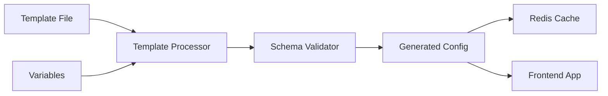

# 📝 Templates & Configs - Working with Templates and Configurations

Comprehensive guide to understanding and working with configuration templates and generated configurations.

## 🎯 What are Templates and Configs?

### Templates

Templates are **source files** that define the structure and default values for your screens. They contain:

- Static configuration structure
- Variable placeholders (e.g., `{{VERSION}}`, `{{TIMESTAMP}}`)
- Default values and fallbacks
- Reusable component patterns

### Configs

Configs are **generated files** created from templates with:

- Processed variables (real values replace placeholders)
- Environment-specific values
- Validated against schemas
- Ready for frontend consumption

## 🔄 Template to Config Flow



### Processing Pipeline

1. **Load Template** → Read template file from disk
2. **Process Variables** → Replace `{{VARIABLE}}` with actual values
3. **Validate Schema** → Ensure structure matches schema
4. **Generate Config** → Create final configuration
5. **Cache Config** → Store in Redis for fast access
6. **Serve Config** → Send to frontend applications

## 📁 File Organization

### Directory Structure

```
remote-config/
├── templates/                    # Source templates
│   ├── Auth.template.json        # Authentication screen template
│   ├── Home.template.json        # Home screen template
│   ├── Profile.template.json     # Profile screen template
│   ├── App.template.json         # Main app configuration template
│   └── ChooseLanguage.template.json # Language selection template
├── configs/                      # Generated configurations
│   ├── Auth.json                 # Generated auth config
│   ├── Home.json                 # Generated home config
│   ├── Profile.json              # Generated profile config
│   ├── App.json                  # Generated app config
│   └── ChooseLanguage.json       # Generated language config
└── schemas/                      # Validation schemas
    ├── Auth.schema.json          # Auth validation schema
    ├── Home.schema.json          # Home validation schema
    └── ...
```

### Naming Conventions

- **Templates**: `ScreenName.template.json`
- **Configs**: `ScreenName.json`
- **Schemas**: `ScreenName.schema.json`

## 📋 Template Structure

### Basic Template Format

```json
{
  "screenType": "{{SCREEN_TYPE}}",
  "metadata": {
    "screenTitle": "{{SCREEN_TITLE}}",
    "description": "{{SCREEN_DESCRIPTION}}",
    "version": "{{VERSION}}",
    "lastUpdated": "{{TIMESTAMP}}",
    "environment": "{{ENVIRONMENT}}"
  },
  "globalStyles": {
    "backgroundColor": "{{BACKGROUND_COLOR}}",
    "primaryColor": "{{PRIMARY_COLOR}}"
  },
  "components": [
    // Component tree goes here
  ],
  "features": {
    "enabled": "{{FEATURES_ENABLED}}",
    "darkMode": "{{DARK_MODE_ENABLED}}"
  }
}
```

### Complete Template Example

**File:** `templates/Auth.template.json`

```json
{
  "screenType": "Auth",
  "metadata": {
    "screenTitle": "Authentication",
    "description": "User login and registration screen",
    "version": "{{VERSION}}",
    "lastUpdated": "{{TIMESTAMP}}",
    "environment": "{{ENVIRONMENT}}",
    "author": "Labor2Hire Team"
  },
  "globalStyles": {
    "backgroundColor": "{{AUTH_BACKGROUND_COLOR}}",
    "primaryColor": "{{PRIMARY_COLOR}}",
    "secondaryColor": "{{SECONDARY_COLOR}}",
    "textColor": "{{TEXT_COLOR}}",
    "errorColor": "{{ERROR_COLOR}}"
  },
  "components": [
    {
      "type": "SafeAreaView",
      "style": {
        "flex": 1,
        "backgroundColor": "{{AUTH_BACKGROUND_COLOR}}"
      },
      "children": [
        {
          "type": "KeyboardAvoidingView",
          "props": {
            "behavior": "{{KEYBOARD_BEHAVIOR}}"
          },
          "style": {
            "flex": 1,
            "justifyContent": "center",
            "paddingHorizontal": 20
          },
          "children": [
            {
              "type": "Text",
              "props": {
                "text": "{{APP_NAME}}"
              },
              "style": {
                "fontSize": 32,
                "fontWeight": "bold",
                "textAlign": "center",
                "marginBottom": 10,
                "color": "{{PRIMARY_COLOR}}"
              }
            },
            {
              "type": "Text",
              "props": {
                "text": "{{AUTH_SUBTITLE}}"
              },
              "style": {
                "fontSize": 16,
                "textAlign": "center",
                "marginBottom": 30,
                "color": "{{TEXT_COLOR}}"
              }
            }
          ]
        }
      ]
    }
  ],
  "features": {
    "socialLogin": "{{SOCIAL_LOGIN_ENABLED}}",
    "biometricAuth": "{{BIOMETRIC_AUTH_ENABLED}}",
    "rememberMe": "{{REMEMBER_ME_ENABLED}}",
    "forgotPassword": "{{FORGOT_PASSWORD_ENABLED}}"
  },
  "errorState": {
    "type": "View",
    "style": {
      "flex": 1,
      "justifyContent": "center",
      "alignItems": "center",
      "backgroundColor": "{{ERROR_BACKGROUND_COLOR}}"
    },
    "children": [
      {
        "type": "Text",
        "props": {
          "text": "{{ERROR_MESSAGE}}"
        },
        "style": {
          "fontSize": 18,
          "color": "{{ERROR_COLOR}}",
          "textAlign": "center"
        }
      }
    ]
  },
  "loadingState": {
    "type": "View",
    "style": {
      "flex": 1,
      "justifyContent": "center",
      "alignItems": "center",
      "backgroundColor": "{{AUTH_BACKGROUND_COLOR}}"
    },
    "children": [
      {
        "type": "ActivityIndicator",
        "props": {
          "size": "large",
          "color": "{{PRIMARY_COLOR}}"
        }
      },
      {
        "type": "Text",
        "props": {
          "text": "{{LOADING_MESSAGE}}"
        },
        "style": {
          "marginTop": 16,
          "fontSize": 16,
          "color": "{{TEXT_COLOR}}"
        }
      }
    ]
  }
}
```

## 🔧 Variable System

### Built-in Variables

The system provides several built-in variables:

```javascript
const builtInVariables = {
  // System Variables
  VERSION: process.env.npm_package_version || "1.0.0",
  TIMESTAMP: new Date().toISOString(),
  ENVIRONMENT: process.env.NODE_ENV || "development",
  BUILD_NUMBER: process.env.BUILD_NUMBER || "dev",

  // Server Configuration
  API_BASE_URL: process.env.API_BASE_URL || "http://localhost:5002",
  WEBSOCKET_URL: process.env.WEBSOCKET_URL || "ws://localhost:5002",

  // App Information
  APP_NAME: "Labor2Hire",
  APP_VERSION: "{{VERSION}}",

  // Device/Platform
  PLATFORM: "{{PLATFORM}}",
  DEVICE_TYPE: "{{DEVICE_TYPE}}",

  // User Context
  USER_ID: "{{USER_ID}}",
  USER_ROLE: "{{USER_ROLE}}",
  USER_LANGUAGE: "{{USER_LANGUAGE}}",
};
```

### Custom Variables

You can define custom variables in your environment or configuration:

```env
# .env file
AUTH_BACKGROUND_COLOR=#f0f8ff
PRIMARY_COLOR=#007bff
SECONDARY_COLOR=#6c757d
TEXT_COLOR=#333333
ERROR_COLOR=#dc3545
APP_NAME=Labor2Hire
AUTH_SUBTITLE=Choose your language and sign in
KEYBOARD_BEHAVIOR=padding
SOCIAL_LOGIN_ENABLED=true
BIOMETRIC_AUTH_ENABLED=false
REMEMBER_ME_ENABLED=true
FORGOT_PASSWORD_ENABLED=true
LOADING_MESSAGE=Loading, please wait...
ERROR_MESSAGE=Unable to load authentication screen
ERROR_BACKGROUND_COLOR=#fff5f5
```

### Dynamic Variables

Variables can be computed dynamically:

```javascript
const dynamicVariables = {
  CURRENT_YEAR: () => new Date().getFullYear(),
  RANDOM_ID: () => Math.random().toString(36).substr(2, 9),
  USER_GREETING: (context) => `Hello, ${context.user?.name || "User"}!`,
  THEME_COLOR: (context) => (context.theme === "dark" ? "#000000" : "#ffffff"),
  DEVICE_WIDTH: (context) => context.device?.width || 375,
  DEVICE_HEIGHT: (context) => context.device?.height || 812,
};
```

### Conditional Variables

Variables can include conditional logic:

```json
{
  "backgroundColor": "{{#if DARK_MODE}}#1a1a1a{{else}}#ffffff{{/if}}",
  "textColor": "{{#if DARK_MODE}}#ffffff{{else}}#333333{{/if}}",
  "buttonText": "{{#if USER_LOGGED_IN}}Dashboard{{else}}Sign In{{/if}}"
}
```

## 🏭 Template Processing

### Variable Replacement

Simple variable replacement:

```javascript
function processVariables(template, variables) {
  let processed = JSON.stringify(template);

  Object.entries(variables).forEach(([key, value]) => {
    const regex = new RegExp(`{{${key}}}`, "g");
    processed = processed.replace(regex, value);
  });

  return JSON.parse(processed);
}
```

### Advanced Template Processing

With filters and functions:

```javascript
class TemplateProcessor {
  constructor() {
    this.filters = new Map();
    this.functions = new Map();
    this.setupBuiltinFilters();
  }

  setupBuiltinFilters() {
    this.filters.set("uppercase", (str) => str.toUpperCase());
    this.filters.set("lowercase", (str) => str.toLowerCase());
    this.filters.set(
      "capitalize",
      (str) => str.charAt(0).toUpperCase() + str.slice(1)
    );
    this.filters.set("truncate", (str, length = 50) =>
      str.length > length ? str.substring(0, length) + "..." : str
    );
    this.filters.set("formatDate", (date) =>
      new Date(date).toLocaleDateString()
    );
    this.filters.set("formatCurrency", (amount) => `$${amount.toFixed(2)}`);
  }

  processTemplate(template, context = {}) {
    let processed = JSON.stringify(template);

    // Process variables with filters
    const variableRegex = /{{([^}]+)}}/g;
    processed = processed.replace(variableRegex, (match, expression) => {
      return this.evaluateExpression(expression.trim(), context);
    });

    return JSON.parse(processed);
  }

  evaluateExpression(expression, context) {
    // Handle filters: {{variable | filter:param}}
    if (expression.includes("|")) {
      const [variable, ...filterChain] = expression.split("|");
      let value = this.getVariableValue(variable.trim(), context);

      filterChain.forEach((filterExpr) => {
        const [filterName, ...params] = filterExpr.trim().split(":");
        const filter = this.filters.get(filterName);
        if (filter) {
          value = filter(value, ...params);
        }
      });

      return value;
    }

    // Simple variable replacement
    return this.getVariableValue(expression, context);
  }

  getVariableValue(variable, context) {
    // Support nested properties: user.profile.name
    const keys = variable.split(".");
    let value = context;

    for (const key of keys) {
      value = value?.[key];
      if (value === undefined) break;
    }

    return value !== undefined ? value : `{{${variable}}}`;
  }
}
```

## 📊 Generated Configurations

### Config Generation Process

```javascript
class ConfigGenerator {
  constructor() {
    this.processor = new TemplateProcessor();
    this.validator = new SchemaValidator();
  }

  async generateConfig(screenName, context = {}) {
    try {
      // 1. Load template
      const template = await this.loadTemplate(screenName);

      // 2. Prepare context with built-in variables
      const fullContext = {
        ...this.getBuiltInVariables(),
        ...this.getEnvironmentVariables(),
        ...context,
      };

      // 3. Process template
      const processedConfig = this.processor.processTemplate(
        template,
        fullContext
      );

      // 4. Validate against schema
      const schema = await this.loadSchema(screenName);
      const validation = this.validator.validate(schema, processedConfig);

      if (!validation.valid) {
        throw new Error(`Validation failed: ${validation.errors.join(", ")}`);
      }

      // 5. Add metadata
      processedConfig._metadata = {
        generatedAt: new Date().toISOString(),
        templateVersion: template.metadata?.version,
        environment: process.env.NODE_ENV,
        source: "template",
      };

      // 6. Save generated config
      await this.saveConfig(screenName, processedConfig);

      return processedConfig;
    } catch (error) {
      logger.error(`Failed to generate config for ${screenName}:`, error);
      throw error;
    }
  }

  getBuiltInVariables() {
    return {
      VERSION: process.env.npm_package_version || "1.0.0",
      TIMESTAMP: new Date().toISOString(),
      ENVIRONMENT: process.env.NODE_ENV || "development",
      BUILD_NUMBER: process.env.BUILD_NUMBER || "dev",
      API_BASE_URL: process.env.API_BASE_URL || "http://localhost:5002",
      WEBSOCKET_URL: process.env.WEBSOCKET_URL || "ws://localhost:5002",
    };
  }

  getEnvironmentVariables() {
    const envVars = {};
    Object.keys(process.env).forEach((key) => {
      if (key.startsWith("TEMPLATE_")) {
        envVars[key.replace("TEMPLATE_", "")] = process.env[key];
      }
    });
    return envVars;
  }
}
```

### Example Generated Config

**File:** `configs/Auth.json` (generated from template)

```json
{
  "screenType": "Auth",
  "metadata": {
    "screenTitle": "Authentication",
    "description": "User login and registration screen",
    "version": "1.2.3",
    "lastUpdated": "2025-08-10T14:30:00.000Z",
    "environment": "production",
    "author": "Labor2Hire Team"
  },
  "globalStyles": {
    "backgroundColor": "#f0f8ff",
    "primaryColor": "#007bff",
    "secondaryColor": "#6c757d",
    "textColor": "#333333",
    "errorColor": "#dc3545"
  },
  "components": [
    {
      "type": "SafeAreaView",
      "style": {
        "flex": 1,
        "backgroundColor": "#f0f8ff"
      },
      "children": [
        {
          "type": "KeyboardAvoidingView",
          "props": {
            "behavior": "padding"
          },
          "style": {
            "flex": 1,
            "justifyContent": "center",
            "paddingHorizontal": 20
          },
          "children": [
            {
              "type": "Text",
              "props": {
                "text": "Labor2Hire"
              },
              "style": {
                "fontSize": 32,
                "fontWeight": "bold",
                "textAlign": "center",
                "marginBottom": 10,
                "color": "#007bff"
              }
            },
            {
              "type": "Text",
              "props": {
                "text": "Choose your language and sign in"
              },
              "style": {
                "fontSize": 16,
                "textAlign": "center",
                "marginBottom": 30,
                "color": "#333333"
              }
            }
          ]
        }
      ]
    }
  ],
  "features": {
    "socialLogin": true,
    "biometricAuth": false,
    "rememberMe": true,
    "forgotPassword": true
  },
  "_metadata": {
    "generatedAt": "2025-08-10T14:30:00.000Z",
    "templateVersion": "1.2.3",
    "environment": "production",
    "source": "template"
  }
}
```

## 🔄 Template Management

### Template Versioning

```json
{
  "templateInfo": {
    "version": "2.1.0",
    "compatibleWith": ["1.0.0", "1.1.0", "2.0.0"],
    "deprecated": false,
    "migrationPath": "2.0.0-to-2.1.0",
    "changelog": [
      {
        "version": "2.1.0",
        "date": "2025-08-10",
        "changes": [
          "Added biometric authentication support",
          "Updated color scheme variables",
          "Improved accessibility features"
        ]
      }
    ]
  }
}
```

### Template Inheritance

```json
{
  "extends": "BaseScreen.template.json",
  "overrides": {
    "globalStyles": {
      "backgroundColor": "#f0f8ff"
    },
    "features": {
      "socialLogin": true
    }
  },
  "additions": {
    "components": [
      {
        "type": "SpecialAuthComponent",
        "props": {
          "specialFeature": true
        }
      }
    ]
  }
}
```

### Template Composition

```json
{
  "composition": {
    "header": "@include(CommonHeader.template.json)",
    "body": "@include(AuthBody.template.json)",
    "footer": "@include(CommonFooter.template.json)"
  },
  "customizations": {
    "header": {
      "title": "Authentication"
    },
    "body": {
      "showSocialLogin": true
    }
  }
}
```

## 🛠️ Working with Templates

### Creating a New Template

1. **Define the Template Structure**

```json
{
  "screenType": "NewScreen",
  "metadata": {
    "screenTitle": "{{SCREEN_TITLE}}",
    "description": "{{SCREEN_DESCRIPTION}}",
    "version": "{{VERSION}}",
    "lastUpdated": "{{TIMESTAMP}}"
  },
  "components": [
    // Start with basic structure
  ]
}
```

2. **Add Variable Placeholders**

```json
{
  "style": {
    "backgroundColor": "{{BACKGROUND_COLOR}}",
    "primaryColor": "{{PRIMARY_COLOR}}"
  },
  "props": {
    "title": "{{SCREEN_TITLE}}",
    "subtitle": "{{SCREEN_SUBTITLE}}"
  }
}
```

3. **Create Corresponding Schema**

```json
{
  "$schema": "http://json-schema.org/draft-07/schema#",
  "title": "New Screen Configuration Schema",
  "type": "object",
  "required": ["screenType", "metadata", "components"],
  "properties": {
    // Define validation rules
  }
}
```

4. **Test Template Generation**

```bash
# Generate config from template
curl -X POST http://localhost:5002/api/config/template/process \
  -H "Content-Type: application/json" \
  -d '{
    "template": "NewScreen",
    "variables": {
      "SCREEN_TITLE": "My New Screen",
      "BACKGROUND_COLOR": "#ffffff"
    }
  }'
```

### Updating Existing Templates

1. **Make Changes to Template File**
2. **Update Schema if Structure Changed**
3. **Test Configuration Generation**
4. **Regenerate All Affected Configs**

```bash
# Reload template and regenerate config
curl -X POST http://localhost:5002/api/config/reload/ScreenName
```

### Template Best Practices

1. **Use Meaningful Variable Names**

   ```json
   // Good
   "{{PRIMARY_BUTTON_COLOR}}"

   // Bad
   "{{COLOR1}}"
   ```

2. **Provide Default Values**

   ```json
   "backgroundColor": "{{BACKGROUND_COLOR::#ffffff}}"
   ```

3. **Group Related Variables**

   ```json
   "colors": {
     "primary": "{{THEME_PRIMARY}}",
     "secondary": "{{THEME_SECONDARY}}",
     "background": "{{THEME_BACKGROUND}}"
   }
   ```

4. **Document Variables**
   ```json
   "_variables": {
     "SCREEN_TITLE": "The main title displayed on the screen",
     "PRIMARY_COLOR": "Main brand color in hex format (#rrggbb)",
     "FEATURE_ENABLED": "Boolean flag to enable/disable feature"
   }
   ```

## 🔗 Related Documentation

- [Component System](./04-component-system.md) - Understanding components used in templates
- [Schema & Validation](./05-schema-validation.md) - Validating generated configurations
- [Creating New Screens](./07-creating-screens.md) - Using templates to create screens
- [Common Workflows](./15-common-workflows.md) - Template management workflows

---

**Template Like a Pro! 🎨**

Master templates and configurations to build dynamic, maintainable UI systems.
