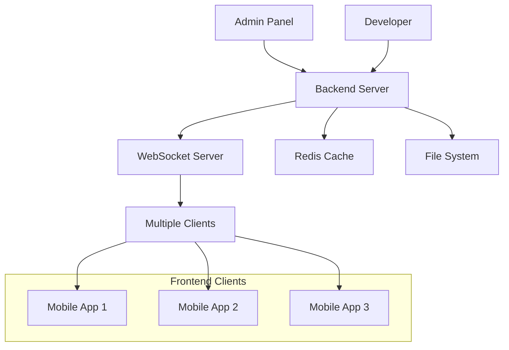

# ⚡ Real-time Updates - WebSocket Configuration Updates

Complete guide to real-time configuration updates using WebSocket connections for instant UI changes.

## 🎯 What are Real-time Updates?

Real-time Updates allow you to push configuration changes instantly to all connected mobile devices without requiring app restarts or deployments. When you update a configuration on the backend, all devices receive the changes immediately via WebSocket connections.

### Key Benefits

- ⚡ **Instant Updates**: Changes appear immediately across all devices
- 🔄 **Automatic Sync**: No manual refresh needed
- 📱 **Live A/B Testing**: Switch configurations in real-time
- 🚨 **Emergency Fixes**: Push critical fixes instantly
- 🎯 **Targeted Updates**: Send updates to specific user segments

## 🏗️ WebSocket Architecture



### Connection Flow

1. **Client Connection**: Mobile app connects to WebSocket server
2. **Authentication**: Client authenticates with JWT/API key
3. **Subscription**: Client subscribes to relevant configuration channels
4. **Configuration Sync**: Server sends current configuration state
5. **Real-time Updates**: Server broadcasts changes as they occur
6. **Client Processing**: Client receives and applies updates instantly

## 🔌 WebSocket Server Implementation

### Server Setup

The WebSocket server is built on Socket.IO for robust real-time communication:

```javascript
import { Server } from "socket.io";
import jwt from "jsonwebtoken";

export class ConfigWebSocketServer {
  constructor() {
    this.io = null;
    this.connectedClients = new Map();
    this.clientStats = {
      totalConnections: 0,
      activeConnections: 0,
      totalBroadcasts: 0,
      lastBroadcast: null,
    };
  }

  initialize(server) {
    this.io = new Server(server, {
      path: "/config-socket",
      cors: {
        origin: process.env.ALLOWED_ORIGINS?.split(",") || ["*"],
        methods: ["GET", "POST"],
        credentials: true,
      },
      transports: ["websocket", "polling"],
    });

    this.setupConnectionHandlers();
    console.log("🔌 WebSocket server initialized on /config-socket");
  }

  setupConnectionHandlers() {
    this.io.on("connection", async (socket) => {
      try {
        await this.handleNewConnection(socket);
      } catch (error) {
        console.error("Connection error:", error);
        socket.disconnect();
      }
    });
  }

  async handleNewConnection(socket) {
    const clientInfo = await this.authenticateClient(socket);

    if (!clientInfo) {
      socket.emit("auth_error", { message: "Authentication failed" });
      socket.disconnect();
      return;
    }

    // Store client information
    this.connectedClients.set(socket.id, {
      socket,
      ...clientInfo,
      connectedAt: new Date(),
      lastActivity: new Date(),
    });

    this.clientStats.totalConnections++;
    this.clientStats.activeConnections++;

    // Send connection confirmation
    socket.emit("connection_established", {
      clientId: socket.id,
      timestamp: new Date().toISOString(),
      serverVersion: "2.0.0",
    });

    // Send current configuration state
    await this.sendFullConfigToClient(socket);

    // Setup event handlers for this client
    this.setupClientEventHandlers(socket);

    console.log(`✅ Client connected: ${socket.id} (${clientInfo.userAgent})`);
  }

  async authenticateClient(socket) {
    const token = socket.handshake.auth?.token || socket.handshake.query?.token;
    const apiKey =
      socket.handshake.auth?.apiKey || socket.handshake.query?.apiKey;

    try {
      if (token) {
        const decoded = jwt.verify(token, process.env.JWT_SECRET);
        return {
          type: "jwt",
          userId: decoded.userId,
          role: decoded.role,
          userAgent: socket.handshake.headers["user-agent"],
        };
      } else if (apiKey && this.isValidApiKey(apiKey)) {
        return {
          type: "apiKey",
          apiKey: apiKey,
          userAgent: socket.handshake.headers["user-agent"],
        };
      }
    } catch (error) {
      console.error("Authentication error:", error);
    }

    return null;
  }

  setupClientEventHandlers(socket) {
    // Handle client ping for connection health
    socket.on("ping", () => {
      socket.emit("pong", { timestamp: new Date().toISOString() });
      this.updateClientActivity(socket.id);
    });

    // Handle configuration subscription
    socket.on("subscribe_to_screen", (data) => {
      const { screenName } = data;
      socket.join(`screen:${screenName}`);
      console.log(`Client ${socket.id} subscribed to screen: ${screenName}`);
    });

    // Handle configuration unsubscription
    socket.on("unsubscribe_from_screen", (data) => {
      const { screenName } = data;
      socket.leave(`screen:${screenName}`);
      console.log(
        `Client ${socket.id} unsubscribed from screen: ${screenName}`
      );
    });

    // Handle client disconnect
    socket.on("disconnect", (reason) => {
      this.handleClientDisconnect(socket.id, reason);
    });

    // Handle errors
    socket.on("error", (error) => {
      console.error(`Socket error for client ${socket.id}:`, error);
    });
  }

  async sendFullConfigToClient(socket) {
    try {
      const allConfigs = configManager.getAllConfigs();

      socket.emit("full_config_sync", {
        type: "full_sync",
        configs: allConfigs,
        timestamp: new Date().toISOString(),
        version: "2.0.0",
      });

      console.log(`📦 Full config sent to client: ${socket.id}`);
    } catch (error) {
      console.error("Failed to send full config:", error);
      socket.emit("config_error", {
        message: "Failed to load configuration",
        timestamp: new Date().toISOString(),
      });
    }
  }

  // Broadcast configuration update to all connected clients
  async broadcastConfigUpdate(screenName, config) {
    if (!this.io) return;

    const updateData = {
      type: "config_update",
      screen: screenName,
      config: config,
      timestamp: new Date().toISOString(),
      version: config.version || "1.0.0",
    };

    // Broadcast to all clients subscribed to this screen
    this.io.to(`screen:${screenName}`).emit("config_update", updateData);

    // Also broadcast to all clients (for general listeners)
    this.io.emit("config_update", updateData);

    this.clientStats.totalBroadcasts++;
    this.clientStats.lastBroadcast = new Date().toISOString();

    console.log(
      `📡 Broadcasted update for screen: ${screenName} to ${this.clientStats.activeConnections} clients`
    );
  }

  // Broadcast full configuration sync
  async broadcastFullConfigSync() {
    if (!this.io) return;

    try {
      const allConfigs = configManager.getAllConfigs();

      const syncData = {
        type: "full_sync",
        configs: allConfigs,
        timestamp: new Date().toISOString(),
        reason: "manual_sync",
      };

      this.io.emit("full_config_sync", syncData);

      this.clientStats.totalBroadcasts++;
      this.clientStats.lastBroadcast = new Date().toISOString();

      console.log(
        `🔄 Full config sync broadcasted to ${this.clientStats.activeConnections} clients`
      );
    } catch (error) {
      console.error("Failed to broadcast full config sync:", error);
    }
  }

  handleClientDisconnect(socketId, reason) {
    if (this.connectedClients.has(socketId)) {
      this.connectedClients.delete(socketId);
      this.clientStats.activeConnections--;
      console.log(`❌ Client disconnected: ${socketId} (${reason})`);
    }
  }

  updateClientActivity(socketId) {
    const client = this.connectedClients.get(socketId);
    if (client) {
      client.lastActivity = new Date();
    }
  }

  getConnectionStats() {
    return {
      serverStatus: this.io ? "running" : "stopped",
      connectedClients: this.clientStats.activeConnections,
      totalConnections: this.clientStats.totalConnections,
      totalBroadcasts: this.clientStats.totalBroadcasts,
      lastBroadcast: this.clientStats.lastBroadcast,
      clientDetails: Array.from(this.connectedClients.values()).map(
        (client) => ({
          id: client.socket.id,
          connectedAt: client.connectedAt,
          lastActivity: client.lastActivity,
          userAgent: client.userAgent,
        })
      ),
    };
  }
}
```

## 📱 Frontend Client Implementation

### React Native Client

```typescript
import io from "socket.io-client";
import AsyncStorage from "@react-native-async-storage/async-storage";

class ConfigWebSocketClient {
  private socket: any;
  private baseUrl: string;
  private isConnected: boolean = false;
  private reconnectAttempts: number = 0;
  private maxReconnectAttempts: number = 10;
  private reconnectDelay: number = 1000;

  constructor(baseUrl: string) {
    this.baseUrl = baseUrl;
    this.initializeSocket();
  }

  private initializeSocket() {
    const token = this.getAuthToken();

    this.socket = io(`${this.baseUrl}/config-socket`, {
      auth: {
        token: token,
      },
      transports: ["websocket"],
      reconnection: true,
      reconnectionAttempts: this.maxReconnectAttempts,
      reconnectionDelay: this.reconnectDelay,
      timeout: 20000,
    });

    this.setupEventHandlers();
  }

  private setupEventHandlers() {
    // Connection established
    this.socket.on("connect", () => {
      console.log("🔌 Connected to configuration server");
      this.isConnected = true;
      this.reconnectAttempts = 0;
      this.onConnectionEstablished();
    });

    // Connection confirmation from server
    this.socket.on("connection_established", (data: any) => {
      console.log("✅ Connection confirmed:", data);
      this.subscribeToScreens();
    });

    // Configuration update received
    this.socket.on("config_update", (data: any) => {
      console.log(`📡 Configuration update received for: ${data.screen}`);
      this.handleConfigUpdate(data);
    });

    // Full configuration sync
    this.socket.on("full_config_sync", (data: any) => {
      console.log("🔄 Full configuration sync received");
      this.handleFullConfigSync(data);
    });

    // Connection lost
    this.socket.on("disconnect", (reason: string) => {
      console.log("❌ Disconnected from server:", reason);
      this.isConnected = false;
      this.handleDisconnection(reason);
    });

    // Reconnection attempt
    this.socket.on("reconnect_attempt", (attemptNumber: number) => {
      console.log(
        `🔄 Reconnection attempt ${attemptNumber}/${this.maxReconnectAttempts}`
      );
      this.reconnectAttempts = attemptNumber;
    });

    // Reconnection successful
    this.socket.on("reconnect", (attemptNumber: number) => {
      console.log(`✅ Reconnected after ${attemptNumber} attempts`);
      this.isConnected = true;
      this.reconnectAttempts = 0;
    });

    // Reconnection failed
    this.socket.on("reconnect_failed", () => {
      console.error("❌ Failed to reconnect to configuration server");
      this.handleReconnectionFailure();
    });

    // Server pong response
    this.socket.on("pong", (data: any) => {
      console.log("🏓 Pong received:", data.timestamp);
    });

    // Authentication error
    this.socket.on("auth_error", (data: any) => {
      console.error("🔐 Authentication error:", data.message);
      this.handleAuthError();
    });

    // Configuration error
    this.socket.on("config_error", (data: any) => {
      console.error("⚠️ Configuration error:", data.message);
      this.handleConfigError(data);
    });
  }

  private onConnectionEstablished() {
    // Start ping interval for connection health
    setInterval(() => {
      if (this.isConnected) {
        this.socket.emit("ping");
      }
    }, 30000); // Ping every 30 seconds
  }

  private subscribeToScreens() {
    // Subscribe to screens that the app uses
    const screens = ["Auth", "Home", "Profile", "ChooseLanguage"];

    screens.forEach((screen) => {
      this.socket.emit("subscribe_to_screen", { screenName: screen });
    });
  }

  private handleConfigUpdate(data: any) {
    const { screen, config, timestamp } = data;

    // Update local configuration store
    this.updateLocalConfig(screen, config);

    // Notify the app about the update
    this.notifyConfigUpdate(screen, config);

    // Save to local storage for offline access
    this.saveConfigToStorage(screen, config);
  }

  private handleFullConfigSync(data: any) {
    const { configs, timestamp } = data;

    // Update all configurations
    Object.entries(configs).forEach(([screen, config]) => {
      this.updateLocalConfig(screen, config);
      this.saveConfigToStorage(screen, config as any);
    });

    // Notify app about full sync
    this.notifyFullSync(configs);
  }

  private updateLocalConfig(screen: string, config: any) {
    // Update in-memory configuration store
    const configStore = require("../store/ConfigStore");
    configStore.updateScreenConfig(screen, config);
  }

  private notifyConfigUpdate(screen: string, config: any) {
    // Emit custom event for React Native components to listen
    const { DeviceEventEmitter } = require("react-native");
    DeviceEventEmitter.emit("CONFIG_UPDATE", { screen, config });
  }

  private notifyFullSync(configs: any) {
    const { DeviceEventEmitter } = require("react-native");
    DeviceEventEmitter.emit("CONFIG_FULL_SYNC", { configs });
  }

  private async saveConfigToStorage(screen: string, config: any) {
    try {
      const key = `config_${screen}`;
      await AsyncStorage.setItem(
        key,
        JSON.stringify({
          config,
          timestamp: new Date().toISOString(),
        })
      );
    } catch (error) {
      console.error("Failed to save config to storage:", error);
    }
  }

  private handleDisconnection(reason: string) {
    // Show user notification about lost connection
    this.showConnectionStatus("disconnected");

    // Try to use cached configurations
    this.loadCachedConfigs();
  }

  private handleReconnectionFailure() {
    // Show persistent error state
    this.showConnectionStatus("failed");

    // Fall back to cached configurations
    this.loadCachedConfigs();
  }

  private handleAuthError() {
    // Clear stored token and redirect to login
    AsyncStorage.removeItem("auth_token");
    this.notifyAuthError();
  }

  private handleConfigError(data: any) {
    // Show error to user and fall back to cached config
    console.error("Configuration error:", data);
    this.loadCachedConfigs();
  }

  private async loadCachedConfigs() {
    try {
      const screens = ["Auth", "Home", "Profile", "ChooseLanguage"];

      for (const screen of screens) {
        const key = `config_${screen}`;
        const cached = await AsyncStorage.getItem(key);

        if (cached) {
          const { config } = JSON.parse(cached);
          this.updateLocalConfig(screen, config);
        }
      }

      console.log("📱 Loaded cached configurations");
    } catch (error) {
      console.error("Failed to load cached configs:", error);
    }
  }

  private getAuthToken(): string | null {
    // Get stored authentication token
    // This should be implemented based on your auth system
    return null;
  }

  private showConnectionStatus(
    status: "connected" | "disconnected" | "failed"
  ) {
    // Show connection status to user
    const { DeviceEventEmitter } = require("react-native");
    DeviceEventEmitter.emit("CONNECTION_STATUS", { status });
  }

  private notifyAuthError() {
    const { DeviceEventEmitter } = require("react-native");
    DeviceEventEmitter.emit("AUTH_ERROR");
  }

  // Public methods
  public disconnect() {
    if (this.socket) {
      this.socket.disconnect();
    }
  }

  public isSocketConnected(): boolean {
    return this.isConnected && this.socket?.connected;
  }

  public getConnectionStatus() {
    return {
      connected: this.isConnected,
      reconnectAttempts: this.reconnectAttempts,
      socketId: this.socket?.id,
    };
  }
}

export default ConfigWebSocketClient;
```

## 🔄 Integration with React Native

### Store Integration

```typescript
// ConfigStore.ts
import { create } from "zustand";
import { DeviceEventEmitter } from "react-native";

interface ConfigState {
  configs: Record<string, any>;
  isLoading: boolean;
  lastUpdated: string | null;
  connectionStatus: "connected" | "disconnected" | "failed";
  updateScreenConfig: (screen: string, config: any) => void;
  setConnectionStatus: (status: string) => void;
}

export const useConfigStore = create<ConfigState>((set, get) => ({
  configs: {},
  isLoading: true,
  lastUpdated: null,
  connectionStatus: "disconnected",

  updateScreenConfig: (screen: string, config: any) => {
    set((state) => ({
      configs: {
        ...state.configs,
        [screen]: config,
      },
      lastUpdated: new Date().toISOString(),
      isLoading: false,
    }));
  },

  setConnectionStatus: (status: "connected" | "disconnected" | "failed") => {
    set({ connectionStatus: status });
  },
}));

// Setup event listeners
DeviceEventEmitter.addListener("CONFIG_UPDATE", ({ screen, config }) => {
  useConfigStore.getState().updateScreenConfig(screen, config);
});

DeviceEventEmitter.addListener("CONFIG_FULL_SYNC", ({ configs }) => {
  Object.entries(configs).forEach(([screen, config]) => {
    useConfigStore.getState().updateScreenConfig(screen, config as any);
  });
});

DeviceEventEmitter.addListener("CONNECTION_STATUS", ({ status }) => {
  useConfigStore.getState().setConnectionStatus(status);
});
```

### Component Usage

```typescript
// DynamicScreen.tsx
import React, { useEffect, useState } from 'react';
import { View, Text } from 'react-native';
import { useConfigStore } from '../store/ConfigStore';
import DynamicRenderer from '../components/DynamicRenderer';

interface DynamicScreenProps {
  screenName: string;
}

const DynamicScreen: React.FC<DynamicScreenProps> = ({ screenName }) => {
  const { configs, isLoading, connectionStatus } = useConfigStore();
  const [config, setConfig] = useState(null);

  useEffect(() => {
    const screenConfig = configs[screenName];
    if (screenConfig) {
      setConfig(screenConfig);
    }
  }, [configs, screenName]);

  if (isLoading && !config) {
    return (
      <View style={{ flex: 1, justifyContent: 'center', alignItems: 'center' }}>
        <Text>Loading configuration...</Text>
      </View>
    );
  }

  if (!config) {
    return (
      <View style={{ flex: 1, justifyContent: 'center', alignItems: 'center' }}>
        <Text>Configuration not found for {screenName}</Text>
      </View>
    );
  }

  return (
    <View style={{ flex: 1 }}>
      {/* Connection status indicator */}
      {connectionStatus !== 'connected' && (
        <View style={{
          backgroundColor: connectionStatus === 'failed' ? '#dc3545' : '#ffc107',
          padding: 8
        }}>
          <Text style={{ textAlign: 'center', color: 'white' }}>
            {connectionStatus === 'failed' ? 'Offline Mode' : 'Reconnecting...'}
          </Text>
        </View>
      )}

      {/* Dynamic content */}
      <DynamicRenderer config={config} />
    </View>
  );
};

export default DynamicScreen;
```

## 📊 Monitoring & Analytics

### Connection Health Monitoring

```javascript
// Backend monitoring
class WebSocketMonitor {
  constructor(wsServer) {
    this.wsServer = wsServer;
    this.metrics = {
      connectionsPerMinute: 0,
      disconnectionsPerMinute: 0,
      broadcastsPerMinute: 0,
      averageResponseTime: 0,
    };

    this.startMonitoring();
  }

  startMonitoring() {
    setInterval(() => {
      this.collectMetrics();
      this.logHealthStatus();
    }, 60000); // Every minute
  }

  collectMetrics() {
    const stats = this.wsServer.getConnectionStats();

    // Calculate metrics
    this.metrics = {
      activeConnections: stats.connectedClients,
      totalConnections: stats.totalConnections,
      totalBroadcasts: stats.totalBroadcasts,
      lastBroadcast: stats.lastBroadcast,
    };
  }

  logHealthStatus() {
    console.log("📊 WebSocket Health Status:", this.metrics);

    // Send to monitoring service
    this.sendToMonitoring(this.metrics);
  }

  sendToMonitoring(metrics) {
    // Send to your monitoring service (Prometheus, DataDog, etc.)
  }
}
```

## 🔧 Advanced Features

### Targeted Updates

Send updates to specific user segments:

```javascript
// Send update to specific users
broadcastToUsers(userIds, screenName, config) {
  userIds.forEach(userId => {
    const clients = this.getClientsByUserId(userId);
    clients.forEach(client => {
      client.socket.emit('config_update', {
        type: 'targeted_update',
        screen: screenName,
        config: config,
        targetUser: userId
      });
    });
  });
}

// Send update based on user role
broadcastToRole(role, screenName, config) {
  const clients = Array.from(this.connectedClients.values())
    .filter(client => client.role === role);

  clients.forEach(client => {
    client.socket.emit('config_update', {
      type: 'role_update',
      screen: screenName,
      config: config,
      targetRole: role
    });
  });
}
```

### A/B Testing Support

```javascript
// A/B test configuration delivery
broadcastABTest(testId, screenName, variants) {
  this.connectedClients.forEach((client, socketId) => {
    const variant = this.getABTestVariant(testId, client.userId);
    const config = variants[variant];

    client.socket.emit('config_update', {
      type: 'ab_test_update',
      screen: screenName,
      config: config,
      testId: testId,
      variant: variant
    });
  });
}
```

## 🛠️ Testing Real-time Updates

### Manual Testing

```bash
# Test WebSocket connection
wscat -c ws://localhost:5002/config-socket

# Send test broadcast
curl -X POST http://localhost:5002/api/config/test-broadcast \
  -H "Content-Type: application/json" \
  -H "Authorization: Bearer your-jwt-token" \
  -d '{"message": "Test broadcast", "screen": "Auth"}'
```

### Automated Testing

```javascript
// WebSocket integration test
describe("WebSocket Real-time Updates", () => {
  let client;
  let server;

  beforeEach(async () => {
    server = new ConfigWebSocketServer();
    client = io("http://localhost:5002/config-socket");
  });

  test("should receive configuration update", (done) => {
    client.on("config_update", (data) => {
      expect(data.screen).toBe("Auth");
      expect(data.config).toBeDefined();
      done();
    });

    // Trigger update
    server.broadcastConfigUpdate("Auth", { updated: true });
  });

  test("should handle connection loss gracefully", (done) => {
    client.on("disconnect", () => {
      // Should attempt reconnection
      expect(client.disconnected).toBe(true);
      done();
    });

    server.disconnect();
  });
});
```

## 🔗 Related Documentation

- [Installation & Setup](./03-installation-setup.md) - Setting up WebSocket server
- [API Reference](./12-api-reference.md) - WebSocket API endpoints
- [Performance & Monitoring](./14-performance-monitoring.md) - Monitoring WebSocket performance
- [Troubleshooting](./16-troubleshooting.md) - Fixing connection issues

---

**Real-time Configuration Magic! ⚡**

With WebSocket updates, your app's UI can change instantly across all devices.
