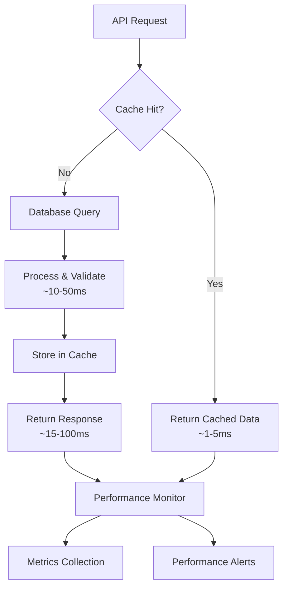

# ⚡ Performance & Monitoring - Optimization Guide

Comprehensive performance optimization and monitoring guide for the Remote Configuration System with metrics, caching strategies, and monitoring tools.

## 🎯 Performance Overview

The Remote Configuration System is optimized for high-performance operation with intelligent caching, efficient data structures, and comprehensive monitoring.

### Performance Metrics



### Key Performance Indicators

- 🚀 **Response Time**: < 100ms for cache hits, < 500ms for cache misses
- 📊 **Cache Hit Rate**: > 90% for configuration requests
- 🔄 **Throughput**: > 1000 requests per second
- 💾 **Memory Usage**: < 512MB Redis cache
- 📡 **WebSocket Latency**: < 50ms for real-time updates

## 📊 Performance Monitoring

### Performance Metrics Collection

```javascript
import { performance } from "perf_hooks";
import { cache } from "../../../config/redis.js";

export class PerformanceMonitor {
  constructor() {
    this.metrics = {
      requests: new Map(),
      cacheStats: new Map(),
      responseTimeHistory: [],
      errorCounts: new Map(),
    };

    this.startTime = Date.now();
    this.requestCount = 0;
    this.cacheHits = 0;
    this.cacheMisses = 0;
  }

  // Request timing middleware
  middleware() {
    return (req, res, next) => {
      const startTime = performance.now();
      const requestId = this.generateRequestId();

      req.performanceId = requestId;
      req.startTime = startTime;

      // Override res.end to capture metrics
      const originalEnd = res.end;
      res.end = function (...args) {
        const endTime = performance.now();
        const duration = endTime - startTime;

        this.performanceMonitor.recordRequest({
          requestId,
          method: req.method,
          url: req.url,
          statusCode: res.statusCode,
          duration,
          timestamp: new Date().toISOString(),
          userAgent: req.get("User-Agent"),
          ip: req.ip,
        });

        originalEnd.apply(this, args);
      }.bind({ performanceMonitor: this });

      next();
    };
  }

  recordRequest(data) {
    this.requestCount++;
    this.responseTimeHistory.push(data.duration);

    // Keep only last 1000 entries for history
    if (this.responseTimeHistory.length > 1000) {
      this.responseTimeHistory.shift();
    }

    // Store detailed metrics
    this.metrics.requests.set(data.requestId, data);

    // Clean old requests (keep only last hour)
    this.cleanOldMetrics();

    // Log slow requests
    if (data.duration > 1000) {
      // > 1 second
      console.warn("Slow request detected:", {
        url: data.url,
        method: data.method,
        duration: `${data.duration.toFixed(2)}ms`,
        statusCode: data.statusCode,
      });
    }

    // Update real-time stats
    this.updateRealtimeStats(data);
  }

  recordCacheHit() {
    this.cacheHits++;
  }

  recordCacheMiss() {
    this.cacheMisses++;
  }

  getCacheHitRate() {
    const total = this.cacheHits + this.cacheMisses;
    return total > 0 ? ((this.cacheHits / total) * 100).toFixed(2) : "0.00";
  }

  getAverageResponseTime() {
    if (this.responseTimeHistory.length === 0) return 0;

    const sum = this.responseTimeHistory.reduce((a, b) => a + b, 0);
    return (sum / this.responseTimeHistory.length).toFixed(2);
  }

  getPercentileResponseTime(percentile = 95) {
    if (this.responseTimeHistory.length === 0) return 0;

    const sorted = [...this.responseTimeHistory].sort((a, b) => a - b);
    const index = Math.ceil((percentile / 100) * sorted.length) - 1;
    return sorted[index].toFixed(2);
  }

  getMetricsSummary() {
    const uptime = Date.now() - this.startTime;
    const requestsPerSecond = this.requestCount / (uptime / 1000);

    return {
      uptime: this.formatUptime(uptime),
      totalRequests: this.requestCount,
      requestsPerSecond: requestsPerSecond.toFixed(2),
      cacheHitRate: this.getCacheHitRate() + "%",
      averageResponseTime: this.getAverageResponseTime() + "ms",
      p95ResponseTime: this.getPercentileResponseTime(95) + "ms",
      p99ResponseTime: this.getPercentileResponseTime(99) + "ms",
      memoryUsage: this.getMemoryUsage(),
      timestamp: new Date().toISOString(),
    };
  }

  getDetailedMetrics() {
    const recentRequests = Array.from(this.metrics.requests.values())
      .filter((req) => {
        const requestTime = new Date(req.timestamp).getTime();
        const tenMinutesAgo = Date.now() - 10 * 60 * 1000;
        return requestTime > tenMinutesAgo;
      })
      .sort((a, b) => new Date(b.timestamp) - new Date(a.timestamp))
      .slice(0, 100);

    return {
      summary: this.getMetricsSummary(),
      recentRequests,
      responseTimeDistribution: this.getResponseTimeDistribution(),
      statusCodeDistribution: this.getStatusCodeDistribution(),
      slowestRequests: this.getSlowestRequests(),
      errorRate: this.getErrorRate(),
    };
  }

  getResponseTimeDistribution() {
    const buckets = {
      "0-50ms": 0,
      "51-100ms": 0,
      "101-250ms": 0,
      "251-500ms": 0,
      "501-1000ms": 0,
      "1000ms+": 0,
    };

    this.responseTimeHistory.forEach((time) => {
      if (time <= 50) buckets["0-50ms"]++;
      else if (time <= 100) buckets["51-100ms"]++;
      else if (time <= 250) buckets["101-250ms"]++;
      else if (time <= 500) buckets["251-500ms"]++;
      else if (time <= 1000) buckets["501-1000ms"]++;
      else buckets["1000ms+"]++;
    });

    return buckets;
  }

  getStatusCodeDistribution() {
    const distribution = {};

    Array.from(this.metrics.requests.values()).forEach((req) => {
      const statusCode = req.statusCode;
      distribution[statusCode] = (distribution[statusCode] || 0) + 1;
    });

    return distribution;
  }

  getSlowestRequests(limit = 10) {
    return Array.from(this.metrics.requests.values())
      .sort((a, b) => b.duration - a.duration)
      .slice(0, limit)
      .map((req) => ({
        url: req.url,
        method: req.method,
        duration: req.duration.toFixed(2) + "ms",
        statusCode: req.statusCode,
        timestamp: req.timestamp,
      }));
  }

  getErrorRate() {
    const total = this.requestCount;
    const errors = Array.from(this.metrics.requests.values()).filter(
      (req) => req.statusCode >= 400
    ).length;

    return total > 0 ? ((errors / total) * 100).toFixed(2) + "%" : "0.00%";
  }

  getMemoryUsage() {
    const used = process.memoryUsage();
    return {
      rss: Math.round(used.rss / 1024 / 1024) + "MB",
      heapUsed: Math.round(used.heapUsed / 1024 / 1024) + "MB",
      heapTotal: Math.round(used.heapTotal / 1024 / 1024) + "MB",
      external: Math.round(used.external / 1024 / 1024) + "MB",
    };
  }

  formatUptime(uptime) {
    const seconds = Math.floor(uptime / 1000);
    const minutes = Math.floor(seconds / 60);
    const hours = Math.floor(minutes / 60);
    const days = Math.floor(hours / 24);

    if (days > 0) return `${days}d ${hours % 24}h ${minutes % 60}m`;
    if (hours > 0) return `${hours}h ${minutes % 60}m ${seconds % 60}s`;
    if (minutes > 0) return `${minutes}m ${seconds % 60}s`;
    return `${seconds}s`;
  }

  updateRealtimeStats(data) {
    // Update Redis with real-time statistics
    const stats = {
      totalRequests: this.requestCount,
      cacheHitRate: this.getCacheHitRate(),
      averageResponseTime: this.getAverageResponseTime(),
      lastRequestTime: data.timestamp,
      timestamp: new Date().toISOString(),
    };

    cache.setex("config:performance:realtime", 300, JSON.stringify(stats));
  }

  cleanOldMetrics() {
    const oneHourAgo = Date.now() - 60 * 60 * 1000;

    for (const [requestId, request] of this.metrics.requests) {
      const requestTime = new Date(request.timestamp).getTime();
      if (requestTime < oneHourAgo) {
        this.metrics.requests.delete(requestId);
      }
    }
  }

  generateRequestId() {
    return `req_${Date.now()}_${Math.random().toString(36).substr(2, 9)}`;
  }
}

// Create singleton instance
const performanceMonitor = new PerformanceMonitor();
export default performanceMonitor;
```

### Cache Performance Monitoring

```javascript
export class CachePerformanceMonitor {
  constructor() {
    this.stats = {
      hits: 0,
      misses: 0,
      sets: 0,
      deletes: 0,
      errors: 0,
      totalTime: 0,
      operationTimes: [],
    };
  }

  async recordOperation(operation, key, fn) {
    const startTime = performance.now();

    try {
      const result = await fn();
      const endTime = performance.now();
      const duration = endTime - startTime;

      this.recordOperationSuccess(operation, duration);

      return result;
    } catch (error) {
      const endTime = performance.now();
      const duration = endTime - startTime;

      this.recordOperationError(operation, duration, error);

      throw error;
    }
  }

  recordOperationSuccess(operation, duration) {
    this.stats[operation]++;
    this.stats.totalTime += duration;
    this.stats.operationTimes.push({
      operation,
      duration,
      timestamp: Date.now(),
    });

    // Keep only last 1000 operations
    if (this.stats.operationTimes.length > 1000) {
      this.stats.operationTimes.shift();
    }
  }

  recordOperationError(operation, duration, error) {
    this.stats.errors++;
    this.stats.totalTime += duration;

    console.error(`Cache ${operation} error:`, {
      operation,
      duration: duration.toFixed(2) + "ms",
      error: error.message,
    });
  }

  getCacheStats() {
    const total = this.stats.hits + this.stats.misses;
    const hitRate =
      total > 0 ? ((this.stats.hits / total) * 100).toFixed(2) : "0.00";
    const avgTime =
      this.stats.operationTimes.length > 0
        ? (this.stats.totalTime / this.stats.operationTimes.length).toFixed(2)
        : "0.00";

    return {
      hitRate: hitRate + "%",
      totalOperations:
        this.stats.hits +
        this.stats.misses +
        this.stats.sets +
        this.stats.deletes,
      hits: this.stats.hits,
      misses: this.stats.misses,
      sets: this.stats.sets,
      deletes: this.stats.deletes,
      errors: this.stats.errors,
      averageTime: avgTime + "ms",
      timestamp: new Date().toISOString(),
    };
  }

  getRecentOperations(limit = 50) {
    return this.stats.operationTimes.slice(-limit).map((op) => ({
      operation: op.operation,
      duration: op.duration.toFixed(2) + "ms",
      timestamp: new Date(op.timestamp).toISOString(),
    }));
  }
}

const cacheMonitor = new CachePerformanceMonitor();
export { cacheMonitor };
```

## 🚀 Performance Optimization

### Redis Cache Optimization

```javascript
export class OptimizedCacheManager {
  constructor(redisClient) {
    this.redis = redisClient;
    this.compressionThreshold = 1024; // Compress data > 1KB
    this.defaultTTL = 3600; // 1 hour
    this.pipeline = null;
  }

  // Efficient multi-key retrieval
  async mget(keys, useCompression = true) {
    const startTime = performance.now();

    try {
      const values = await this.redis.mget(keys);
      const result = {};

      for (let i = 0; i < keys.length; i++) {
        if (values[i] !== null) {
          result[keys[i]] = useCompression
            ? this.decompress(values[i])
            : JSON.parse(values[i]);
        }
      }

      cacheMonitor.recordOperation("hits", null, () => Promise.resolve(result));

      return result;
    } catch (error) {
      cacheMonitor.recordOperation("errors", null, () => Promise.reject(error));
      throw error;
    }
  }

  // Efficient multi-key storage
  async mset(keyValuePairs, ttl = this.defaultTTL, useCompression = true) {
    const pipeline = this.redis.pipeline();

    for (const [key, value] of Object.entries(keyValuePairs)) {
      const serialized = JSON.stringify(value);
      const compressed =
        useCompression && serialized.length > this.compressionThreshold
          ? this.compress(serialized)
          : serialized;

      pipeline.setex(key, ttl, compressed);
    }

    const results = await pipeline.exec();
    cacheMonitor.recordOperation("sets", null, () => Promise.resolve(results));

    return results;
  }

  // Intelligent cache invalidation
  async invalidatePattern(pattern) {
    const keys = await this.redis.keys(pattern);

    if (keys.length === 0) return 0;

    // Use pipeline for bulk deletion
    const pipeline = this.redis.pipeline();
    keys.forEach((key) => pipeline.del(key));

    const results = await pipeline.exec();
    const deletedCount = results.filter((result) => result[1] === 1).length;

    console.log(
      `Cache invalidation: ${deletedCount} keys deleted for pattern: ${pattern}`
    );

    return deletedCount;
  }

  // Cache warming
  async warmCache(configurations) {
    console.log("Starting cache warming process...");
    const startTime = performance.now();

    const pipeline = this.redis.pipeline();
    let warmedCount = 0;

    for (const [key, config] of Object.entries(configurations)) {
      const cacheKey = `config:${key}`;
      const serialized = JSON.stringify(config);
      const compressed =
        serialized.length > this.compressionThreshold
          ? this.compress(serialized)
          : serialized;

      pipeline.setex(cacheKey, this.defaultTTL, compressed);
      warmedCount++;
    }

    await pipeline.exec();

    const endTime = performance.now();
    const duration = (endTime - startTime).toFixed(2);

    console.log(`Cache warmed: ${warmedCount} configurations in ${duration}ms`);

    return { warmedCount, duration };
  }

  compress(data) {
    // Simple gzip compression for demonstration
    // In production, use a proper compression library
    return Buffer.from(data).toString("base64");
  }

  decompress(data) {
    // Simple decompression for demonstration
    return Buffer.from(data, "base64").toString("utf8");
  }

  // Memory usage monitoring
  async getMemoryUsage() {
    const info = await this.redis.info("memory");
    const lines = info.split("\r\n");
    const memoryInfo = {};

    lines.forEach((line) => {
      if (line.includes(":")) {
        const [key, value] = line.split(":");
        if (key.startsWith("used_memory")) {
          memoryInfo[key] = parseInt(value);
        }
      }
    });

    return {
      usedMemory: Math.round(memoryInfo.used_memory / 1024 / 1024) + "MB",
      usedMemoryPeak:
        Math.round(memoryInfo.used_memory_peak / 1024 / 1024) + "MB",
      usedMemoryRss:
        Math.round(memoryInfo.used_memory_rss / 1024 / 1024) + "MB",
    };
  }
}
```

### Query Optimization

```javascript
export class QueryOptimizer {
  constructor(cacheManager) {
    this.cache = cacheManager;
    this.queryCache = new Map();
    this.batchSize = 100;
  }

  // Batch configuration loading
  async loadConfigurationsBatch(screenNames, forceRefresh = false) {
    if (!forceRefresh) {
      // Try to get from cache first
      const cacheKeys = screenNames.map((screen) => `config:screen:${screen}`);
      const cached = await this.cache.mget(cacheKeys);

      const missingScreens = [];
      const result = {};

      screenNames.forEach((screen, index) => {
        if (cached[cacheKeys[index]]) {
          result[screen] = cached[cacheKeys[index]];
          performanceMonitor.recordCacheHit();
        } else {
          missingScreens.push(screen);
          performanceMonitor.recordCacheMiss();
        }
      });

      // Load missing configurations
      if (missingScreens.length > 0) {
        const freshConfigs = await this.loadFromDatabase(missingScreens);

        // Cache the fresh configurations
        const cacheData = {};
        missingScreens.forEach((screen) => {
          if (freshConfigs[screen]) {
            result[screen] = freshConfigs[screen];
            cacheData[`config:screen:${screen}`] = freshConfigs[screen];
          }
        });

        if (Object.keys(cacheData).length > 0) {
          await this.cache.mset(cacheData);
        }
      }

      return result;
    }

    // Force refresh - load from database and update cache
    const freshConfigs = await this.loadFromDatabase(screenNames);

    const cacheData = {};
    screenNames.forEach((screen) => {
      if (freshConfigs[screen]) {
        cacheData[`config:screen:${screen}`] = freshConfigs[screen];
      }
    });

    if (Object.keys(cacheData).length > 0) {
      await this.cache.mset(cacheData);
    }

    return freshConfigs;
  }

  async loadFromDatabase(screenNames) {
    // Simulate database loading with batching
    const results = {};

    for (let i = 0; i < screenNames.length; i += this.batchSize) {
      const batch = screenNames.slice(i, i + this.batchSize);
      const batchResults = await this.loadBatchFromDatabase(batch);
      Object.assign(results, batchResults);
    }

    return results;
  }

  async loadBatchFromDatabase(screenNames) {
    // Simulate database query
    const startTime = performance.now();

    // In real implementation, this would be a database query
    await new Promise((resolve) => setTimeout(resolve, 10)); // Simulate 10ms DB query

    const endTime = performance.now();
    const duration = endTime - startTime;

    console.log(
      `Database batch query: ${screenNames.length} screens in ${duration.toFixed(2)}ms`
    );

    // Return mock data
    const results = {};
    screenNames.forEach((screen) => {
      results[screen] = {
        components: [],
        navigation: {},
        lastModified: new Date().toISOString(),
      };
    });

    return results;
  }

  // Query result caching with TTL
  async getCachedQuery(queryKey, queryFn, ttl = 300) {
    const cached = this.queryCache.get(queryKey);

    if (cached && cached.expiresAt > Date.now()) {
      return cached.data;
    }

    const result = await queryFn();

    this.queryCache.set(queryKey, {
      data: result,
      expiresAt: Date.now() + ttl * 1000,
    });

    return result;
  }

  // Clear expired query cache
  cleanupQueryCache() {
    const now = Date.now();
    for (const [key, value] of this.queryCache) {
      if (value.expiresAt <= now) {
        this.queryCache.delete(key);
      }
    }
  }
}
```

## 📈 Real-time Monitoring Dashboard

### WebSocket Performance Metrics

```javascript
export class WebSocketPerformanceMonitor {
  constructor(io) {
    this.io = io;
    this.connections = new Map();
    this.messageStats = {
      sent: 0,
      received: 0,
      errors: 0,
      totalLatency: 0,
    };

    this.setupMonitoring();
  }

  setupMonitoring() {
    this.io.on("connection", (socket) => {
      const connectionInfo = {
        id: socket.id,
        connectedAt: Date.now(),
        lastActivity: Date.now(),
        messagesSent: 0,
        messagesReceived: 0,
        ip: socket.handshake.address,
        userAgent: socket.handshake.headers["user-agent"],
      };

      this.connections.set(socket.id, connectionInfo);

      socket.on("ping", (callback) => {
        const pong = Date.now();
        callback(pong);

        // Calculate latency
        const latency = pong - Date.now();
        this.messageStats.totalLatency += latency;
      });

      socket.on("disconnect", () => {
        this.connections.delete(socket.id);
      });

      // Monitor all events
      const originalEmit = socket.emit;
      socket.emit = function (...args) {
        connectionInfo.messagesSent++;
        connectionInfo.lastActivity = Date.now();
        this.messageStats.sent++;
        return originalEmit.apply(this, args);
      }.bind(this);
    });
  }

  getConnectionStats() {
    const activeConnections = this.connections.size;
    const averageLatency =
      this.messageStats.sent > 0
        ? (this.messageStats.totalLatency / this.messageStats.sent).toFixed(2)
        : "0.00";

    return {
      activeConnections,
      totalMessagesSent: this.messageStats.sent,
      totalMessagesReceived: this.messageStats.received,
      errors: this.messageStats.errors,
      averageLatency: averageLatency + "ms",
      timestamp: new Date().toISOString(),
    };
  }

  getDetailedConnectionInfo() {
    const connections = Array.from(this.connections.values()).map((conn) => ({
      id: conn.id,
      connectedAt: new Date(conn.connectedAt).toISOString(),
      duration: this.formatDuration(Date.now() - conn.connectedAt),
      lastActivity: new Date(conn.lastActivity).toISOString(),
      messagesSent: conn.messagesSent,
      messagesReceived: conn.messagesReceived,
      ip: conn.ip,
    }));

    return {
      stats: this.getConnectionStats(),
      connections: connections.sort((a, b) => b.messagesSent - a.messagesSent),
    };
  }

  formatDuration(ms) {
    const seconds = Math.floor(ms / 1000);
    const minutes = Math.floor(seconds / 60);
    const hours = Math.floor(minutes / 60);

    if (hours > 0) return `${hours}h ${minutes % 60}m`;
    if (minutes > 0) return `${minutes}m ${seconds % 60}s`;
    return `${seconds}s`;
  }
}
```

### Health Check Endpoint

```javascript
export class HealthChecker {
  constructor(cacheManager, performanceMonitor) {
    this.cache = cacheManager;
    this.monitor = performanceMonitor;
  }

  async getDetailedHealth() {
    const startTime = performance.now();

    const health = {
      status: "healthy",
      timestamp: new Date().toISOString(),
      version: process.env.npm_package_version || "1.0.0",
      uptime: process.uptime(),
      checks: {},
    };

    try {
      // Check Redis connectivity
      await this.checkRedis(health.checks);

      // Check memory usage
      await this.checkMemoryUsage(health.checks);

      // Check performance metrics
      await this.checkPerformanceMetrics(health.checks);

      // Check cache performance
      await this.checkCachePerformance(health.checks);

      // Determine overall health status
      const failedChecks = Object.values(health.checks).filter(
        (check) => check.status !== "healthy"
      );

      if (failedChecks.length > 0) {
        const criticalFailures = failedChecks.filter(
          (check) => check.status === "critical"
        );
        health.status = criticalFailures.length > 0 ? "critical" : "warning";
      }

      health.responseTime = (performance.now() - startTime).toFixed(2) + "ms";
    } catch (error) {
      health.status = "critical";
      health.error = error.message;
    }

    return health;
  }

  async checkRedis(checks) {
    try {
      const pingStart = performance.now();
      await this.cache.redis.ping();
      const pingTime = (performance.now() - pingStart).toFixed(2);

      const memoryUsage = await this.cache.getMemoryUsage();

      checks.redis = {
        status: "healthy",
        responseTime: pingTime + "ms",
        memoryUsage: memoryUsage,
        connected: true,
      };
    } catch (error) {
      checks.redis = {
        status: "critical",
        error: error.message,
        connected: false,
      };
    }
  }

  async checkMemoryUsage(checks) {
    const usage = process.memoryUsage();
    const usedMB = Math.round(usage.heapUsed / 1024 / 1024);
    const totalMB = Math.round(usage.heapTotal / 1024 / 1024);
    const usagePercent = ((usedMB / totalMB) * 100).toFixed(2);

    let status = "healthy";
    if (usagePercent > 90) status = "critical";
    else if (usagePercent > 80) status = "warning";

    checks.memory = {
      status,
      used: usedMB + "MB",
      total: totalMB + "MB",
      percentage: usagePercent + "%",
      rss: Math.round(usage.rss / 1024 / 1024) + "MB",
    };
  }

  async checkPerformanceMetrics(checks) {
    const metrics = this.monitor.getMetricsSummary();
    const avgResponseTime = parseFloat(metrics.averageResponseTime);
    const p95ResponseTime = parseFloat(metrics.p95ResponseTime);

    let status = "healthy";
    if (p95ResponseTime > 1000) status = "critical";
    else if (p95ResponseTime > 500) status = "warning";

    checks.performance = {
      status,
      averageResponseTime: metrics.averageResponseTime,
      p95ResponseTime: metrics.p95ResponseTime,
      requestsPerSecond: metrics.requestsPerSecond,
      totalRequests: metrics.totalRequests,
    };
  }

  async checkCachePerformance(checks) {
    const cacheStats = cacheMonitor.getCacheStats();
    const hitRate = parseFloat(cacheStats.hitRate);

    let status = "healthy";
    if (hitRate < 70) status = "critical";
    else if (hitRate < 80) status = "warning";

    checks.cache = {
      status,
      hitRate: cacheStats.hitRate,
      totalOperations: cacheStats.totalOperations,
      errors: cacheStats.errors,
      averageTime: cacheStats.averageTime,
    };
  }
}
```

## 📊 Performance Analytics

### Performance Analytics Endpoint

```javascript
export async function getPerformanceAnalytics(req, res) {
  try {
    const analytics = {
      summary: performanceMonitor.getMetricsSummary(),
      detailed: performanceMonitor.getDetailedMetrics(),
      cache: cacheMonitor.getCacheStats(),
      recentOperations: cacheMonitor.getRecentOperations(),
      health: await healthChecker.getDetailedHealth(),
      trends: await getPerformanceTrends(),
    };

    res.json({
      success: true,
      analytics,
      timestamp: new Date().toISOString(),
    });
  } catch (error) {
    console.error("Performance analytics error:", error);
    res.status(500).json({
      success: false,
      message: "Failed to retrieve performance analytics",
      error: "ANALYTICS_ERROR",
      timestamp: new Date().toISOString(),
    });
  }
}

async function getPerformanceTrends() {
  // Get hourly performance data from Redis
  const hours = [];
  for (let i = 23; i >= 0; i--) {
    const hour = new Date(Date.now() - i * 60 * 60 * 1000);
    const hourKey = `perf:hour:${hour.getFullYear()}-${hour.getMonth()}-${hour.getDate()}-${hour.getHours()}`;

    const hourData = await cache.get(hourKey);
    if (hourData) {
      hours.push({
        hour: hour.toISOString(),
        ...JSON.parse(hourData),
      });
    }
  }

  return {
    last24Hours: hours,
    trend: calculateTrend(hours),
  };
}

function calculateTrend(data) {
  if (data.length < 2) return "stable";

  const recent = data.slice(-6); // Last 6 hours
  const earlier = data.slice(-12, -6); // 6 hours before that

  const recentAvg =
    recent.reduce((sum, d) => sum + parseFloat(d.averageResponseTime || 0), 0) /
    recent.length;
  const earlierAvg =
    earlier.reduce(
      (sum, d) => sum + parseFloat(d.averageResponseTime || 0),
      0
    ) / earlier.length;

  const change = ((recentAvg - earlierAvg) / earlierAvg) * 100;

  if (change > 10) return "degrading";
  if (change < -10) return "improving";
  return "stable";
}
```

## 🔗 Performance Best Practices

### 1. Caching Strategy

```javascript
// Implement intelligent caching with TTL
const CACHE_STRATEGIES = {
  static: { ttl: 3600 * 24 }, // 24 hours for static configs
  dynamic: { ttl: 300 }, // 5 minutes for dynamic configs
  user: { ttl: 900 }, // 15 minutes for user-specific configs
};
```

### 2. Connection Pooling

```javascript
// Redis connection pooling
const redis = new Redis({
  host: process.env.REDIS_HOST,
  port: process.env.REDIS_PORT,
  maxRetriesPerRequest: 3,
  retryDelayOnFailover: 100,
  enableReadyCheck: false,
  maxLoadingTimeout: 1000,
  lazyConnect: true,
});
```

### 3. Request Batching

```javascript
// Batch multiple configuration requests
app.post("/api/config/batch", async (req, res) => {
  const { screens } = req.body;
  const configs = await queryOptimizer.loadConfigurationsBatch(screens);
  res.json({ success: true, configs });
});
```

### 4. Compression

```javascript
// Enable response compression
import compression from "compression";
app.use(
  compression({
    threshold: 1024,
    level: 6,
  })
);
```

## 🚨 Performance Alerts

### Alert Configuration

```javascript
export class PerformanceAlerter {
  constructor() {
    this.thresholds = {
      responseTime: { warning: 500, critical: 1000 },
      errorRate: { warning: 5, critical: 10 },
      cacheHitRate: { warning: 80, critical: 70 },
      memoryUsage: { warning: 80, critical: 90 },
    };

    this.alertHistory = new Map();
    this.cooldownPeriod = 300000; // 5 minutes
  }

  async checkThresholds() {
    const metrics = performanceMonitor.getMetricsSummary();
    const health = await healthChecker.getDetailedHealth();

    this.checkResponseTime(parseFloat(metrics.p95ResponseTime));
    this.checkErrorRate(parseFloat(metrics.errorRate));
    this.checkCacheHitRate(parseFloat(metrics.cacheHitRate));
    this.checkMemoryUsage(health.checks.memory?.percentage);
  }

  async sendAlert(type, level, message, data) {
    const alertKey = `${type}_${level}`;
    const lastAlert = this.alertHistory.get(alertKey);

    if (lastAlert && Date.now() - lastAlert < this.cooldownPeriod) {
      return; // Still in cooldown period
    }

    this.alertHistory.set(alertKey, Date.now());

    const alert = {
      type,
      level,
      message,
      data,
      timestamp: new Date().toISOString(),
      environment: process.env.NODE_ENV,
    };

    console.warn("Performance Alert:", alert);

    // Send to external monitoring systems
    // await sendToSlack(alert);
    // await sendToWebhook(alert);
  }
}
```

## 🔗 Related Documentation

- [API Reference](./12-api-reference.md) - Performance endpoints
- [Security & Authentication](./13-security-auth.md) - Security monitoring
- [Configuration Reference](./19-configuration-reference.md) - Performance settings
- [Troubleshooting](./16-troubleshooting.md) - Performance troubleshooting

---

**Monitor Everything! 📊**

Use these performance monitoring tools to keep your Remote Configuration System running at peak efficiency.
