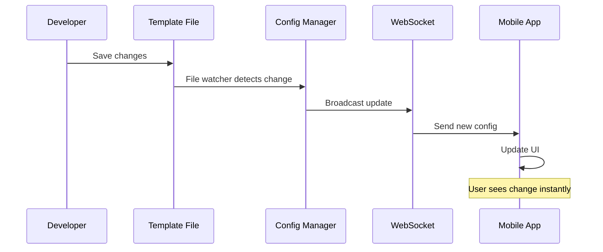

# 📚 Common Workflows - Real-World Usage Examples

Practical examples of the most common tasks you'll perform with the remote configuration system.

## 🎯 Quick Reference

| Task                   | Files to Change                               | Time        |
| ---------------------- | --------------------------------------------- | ----------- |
| Change button text     | 1 template file                               | 30 seconds  |
| Change colors/styling  | 1 template file                               | 1 minute    |
| Add new button         | 1 template file                               | 2 minutes   |
| Add new screen         | 4 files (template, schema, constants, routes) | 15 minutes  |
| Add new component type | Multiple files + frontend                     | 30+ minutes |

## 🔄 Workflow 1: Updating Existing Screen Content

### Scenario: Change login button text from "Login" to "Sign In"

**Files to modify:** 1 file
**Time:** 30 seconds

#### Step 1: Locate the Template

```bash
# Open the Auth template
code remote-config/templates/Auth.template.json
```

#### Step 2: Find and Update the Button

```json
// Find this:
{
  "type": "Button",
  "props": {
    "text": "Login"  // 👈 Change this
  }
}

// Change to:
{
  "type": "Button",
  "props": {
    "text": "Sign In"  // ✅ Updated
  }
}
```

#### Step 3: Save and See Results

- Save the file
- Changes appear instantly in the app! 🎉

### Real-time Update Flow



---

## 🎨 Workflow 2: Changing Colors and Styling

### Scenario: Update app theme colors across multiple components

**Files to modify:** 1-3 template files
**Time:** 5 minutes

#### Step 1: Update Global Styles

```json
// In any template file, update globalStyles:
{
  "globalStyles": {
    "primaryColor": "#ff6b6b", // Changed from blue to red
    "secondaryColor": "#4ecdc4", // Changed from gray to teal
    "backgroundColor": "#f8f9fa" // Keep same
  }
}
```

#### Step 2: Update Individual Components

```json
// Update button colors:
{
  "type": "Button",
  "props": {
    "text": "Login"
  },
  "style": {
    "backgroundColor": "{{primaryColor}}",  // Uses global color
    "color": "#ffffff"
  }
}

// Update text colors:
{
  "type": "Text",
  "props": {
    "text": "Welcome"
  },
  "style": {
    "color": "{{primaryColor}}",  // Uses global color
    "fontSize": 24
  }
}
```

#### Step 3: Batch Update Multiple Screens

```bash
# Use API to update multiple screens at once
curl -X POST http://localhost:5001/api/config/update-bulk \
  -H "Content-Type: application/json" \
  -d '{
    "updates": {
      "Auth": {
        "globalStyles.primaryColor": "#ff6b6b"
      },
      "Home": {
        "globalStyles.primaryColor": "#ff6b6b"
      },
      "Profile": {
        "globalStyles.primaryColor": "#ff6b6b"
      }
    }
  }'
```

---

## ➕ Workflow 3: Adding New Components to Existing Screen

### Scenario: Add a "Forgot Password" link to the Auth screen

**Files to modify:** 1 template file
**Time:** 3 minutes

#### Step 1: Find Insertion Point

```json
// In Auth.template.json, find the login button:
{
  "type": "Button",
  "props": {
    "text": "Login"
  },
  "style": {
    "backgroundColor": "#007bff"
  }
},
// 👈 Add new component after this
```

#### Step 2: Add the Component

```json
{
  "type": "Button",
  "props": {
    "text": "Login"
  },
  "style": {
    "backgroundColor": "#007bff"
  }
},
{
  "type": "TouchableOpacity",  // 👈 New component
  "style": {
    "marginTop": 15,
    "alignItems": "center"
  },
  "actions": {
    "onPress": {
      "type": "navigate",
      "target": "ForgotPassword"
    }
  },
  "children": [
    {
      "type": "Text",
      "props": {
        "text": "Forgot Password?"
      },
      "style": {
        "color": "#007bff",
        "fontSize": 14,
        "textDecorationLine": "underline"
      }
    }
  ]
}
```

#### Step 3: Test the Addition

- Save the file
- Check if the link appears
- Test the navigation action

---

## 📱 Workflow 4: Creating a Complete New Screen

### Scenario: Create a "Settings" screen

**Files to modify:** 4 files
**Time:** 15 minutes

#### Step 1: Add Screen Name Constant

**File:** `Labor2Hire/src/constants/ScreenNames.ts`

```typescript
export const SCREEN_NAMES = {
  // ... existing screens
  SETTINGS: "Settings", // 👈 Add this
} as const;
```

#### Step 2: Create Schema File

**File:** `remote-config/schemas/Settings.schema.json`

```json
{
  "$schema": "http://json-schema.org/draft-07/schema#",
  "title": "Settings Screen Configuration Schema",
  "type": "object",
  "required": ["screenType", "metadata", "components"],
  "properties": {
    "screenType": {
      "type": "string",
      "enum": ["Settings"]
    },
    "metadata": {
      "type": "object",
      "required": ["screenTitle", "description", "version", "lastUpdated"],
      "properties": {
        "screenTitle": { "type": "string" },
        "description": { "type": "string" },
        "version": { "type": "string" },
        "lastUpdated": { "type": "string" }
      }
    },
    "components": {
      "type": "array",
      "items": { "$ref": "#/definitions/Component" }
    }
  },
  "definitions": {
    "Component": {
      "type": "object",
      "required": ["type"],
      "properties": {
        "type": { "type": "string" },
        "props": { "type": "object" },
        "style": { "type": "object" },
        "children": {
          "type": "array",
          "items": { "$ref": "#/definitions/Component" }
        }
      }
    }
  }
}
```

#### Step 3: Create Template File

**File:** `remote-config/templates/Settings.template.json`

```json
{
  "screenType": "Settings",
  "metadata": {
    "screenTitle": "Settings",
    "description": "App settings and preferences",
    "version": "1.0.0",
    "lastUpdated": "2025-08-10T00:00:00Z"
  },
  "globalStyles": {
    "backgroundColor": "#f8f9fa"
  },
  "components": [
    {
      "type": "SafeAreaView",
      "style": { "flex": 1, "backgroundColor": "#f8f9fa" },
      "children": [
        {
          "type": "ScrollView",
          "style": { "flex": 1, "padding": 20 },
          "children": [
            {
              "type": "Text",
              "props": { "text": "Settings" },
              "style": {
                "fontSize": 28,
                "fontWeight": "bold",
                "color": "#2c3e50",
                "marginBottom": 30
              }
            },
            {
              "type": "View",
              "style": {
                "backgroundColor": "#ffffff",
                "borderRadius": 12,
                "padding": 20
              },
              "children": [
                {
                  "type": "Text",
                  "props": { "text": "Notifications" },
                  "style": {
                    "fontSize": 18,
                    "fontWeight": "bold",
                    "marginBottom": 15
                  }
                },
                {
                  "type": "View",
                  "style": {
                    "flexDirection": "row",
                    "justifyContent": "space-between",
                    "alignItems": "center",
                    "paddingVertical": 10
                  },
                  "children": [
                    {
                      "type": "Text",
                      "props": { "text": "Push Notifications" },
                      "style": { "fontSize": 16 }
                    },
                    {
                      "type": "Switch",
                      "props": {
                        "value": true,
                        "trackColor": { "false": "#d3d3d3", "true": "#007bff" }
                      }
                    }
                  ]
                }
              ]
            }
          ]
        }
      ]
    }
  ]
}
```

#### Step 4: Add Route to Navigation

**File:** `remote-config/templates/App.template.json`

```json
{
  "navigation": {
    "routes": [
      // ... existing routes
      {
        "name": "Settings",
        "component": "Settings",
        "options": {
          "title": "Settings",
          "headerShown": true
        }
      }
    ]
  }
}
```

#### Step 5: Test the New Screen

```bash
# Validate schema
npm run validate:schema Settings

# Test API endpoint
curl http://localhost:5001/api/config/screen/Settings

# Navigate to screen in app
# Add a button somewhere that navigates to Settings
```

---

## 🛠️ Workflow 5: Setting Up Routes and Navigation

### Scenario: Add navigation between screens

#### Step 1: Define Navigation Structure

**File:** `remote-config/templates/App.template.json`

```json
{
  "navigation": {
    "initialRoute": "LanguageSelection",
    "routes": [
      {
        "name": "LanguageSelection",
        "component": "ChooseLanguage",
        "options": {
          "headerShown": false
        }
      },
      {
        "name": "Auth",
        "component": "Auth",
        "options": {
          "title": "Login",
          "headerShown": true,
          "headerBackVisible": false
        }
      },
      {
        "name": "Home",
        "component": "Home",
        "options": {
          "title": "Home",
          "headerShown": true,
          "headerLeft": null
        }
      },
      {
        "name": "Profile",
        "component": "Profile",
        "options": {
          "title": "Profile",
          "headerShown": true,
          "headerBackVisible": true
        }
      }
    ]
  }
}
```

#### Step 2: Add Navigation Actions to Components

```json
// Navigation button
{
  "type": "Button",
  "props": {
    "text": "Go to Profile"
  },
  "actions": {
    "onPress": {
      "type": "navigate",
      "target": "Profile",
      "params": {
        "userId": "{{USER_ID}}"
      }
    }
  }
}

// Back button
{
  "type": "Button",
  "props": {
    "text": "Back"
  },
  "actions": {
    "onPress": {
      "type": "goBack"
    }
  }
}

// Replace screen (no back option)
{
  "type": "Button",
  "props": {
    "text": "Login"
  },
  "actions": {
    "onPress": {
      "type": "replace",
      "target": "Home"
    }
  }
}

// Reset navigation stack
{
  "type": "Button",
  "props": {
    "text": "Logout"
  },
  "actions": {
    "onPress": {
      "type": "reset",
      "target": "Auth"
    }
  }
}
```

---

## 🔄 Workflow 6: Cache Management

### Scenario: Clear cache and force reload configurations

#### Method 1: API Cache Management

```bash
# Clear specific screen cache
curl -X POST http://localhost:5001/api/config/clear-cache \
  -H "Content-Type: application/json" \
  -d '{"screen": "Auth"}'

# Clear all cache
curl -X POST http://localhost:5001/api/config/clear-cache \
  -H "Content-Type: application/json" \
  -d '{"clearAll": true}'

# Force reload from files
curl -X POST http://localhost:5001/api/config/reload/Auth
```

#### Method 2: File System Restart

```bash
# Restart the backend server
npm run dev

# Or just restart config manager
curl -X POST http://localhost:5001/api/config/restart
```

#### Method 3: Frontend Cache Clear

```typescript
// In React Native app
import AsyncStorage from "@react-native-async-storage/async-storage";

// Clear config cache
await AsyncStorage.removeItem("@Labor2Hire:ConfigCache");

// Clear all app cache
await AsyncStorage.clear();
```

---

## 🧪 Workflow 7: Testing and Validation

### Scenario: Validate changes before deployment

#### Step 1: Schema Validation

```bash
# Validate specific screen
npm run validate:schema Auth

# Validate all schemas
npm run validate:all

# Check for schema errors
npm run lint:schemas
```

#### Step 2: API Testing

```bash
# Test configuration endpoints
curl http://localhost:5001/api/config/health
curl http://localhost:5001/api/config/all
curl http://localhost:5001/api/config/screen/Auth

# Test WebSocket connection
node remote-config/test-cache-fix.js
```

#### Step 3: Frontend Integration Testing

```javascript
// Test configuration loading
const testConfig = async () => {
  const response = await fetch("http://localhost:5001/api/config/screen/Auth");
  const config = await response.json();
  console.log("Config loaded:", config);
};

// Test WebSocket updates
const testWebSocket = () => {
  const ws = new WebSocket("ws://localhost:5001/config-socket");
  ws.onmessage = (event) => {
    const data = JSON.parse(event.data);
    console.log("WebSocket update:", data);
  };
};
```

---

## 🐛 Workflow 8: Debugging Common Issues

### Issue 1: Screen Not Loading

#### Symptoms:

- Blank screen or error message
- "Configuration not found" error

#### Debug Steps:

```bash
# 1. Check if template file exists
ls remote-config/templates/ScreenName.template.json

# 2. Validate schema
npm run validate:schema ScreenName

# 3. Check server logs
tail -f logs/application-*.log

# 4. Test API directly
curl http://localhost:5001/api/config/screen/ScreenName

# 5. Check WebSocket connection
curl http://localhost:5001/api/config/websocket/stats
```

### Issue 2: Component Not Rendering

#### Symptoms:

- Component missing from screen
- Incorrect component appearance

#### Debug Steps:

```json
// 1. Check component definition
{
  "type": "Button",  // ✅ Check spelling
  "props": {
    "text": "Click Me"  // ✅ Check required props
  },
  "style": {
    "backgroundColor": "#007bff"  // ✅ Check valid styles
  }
}

// 2. Check parent-child relationship
{
  "type": "View",
  "children": [  // ✅ Make sure children array exists
    {
      "type": "Button",
      "props": { "text": "Child Button" }
    }
  ]
}
```

### Issue 3: Actions Not Working

#### Symptoms:

- Button clicks do nothing
- Navigation doesn't work

#### Debug Steps:

```json
// 1. Check action syntax
{
  "actions": {
    "onPress": {
      // ✅ Correct event name
      "type": "navigate", // ✅ Valid action type
      "target": "Home" // ✅ Valid screen name
    }
  }
}

// 2. Check frontend action handler

// Make sure the action type is supported in DynamicRenderer.tsx
```

---

## 📊 Workflow 9: Performance Optimization

### Scenario: Optimize configuration loading and rendering

#### Step 1: Monitor Performance

```bash
# Check config loading times
curl -w "@curl-format.txt" http://localhost:5001/api/config/screen/Auth

# Monitor WebSocket performance
curl http://localhost:5001/api/config/stats
```

#### Step 2: Optimize Templates

```json
// ❌ Bad: Too many nested levels
{
  "type": "View",
  "children": [
    {
      "type": "View",
      "children": [
        {
          "type": "View",
          "children": [
            { "type": "Text", "props": { "text": "Deep nesting" } }
          ]
        }
      ]
    }
  ]
}

// ✅ Good: Flatter structure
{
  "type": "View",
  "style": { "padding": 20 },
  "children": [
    { "type": "Text", "props": { "text": "Better structure" } }
  ]
}
```

#### Step 3: Use Conditional Rendering

```json
// Only render when needed
{
  "type": "AdminPanel",
  "conditions": {
    "if": {
      "operator": "equals",
      "field": "user.role",
      "value": "admin"
    }
  }
}
```

---

## 📋 Workflow Checklists

### ✅ Screen Update Checklist

- [ ] Template file updated
- [ ] Schema validation passes
- [ ] Changes appear in app
- [ ] All components render correctly
- [ ] Actions work as expected
- [ ] No console errors

### ✅ New Screen Checklist

- [ ] Screen name added to constants
- [ ] Schema file created
- [ ] Template file created
- [ ] Route added to navigation
- [ ] Screen registered in config manager
- [ ] All files validate successfully
- [ ] Navigation works correctly
- [ ] Loading/error states work

### ✅ Component Addition Checklist

- [ ] Component type supported
- [ ] Required props provided
- [ ] Valid style properties
- [ ] Actions configured correctly
- [ ] Conditions work (if applicable)
- [ ] Component renders properly
- [ ] Interactions function correctly

---

## 🎯 Pro Tips

1. **🔄 Use Live Reload**: Changes appear instantly - no need to restart
2. **📝 Validate Early**: Always validate schemas before testing
3. **🧪 Test Incrementally**: Make small changes and test each one
4. **📊 Monitor Performance**: Keep an eye on loading times
5. **🔍 Use Browser DevTools**: Debug WebSocket connections
6. **📚 Document Changes**: Keep track of what you modify
7. **🛡️ Backup Templates**: Save working versions before major changes

---

## 🚀 You're Now a Workflow Expert!

These workflows cover 90% of what you'll do with the remote configuration system. Remember:

- 🎯 **Start Simple**: Make small changes first
- 🧪 **Test Often**: Validate every change
- 📝 **Document Everything**: Keep notes on what works
- 🤝 **Ask for Help**: When in doubt, check the docs or ask the team

_Next: [Troubleshooting Guide](./16-troubleshooting.md)_
