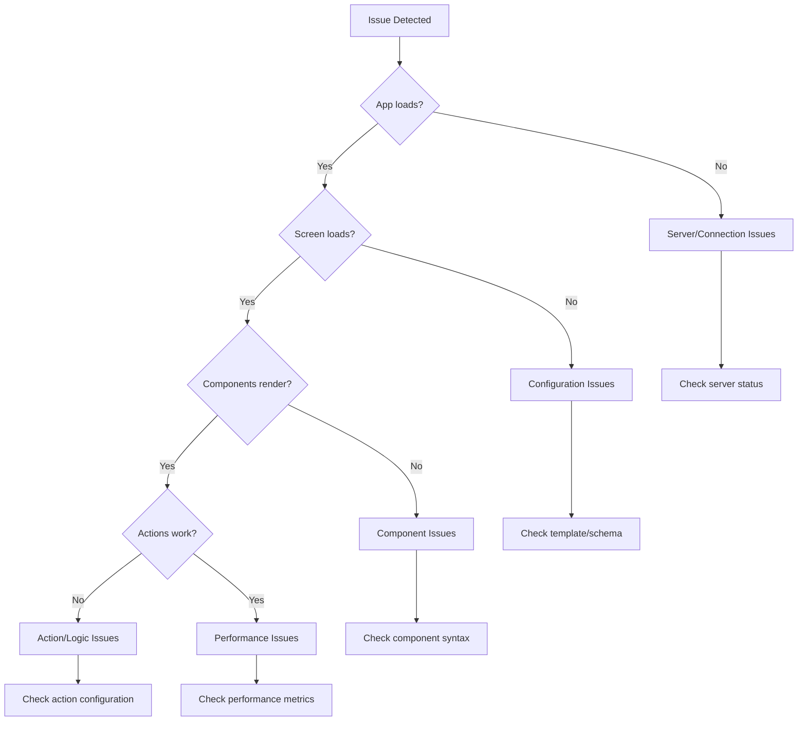

# 🚨 Troubleshooting Guide

Complete guide to solving common issues with the remote configuration system.

## 🔍 Quick Diagnosis

Use this flowchart to quickly identify your issue:



## 🔥 Emergency Quick Fixes

### 🚨 CRITICAL: App Won't Start

**Symptoms:** App crashes on startup, white screen, or connection errors

**Immediate Actions:**

```bash
# 1. Check server status
curl http://localhost:5001/api/config/health

# 2. If server is down, restart it
cd labor2Hire-Backend
npm run dev

# 3. Check Redis connection
redis-cli ping

# 4. Clear all caches
curl -X POST http://localhost:5001/api/config/clear-cache \
  -d '{"clearAll": true}'
```

**Root Causes:**

- ❌ Backend server not running
- ❌ Redis server not available
- ❌ Corrupted configuration cache
- ❌ Invalid main App configuration

---

### 🚨 HIGH: Screen Shows Error/Blank

**Symptoms:** "Configuration not found", blank screen, or error message

**Immediate Actions:**

```bash
# 1. Check if template exists
ls remote-config/templates/ScreenName.template.json

# 2. Validate template syntax
node -e "JSON.parse(require('fs').readFileSync('remote-config/templates/ScreenName.template.json'))"

# 3. Check API response
curl http://localhost:5001/api/config/screen/ScreenName

# 4. Reload configuration
curl -X POST http://localhost:5001/api/config/reload/ScreenName
```

**Root Causes:**

- ❌ Template file missing or corrupted
- ❌ JSON syntax errors
- ❌ Schema validation failures
- ❌ File permissions issues

---

### 🟡 MEDIUM: Components Not Rendering

**Symptoms:** Some components missing, incorrect layout, or style issues

**Immediate Actions:**

1. Check component syntax in template
2. Verify parent-child relationships
3. Check for typos in component types
4. Validate style properties

---

## 📱 Frontend Issues

### Issue 1: "Cannot connect to configuration server"

**Symptoms:**

```
Connection failed: ws://localhost:5001/config-socket
Unable to establish WebSocket connection
```

**Debugging Steps:**

```bash
# 1. Check server status
curl http://localhost:5001/api/config/health

# 2. Test WebSocket endpoint
curl -i -N -H "Connection: Upgrade" \
     -H "Upgrade: websocket" \
     -H "Sec-WebSocket-Key: test" \
     -H "Sec-WebSocket-Version: 13" \
     http://localhost:5001/config-socket

# 3. Check network connectivity
ping localhost
telnet localhost 5001
```

**Solutions:**

```javascript
// Frontend: Check ConfigClient.ts configuration
export const configClient = new ConfigClient({
  serverUrl: "http://localhost:5001", // ✅ Correct URL
  websocketPath: "/config-socket", // ✅ Correct path
  autoReconnect: true,
  maxReconnectAttempts: 10,
});

// Backend: Check WebSocket server initialization
// In app.js, ensure WebSocket server is initialized:
configWebSocketServer.initialize(server);
```

**Common Causes:**

- ❌ Wrong server URL in frontend
- ❌ WebSocket server not initialized
- ❌ Firewall blocking connections
- ❌ Port already in use

---

### Issue 2: "Configuration loading forever"

**Symptoms:**

```
Loading... (never finishes)
Stuck on loading screen
Spinner shows indefinitely
```

**Debugging Steps:**

```bash
# 1. Check if config endpoint responds
curl -w "@curl-format.txt" http://localhost:5001/api/config/screen/Auth

# 2. Check server logs for errors
tail -f logs/application-*.log | grep ERROR

# 3. Test with minimal config
curl http://localhost:5001/api/config/all
```

**Solutions:**

```typescript
// Frontend: Add timeout handling
const configClient = new ConfigClient({
  requestTimeout: 10000,  // 10 second timeout
  retryAttempts: 3
});

// Add error boundaries
export const LoadingWithTimeout: React.FC = () => {
  const [hasTimedOut, setHasTimedOut] = useState(false);

  useEffect(() => {
    const timer = setTimeout(() => setHasTimedOut(true), 15000);
    return () => clearTimeout(timer);
  }, []);

  if (hasTimedOut) {
    return <ErrorState message="Loading timed out. Please try again." />;
  }

  return <LoadingComponent />;
};
```

**Common Causes:**

- ❌ Server overloaded or hanging
- ❌ Database/Redis connection issues
- ❌ Infinite loops in config processing
- ❌ Memory leaks

---

### Issue 3: "Screen renders but components are missing"

**Symptoms:**

```
Screen loads successfully
Some buttons/texts don't appear
Layout looks incomplete
```

**Debugging Steps:**

```json
// 1. Check component hierarchy in template
{
  "type": "View",
  "children": [
    // ✅ Make sure children array exists
    {
      "type": "Button", // ✅ Check component type spelling
      "props": {
        "text": "Missing Button" // ✅ Check required props
      },
      "style": {
        "display": "flex" // ✅ Check style properties
      }
    }
  ]
}
```

```bash
# 2. Validate against schema
npm run validate:schema ScreenName

# 3. Check frontend component support
# Look in DynamicRenderer.tsx for supported components
```

**Solutions:**

```typescript
// Frontend: Add component type checking
const renderComponent = (component: ComponentDefinition) => {
  const supportedTypes = [
    "View",
    "Text",
    "Button",
    "TextInput",
    "ScrollView",
    "SafeAreaView",
    "TouchableOpacity",
    "Image",
  ];

  if (!supportedTypes.includes(component.type)) {
    console.warn(`Unsupported component type: ${component.type}`);
    return null;
  }

  // Render component...
};
```

**Common Causes:**

- ❌ Unsupported component types
- ❌ Missing required props
- ❌ Invalid parent-child relationships
- ❌ Conditional rendering hiding components

---

## 🖥️ Backend Issues

### Issue 1: "Template file changes not reflected"

**Symptoms:**

```
Modified template file
Changes don't appear in app
Old configuration still loads
```

**Debugging Steps:**

```bash
# 1. Check file watcher status
curl http://localhost:5001/api/config/stats

# 2. Manual reload
curl -X POST http://localhost:5001/api/config/reload/ScreenName

# 3. Check file permissions
ls -la remote-config/templates/

# 4. Clear cache and restart
curl -X POST http://localhost:5001/api/config/clear-cache \
  -d '{"clearAll": true}'
```

**Solutions:**

```javascript
// Backend: Force file watcher restart
const restartFileWatcher = () => {
  if (fileWatcher) {
    fileWatcher.close();
  }
  fileWatcher = chokidar.watch(CONFIG_DIR, {
    ignored: /(^|[\/\\])\../,
    persistent: true,
    ignoreInitial: false,
  });
};

// Backend: Add manual refresh endpoint
app.post("/api/config/refresh-all", async (req, res) => {
  try {
    await configManager.loadAllConfigs();
    await configWebSocketServer.broadcastFullConfigSync();
    res.json({ success: true, message: "All configs refreshed" });
  } catch (error) {
    res.status(500).json({ error: error.message });
  }
});
```

**Common Causes:**

- ❌ File watcher not working
- ❌ Configuration cache not clearing
- ❌ File system permissions
- ❌ Network file system delays

---

### Issue 2: "Schema validation errors"

**Symptoms:**

```
"Configuration validation failed"
"Required property missing"
"Invalid property type"
```

**Debugging Steps:**

```bash
# 1. Validate JSON syntax
node -e "JSON.parse(require('fs').readFileSync('template.json'))"

# 2. Check schema validation
npm run validate:schema ScreenName

# 3. Compare with working template
diff template.json working-template.json
```

**Solutions:**

```json
// Common schema fixes:

// ❌ Missing required properties
{
  "screenType": "Auth"
  // Missing: metadata, components
}

// ✅ Include all required properties
{
  "screenType": "Auth",
  "metadata": {
    "screenTitle": "Authentication",
    "description": "Login screen",
    "version": "1.0.0",
    "lastUpdated": "2025-08-10T00:00:00Z"
  },
  "components": []
}

// ❌ Wrong property types
{
  "components": "not-an-array"
}

// ✅ Correct property types
{
  "components": []
}
```

**Common Causes:**

- ❌ Missing required properties
- ❌ Wrong property types
- ❌ Additional properties not allowed
- ❌ Invalid enum values

---

### Issue 3: "WebSocket connection keeps dropping"

**Symptoms:**

```
"WebSocket disconnected"
Frequent reconnection attempts
Real-time updates not working
```

**Debugging Steps:**

```bash
# 1. Check WebSocket server status
curl http://localhost:5001/api/config/websocket/stats

# 2. Monitor connection logs
tail -f logs/application-*.log | grep websocket

# 3. Test connection stability
# Keep connection open and monitor
wscat -c ws://localhost:5001/config-socket
```

**Solutions:**

```javascript
// Backend: Improve connection handling
io.on('connection', (socket) => {
  // Add heartbeat
  const heartbeat = setInterval(() => {
    socket.emit('ping');
  }, 30000);

  socket.on('disconnect', () => {
    clearInterval(heartbeat);
  });

  // Handle client errors
  socket.on('error', (error) => {
    logger.error('WebSocket error:', error);
  });
});

// Frontend: Improve reconnection logic
class ConfigClient {
  private reconnectAttempts = 0;
  private maxReconnectAttempts = 10;
  private reconnectDelay = 1000;

  private attemptReconnection() {
    if (this.reconnectAttempts < this.maxReconnectAttempts) {
      setTimeout(() => {
        this.reconnectAttempts++;
        this.connect();
      }, this.reconnectDelay * this.reconnectAttempts);
    }
  }
}
```

**Common Causes:**

- ❌ Network connectivity issues
- ❌ Server resource limitations
- ❌ Firewall/proxy interference
- ❌ Client-side memory leaks

---

## 🎨 Component Issues

### Issue 1: "Button not responding to touch"

**Debugging:**

```json
// Check action configuration
{
  "type": "Button",
  "props": {
    "text": "Click Me"
  },
  "actions": {
    "onPress": {
      // ✅ Correct event name
      "type": "navigate", // ✅ Supported action type
      "target": "Home" // ✅ Valid screen name
    }
  },
  "style": {
    "pointerEvents": "auto" // ✅ Enable touch events
  }
}
```

**Solutions:**

```typescript
// Frontend: Add action debugging
const handleAction = (action: ActionDefinition) => {
  console.log("Action triggered:", action);

  if (!action || !action.type) {
    console.error("Invalid action:", action);
    return;
  }

  switch (action.type) {
    case "navigate":
      if (!action.target) {
        console.error("Navigate action missing target");
        return;
      }
      navigation.navigate(action.target, action.params);
      break;
    default:
      console.warn("Unsupported action type:", action.type);
  }
};
```

---

### Issue 2: "Text/Input fields showing {{variables}}"

**Symptoms:**

```
Text shows: "Welcome {{USER_NAME}}"
Instead of: "Welcome John Doe"
```

**Debugging:**

```bash
# Check template processing
curl http://localhost:5001/api/config/screen/Auth | grep -o "{{.*}}"
```

**Solutions:**

```javascript
// Backend: Ensure template variables are processed
const processTemplate = (template, variables) => {
  let processed = JSON.stringify(template);

  // Replace template variables
  Object.entries(variables).forEach(([key, value]) => {
    const regex = new RegExp(`{{${key}}}`, 'g');
    processed = processed.replace(regex, value);
  });

  return JSON.parse(processed);
};

// Frontend: Handle missing variables gracefully
const processTemplateVariables = (text: string, context: any) => {
  return text.replace(/{{(\w+)}}/g, (match, key) => {
    const value = context[key];
    if (value === undefined || value === null) {
      console.warn(`Template variable not found: ${key}`);
      return '';  // Or return default value
    }
    return String(value);
  });
};
```

---

### Issue 3: "Images not loading"

**Debugging:**

```json
// Check image configuration
{
  "type": "Image",
  "props": {
    "source": {
      "uri": "https://example.com/image.jpg" // ✅ Valid URL
    },
    "resizeMode": "contain" // ✅ Valid resize mode
  },
  "style": {
    "width": 100, // ✅ Explicit dimensions
    "height": 100
  }
}
```

**Solutions:**

```typescript
// Frontend: Add image error handling
const ImageComponent = ({ source, style, ...props }) => {
  const [imageError, setImageError] = useState(false);

  if (imageError) {
    return (
      <View style={[style, { backgroundColor: '#f0f0f0' }]}>
        <Text>Image failed to load</Text>
      </View>
    );
  }

  return (
    <Image
      source={source}
      style={style}
      onError={() => setImageError(true)}
      {...props}
    />
  );
};
```

---

## ⚡ Performance Issues

### Issue 1: "App is slow/laggy"

**Debugging:**

```bash
# Check performance metrics
curl http://localhost:5001/api/config/stats

# Monitor memory usage
# In Chrome DevTools or React Native Flipper
```

**Solutions:**

```typescript
// Frontend: Optimize rendering
const DynamicRenderer = React.memo(({ config }) => {
  // Use useMemo for expensive calculations
  const processedComponents = useMemo(() => {
    return optimizeComponentTree(config.components);
  }, [config.components]);

  return <ComponentTree components={processedComponents} />;
});

// Backend: Add caching layers
const getScreenConfig = async (screenName) => {
  // Check memory cache first
  if (memoryCache.has(screenName)) {
    return memoryCache.get(screenName);
  }

  // Check Redis cache
  const redisResult = await redis.get(`config:${screenName}`);
  if (redisResult) {
    memoryCache.set(screenName, JSON.parse(redisResult));
    return JSON.parse(redisResult);
  }

  // Load from file system
  const config = await loadFromFile(screenName);
  redis.setex(`config:${screenName}`, 300, JSON.stringify(config));
  memoryCache.set(screenName, config);
  return config;
};
```

---

## 🔧 System Issues

### Issue 1: "Redis connection failed"

**Symptoms:**

```
Error: Redis connection lost
ECONNREFUSED 127.0.0.1:6379
Cache operations failing
```

**Solutions:**

```bash
# 1. Start Redis server
redis-server

# 2. Check Redis status
redis-cli ping

# 3. Configure Redis connection
# In config/redis.js
const redis = new Redis({
  host: process.env.REDIS_HOST || 'localhost',
  port: process.env.REDIS_PORT || 6379,
  retryDelayOnFailover: 1000,
  maxRetriesPerRequest: 3
});
```

---

### Issue 2: "File permission errors"

**Symptoms:**

```
EACCES: permission denied
Unable to read template files
Watch events not firing
```

**Solutions:**

```bash
# Fix file permissions
chmod -R 755 remote-config/
chown -R $USER:$USER remote-config/

# Check current permissions
ls -la remote-config/templates/
```

---

## 📋 Debugging Checklist

### ✅ Basic Health Check

- [ ] Backend server running (http://localhost:5001/api/config/health)
- [ ] Redis server running (redis-cli ping)
- [ ] Template files exist and readable
- [ ] Schema validation passes
- [ ] WebSocket connection established

### ✅ Configuration Check

- [ ] JSON syntax valid
- [ ] Required properties present
- [ ] Component types supported
- [ ] Action types valid
- [ ] Style properties correct

### ✅ Network Check

- [ ] API endpoints responding
- [ ] WebSocket connection stable
- [ ] No firewall blocking
- [ ] Correct URLs/ports configured

### ✅ Cache Check

- [ ] Cache not corrupted
- [ ] File watchers working
- [ ] Manual reload works
- [ ] Fresh config loads correctly

---

## 📞 Getting Help

### 🔍 Self-Diagnosis Tools

```bash
# Run comprehensive health check
npm run health-check

# Validate all configurations
npm run validate:all

# Check system status
npm run system:status

# Generate debug report
npm run debug:report
```

### 📋 Information to Gather

When asking for help, provide:

1. **Error messages** (exact text)
2. **Steps to reproduce** (what you did)
3. **Expected vs actual behavior**
4. **Browser/device information**
5. **Server logs** (relevant excerpts)
6. **Configuration files** (that aren't working)

### 🆘 Emergency Contacts

- **Critical Issues**: Contact senior developer immediately
- **Configuration Help**: Check team chat or documentation
- **System Issues**: Contact DevOps team

---

## 🎯 Prevention Tips

1. **✅ Always validate before saving**
2. **🧪 Test changes incrementally**
3. **💾 Backup working configurations**
4. **📝 Document complex changes**
5. **🔍 Monitor system health regularly**
6. **🚀 Keep dependencies updated**
7. **📊 Review performance metrics**

---

**Remember: When in doubt, start with the basics - server running, files exist, JSON valid! 🚀**

_Next: [Best Practices Guide](./17-best-practices.md)_
