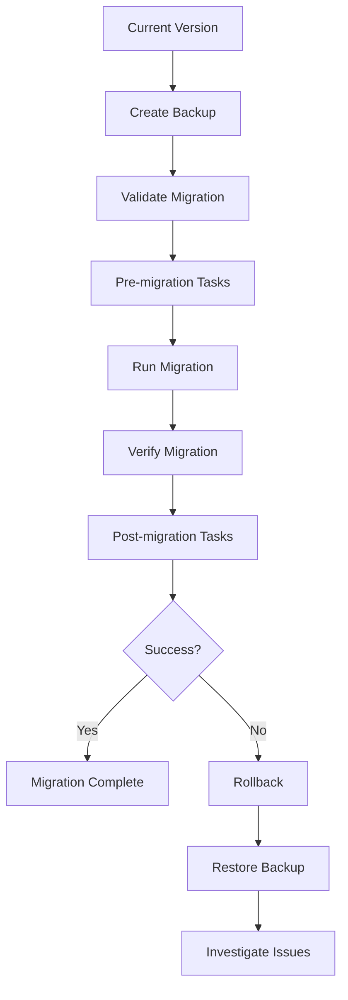

# 🔄 Migration Guide - Upgrading & Version Management

Comprehensive guide for migrating configurations, upgrading system versions, and managing backward compatibility in the Remote Configuration System.

## 🎯 Migration Overview

The Remote Configuration System supports seamless migration between versions with automated migration scripts, backward compatibility, and rollback capabilities.

### Migration Process Flow



### Version Compatibility Matrix

| Current Version | Target Version | Migration Path | Auto-Migration | Manual Steps Required |
| --------------- | -------------- | -------------- | -------------- | --------------------- |
| 1.0.x → 1.1.x   | Direct         | ✅             | ✅             | ❌                    |
| 1.0.x → 1.2.x   | Direct         | ✅             | ✅             | ❌                    |
| 1.0.x → 2.0.x   | Multi-step     | ⚠️             | ❌             | ✅                    |
| 1.1.x → 1.2.x   | Direct         | ✅             | ✅             | ❌                    |
| 1.1.x → 2.0.x   | Multi-step     | ⚠️             | ❌             | ✅                    |
| 1.2.x → 2.0.x   | Direct         | ✅             | ⚠️             | ⚠️                    |

## 🚀 Version Migration

### Version 1.0.x to 1.1.x Migration

#### What's New in 1.1.x

- Enhanced WebSocket performance
- New template helper functions
- Improved caching mechanisms
- Extended API endpoints

#### Pre-migration Checklist

```bash
# 1. Check current version
curl http://localhost:5002/api/health | jq '.version'

# 2. Create backup
curl -X POST http://localhost:5002/api/admin/backup/create \
  -H "Authorization: Bearer <token>" \
  -d '{"description": "Pre-1.1.x migration backup"}'

# 3. Verify system health
curl http://localhost:5002/api/health/detailed

# 4. Check disk space (minimum 2GB free)
df -h

# 5. Stop dependent services
pm2 stop labor2hire-frontend
```

#### Automated Migration Script

```javascript
// migration-1.0.x-to-1.1.x.js
import { MigrationRunner } from "../utils/MigrationRunner.js";
import { cache } from "../config/redis.js";
import { logger } from "../config/logger.js";

export class Migration_1_0_to_1_1 extends MigrationRunner {
  constructor() {
    super("1.0.x", "1.1.x");
  }

  async validate() {
    console.log("🔍 Validating migration from 1.0.x to 1.1.x...");

    // Check if Redis is accessible
    try {
      await cache.ping();
      console.log("✅ Redis connection verified");
    } catch (error) {
      throw new Error("❌ Redis connection failed: " + error.message);
    }

    // Check for existing configurations
    const configKeys = await cache.keys("config:*");
    if (configKeys.length === 0) {
      console.log("⚠️  No existing configurations found");
    } else {
      console.log(`✅ Found ${configKeys.length} existing configurations`);
    }

    // Verify backup exists
    const backups = await this.listBackups();
    if (backups.length === 0) {
      throw new Error(
        "❌ No backup found. Please create a backup before migration."
      );
    }

    console.log("✅ Migration validation complete");
    return true;
  }

  async migrate() {
    console.log("🚀 Starting migration from 1.0.x to 1.1.x...");

    const migrationSteps = [
      { name: "Update cache key format", fn: this.updateCacheKeyFormat },
      {
        name: "Migrate template configurations",
        fn: this.migrateTemplateConfigs,
      },
      { name: "Add new default settings", fn: this.addNewDefaultSettings },
      { name: "Update schema versions", fn: this.updateSchemaVersions },
      { name: "Initialize new features", fn: this.initializeNewFeatures },
    ];

    for (const step of migrationSteps) {
      try {
        console.log(`📝 ${step.name}...`);
        await step.fn.call(this);
        console.log(`✅ ${step.name} completed`);
      } catch (error) {
        console.error(`❌ ${step.name} failed:`, error);
        throw new Error(`Migration failed at step: ${step.name}`);
      }
    }

    // Update version
    await this.updateSystemVersion("1.1.0");

    console.log("🎉 Migration to 1.1.x completed successfully!");
    return true;
  }

  async updateCacheKeyFormat() {
    // Migrate old cache key format to new format
    const oldKeys = await cache.keys("config_*");

    for (const oldKey of oldKeys) {
      const value = await cache.get(oldKey);
      const newKey = oldKey.replace("config_", "config:");

      await cache.set(newKey, value);
      await cache.del(oldKey);
    }

    console.log(`   Updated ${oldKeys.length} cache keys`);
  }

  async migrateTemplateConfigs() {
    // Update template configurations for new features
    const templateKeys = await cache.keys("config:template:*");

    for (const key of templateKeys) {
      const config = JSON.parse(await cache.get(key));

      // Add new template features
      if (!config.features) {
        config.features = {
          handlebarsHelpers: true,
          conditionalRendering: true,
          nestedTemplates: true,
        };
      }

      // Update version
      config.version = "1.1.0";
      config.migrated = new Date().toISOString();

      await cache.set(key, JSON.stringify(config));
    }

    console.log(`   Migrated ${templateKeys.length} template configurations`);
  }

  async addNewDefaultSettings() {
    // Add new default settings introduced in 1.1.x
    const newDefaults = {
      "config:settings:websocket": {
        enhancedPerformance: true,
        compressionEnabled: true,
        adaptivePolling: true,
      },
      "config:settings:cache": {
        intelligentPreloading: true,
        distributedInvalidation: true,
        compressionThreshold: 1024,
      },
      "config:settings:templates": {
        asyncHelpers: true,
        partialCaching: true,
        errorBoundaries: true,
      },
    };

    for (const [key, value] of Object.entries(newDefaults)) {
      const exists = await cache.exists(key);
      if (!exists) {
        await cache.set(key, JSON.stringify(value));
      }
    }

    console.log("   Added new default settings");
  }

  async updateSchemaVersions() {
    // Update schema versions for compatibility
    const schemaKeys = await cache.keys("config:schema:*");

    for (const key of schemaKeys) {
      const schema = JSON.parse(await cache.get(key));

      // Update schema version
      schema.$schema = "http://json-schema.org/draft-07/schema#";
      schema.version = "1.1.0";

      // Add new validation keywords if needed
      if (!schema.properties.metadata) {
        schema.properties.metadata = {
          type: "object",
          properties: {
            version: { type: "string" },
            migrated: { type: "string", format: "date-time" },
            features: { type: "object" },
          },
        };
      }

      await cache.set(key, JSON.stringify(schema));
    }

    console.log(`   Updated ${schemaKeys.length} schema versions`);
  }

  async initializeNewFeatures() {
    // Initialize new features introduced in 1.1.x

    // Initialize enhanced WebSocket features
    await cache.set(
      "config:features:websocket:enhanced",
      JSON.stringify({
        enabled: true,
        features: ["compression", "adaptive-polling", "connection-pooling"],
        initializedAt: new Date().toISOString(),
      })
    );

    // Initialize new template helpers
    await cache.set(
      "config:features:templates:helpers",
      JSON.stringify({
        enabled: true,
        helpers: ["dateFormat", "currency", "pluralize", "truncate"],
        initializedAt: new Date().toISOString(),
      })
    );

    console.log("   Initialized new features");
  }

  async rollback() {
    console.log("🔄 Rolling back migration from 1.1.x to 1.0.x...");

    // Remove new features
    await cache.del("config:features:websocket:enhanced");
    await cache.del("config:features:templates:helpers");

    // Restore old cache key format
    const newKeys = await cache.keys("config:*");
    for (const newKey of newKeys) {
      if (newKey.includes(":")) {
        const value = await cache.get(newKey);
        const oldKey = newKey.replace("config:", "config_");
        await cache.set(oldKey, value);
        await cache.del(newKey);
      }
    }

    // Restore version
    await this.updateSystemVersion("1.0.0");

    console.log("✅ Rollback completed");
  }
}

// Run migration
const migration = new Migration_1_0_to_1_1();
await migration.run();
```

#### Manual Migration Steps

```bash
# 1. Update dependencies
npm update

# 2. Install new dependencies
npm install handlebars-helpers@latest
npm install compression@latest

# 3. Update configuration files
cp config/config.example.json config/config.json
# Edit config.json with new settings

# 4. Restart services
pm2 restart labor2hire-backend
pm2 restart labor2hire-frontend

# 5. Verify migration
curl http://localhost:5002/api/health/detailed | jq '.version'
```

### Version 1.1.x to 2.0.x Migration

#### Breaking Changes in 2.0.x

- ⚠️ **Schema format changes** - New schema structure
- ⚠️ **API endpoint changes** - Some endpoints renamed/removed
- ⚠️ **Configuration key changes** - New hierarchical key structure
- ⚠️ **Template engine updates** - New template syntax requirements

#### Pre-migration Requirements

```bash
# 1. Node.js version check (minimum 18.0.0)
node --version

# 2. Update Node.js if needed
nvm install 18
nvm use 18

# 3. Create comprehensive backup
curl -X POST http://localhost:5002/api/admin/backup/create \
  -H "Authorization: Bearer <token>" \
  -d '{
    "description": "Pre-2.0.x migration backup",
    "includeData": true,
    "includeSchemas": true,
    "includeTemplates": true
  }'

# 4. Export current configurations
curl -X GET http://localhost:5002/api/admin/export/all \
  -H "Authorization: Bearer <token>" \
  -o backup-before-2.0.x.json
```

#### Multi-step Migration Process

```javascript
// migration-1.1.x-to-2.0.x.js
export class Migration_1_1_to_2_0 extends MigrationRunner {
  constructor() {
    super("1.1.x", "2.0.x");
    this.breakingChanges = true;
  }

  async validate() {
    console.log("🔍 Validating migration from 1.1.x to 2.0.x...");

    // Check Node.js version
    const nodeVersion = process.version;
    const majorVersion = parseInt(nodeVersion.slice(1));
    if (majorVersion < 18) {
      throw new Error(`❌ Node.js 18+ required. Current: ${nodeVersion}`);
    }

    // Check for breaking change compatibility
    await this.checkBreakingChanges();

    // Validate all current configurations
    await this.validateCurrentConfigurations();

    console.log("✅ Migration validation complete");
    return true;
  }

  async checkBreakingChanges() {
    console.log("🔍 Checking for breaking changes...");

    const issues = [];

    // Check for deprecated configuration keys
    const deprecatedKeys = await cache.keys("config:old_*");
    if (deprecatedKeys.length > 0) {
      issues.push(
        `Found ${deprecatedKeys.length} deprecated configuration keys`
      );
    }

    // Check for old schema formats
    const schemas = await cache.keys("config:schema:*");
    for (const schemaKey of schemas) {
      const schema = JSON.parse(await cache.get(schemaKey));
      if (!schema.version || schema.version.startsWith("1.")) {
        issues.push(`Schema ${schemaKey} uses old format`);
      }
    }

    // Check for old template syntax
    const templates = await cache.keys("config:template:*");
    for (const templateKey of templates) {
      const template = JSON.parse(await cache.get(templateKey));
      if (template.content && template.content.includes("{{#each}}")) {
        issues.push(`Template ${templateKey} uses deprecated {{#each}} syntax`);
      }
    }

    if (issues.length > 0) {
      console.log("⚠️  Breaking changes detected:");
      issues.forEach((issue) => console.log(`   - ${issue}`));
      console.log("   These will be automatically migrated");
    }
  }

  async migrate() {
    console.log("🚀 Starting migration from 1.1.x to 2.0.x...");

    // Phase 1: Data structure migration
    await this.migrateDataStructures();

    // Phase 2: Schema migration
    await this.migrateSchemas();

    // Phase 3: Template migration
    await this.migrateTemplates();

    // Phase 4: Configuration migration
    await this.migrateConfigurations();

    // Phase 5: API compatibility layer
    await this.setupCompatibilityLayer();

    // Phase 6: Feature initialization
    await this.initialize2_0Features();

    // Update version
    await this.updateSystemVersion("2.0.0");

    console.log("🎉 Migration to 2.0.x completed successfully!");
    return true;
  }

  async migrateDataStructures() {
    console.log("📝 Migrating data structures...");

    // Migrate flat key structure to hierarchical
    const allKeys = await cache.keys("config:*");
    const hierarchicalData = {};

    for (const key of allKeys) {
      const value = await cache.get(key);
      const keyParts = key.replace("config:", "").split(":");

      let current = hierarchicalData;
      for (let i = 0; i < keyParts.length - 1; i++) {
        if (!current[keyParts[i]]) {
          current[keyParts[i]] = {};
        }
        current = current[keyParts[i]];
      }

      current[keyParts[keyParts.length - 1]] = JSON.parse(value);
    }

    // Store hierarchical data
    await cache.set("config:v2:data", JSON.stringify(hierarchicalData));

    console.log("   ✅ Data structures migrated");
  }

  async migrateSchemas() {
    console.log("📝 Migrating schemas to 2.0.x format...");

    const schemaKeys = await cache.keys("config:schema:*");

    for (const schemaKey of schemaKeys) {
      const oldSchema = JSON.parse(await cache.get(schemaKey));

      // Convert to new schema format
      const newSchema = {
        $schema: "https://json-schema.org/draft/2020-12/schema",
        $id: schemaKey.replace("config:schema:", ""),
        version: "2.0.0",
        type: oldSchema.type || "object",
        properties: this.migrateSchemaProperties(oldSchema.properties || {}),
        required: oldSchema.required || [],
        additionalProperties: oldSchema.additionalProperties !== false,
        metadata: {
          migratedFrom: oldSchema.version || "1.1.x",
          migratedAt: new Date().toISOString(),
          originalSchema: oldSchema,
        },
      };

      // Store new schema
      const newSchemaKey = schemaKey.replace(
        "config:schema:",
        "config:v2:schema:"
      );
      await cache.set(newSchemaKey, JSON.stringify(newSchema));
    }

    console.log(`   ✅ Migrated ${schemaKeys.length} schemas`);
  }

  migrateSchemaProperties(properties) {
    const migratedProperties = {};

    for (const [key, property] of Object.entries(properties)) {
      migratedProperties[key] = {
        ...property,
        // Add new 2.0.x property features
        metadata: {
          migratedFrom: "1.1.x",
          originalType: property.type,
        },
      };

      // Handle type changes
      if (property.type === "string" && property.format === "component-type") {
        migratedProperties[key].enum = [
          "button",
          "input",
          "text",
          "image",
          "container",
          "list",
          "grid",
          "navigation",
          "modal",
          "form",
        ];
      }
    }

    return migratedProperties;
  }

  async migrateTemplates() {
    console.log("📝 Migrating templates to 2.0.x syntax...");

    const templateKeys = await cache.keys("config:template:*");

    for (const templateKey of templateKeys) {
      const oldTemplate = JSON.parse(await cache.get(templateKey));

      // Migrate template syntax
      let newContent = oldTemplate.content;

      // Update deprecated syntax
      newContent = newContent.replace(/\{\{#each\}\}/g, "{{#each items}}");
      newContent = newContent.replace(/\{\{#if\}\}/g, "{{#if condition}}");
      newContent = newContent.replace(/\{\{helper\}\}/g, "{{helper value}}");

      // Add new template features
      const newTemplate = {
        ...oldTemplate,
        content: newContent,
        version: "2.0.0",
        features: {
          asyncHelpers: true,
          errorBoundaries: true,
          nestedPartials: true,
          conditionalBlocks: true,
        },
        metadata: {
          migratedFrom: oldTemplate.version || "1.1.x",
          migratedAt: new Date().toISOString(),
          syntaxChanges: [
            "Updated #each syntax",
            "Updated #if syntax",
            "Added explicit helper parameters",
          ],
        },
      };

      // Store new template
      const newTemplateKey = templateKey.replace(
        "config:template:",
        "config:v2:template:"
      );
      await cache.set(newTemplateKey, JSON.stringify(newTemplate));
    }

    console.log(`   ✅ Migrated ${templateKeys.length} templates`);
  }

  async setupCompatibilityLayer() {
    console.log("📝 Setting up API compatibility layer...");

    // Create API mapping for backward compatibility
    const apiMapping = {
      "/api/config/get": "/api/v2/config/retrieve",
      "/api/config/set": "/api/v2/config/update",
      "/api/config/delete": "/api/v2/config/remove",
      "/api/template/render": "/api/v2/template/process",
    };

    await cache.set("config:v2:api-mapping", JSON.stringify(apiMapping));

    // Set compatibility flags
    await cache.set(
      "config:v2:compatibility",
      JSON.stringify({
        enableLegacyEndpoints: true,
        deprecationWarnings: true,
        legacySupport: "6 months",
        sunsetDate: "2025-02-01",
      })
    );

    console.log("   ✅ Compatibility layer configured");
  }
}
```

## 📊 Configuration Data Migration

### Configuration Export/Import

```javascript
export class ConfigurationMigrator {
  constructor() {
    this.exportFormats = ["json", "yaml", "csv"];
    this.importValidation = true;
  }

  async exportConfigurations(format = "json", options = {}) {
    console.log(`📤 Exporting configurations in ${format} format...`);

    const configurations = await this.getAllConfigurations();
    const schemas = await this.getAllSchemas();
    const templates = await this.getAllTemplates();

    const exportData = {
      metadata: {
        exportedAt: new Date().toISOString(),
        version: await this.getSystemVersion(),
        format: format,
        totalConfigurations: Object.keys(configurations).length,
        totalSchemas: Object.keys(schemas).length,
        totalTemplates: Object.keys(templates).length,
      },
      configurations,
      schemas,
      templates,
    };

    switch (format) {
      case "json":
        return JSON.stringify(exportData, null, 2);
      case "yaml":
        return yaml.dump(exportData);
      case "csv":
        return this.convertToCSV(exportData);
      default:
        throw new Error(`Unsupported export format: ${format}`);
    }
  }

  async importConfigurations(data, format = "json", options = {}) {
    console.log(`📥 Importing configurations from ${format} format...`);

    let importData;

    // Parse data based on format
    switch (format) {
      case "json":
        importData = JSON.parse(data);
        break;
      case "yaml":
        importData = yaml.load(data);
        break;
      case "csv":
        importData = this.convertFromCSV(data);
        break;
      default:
        throw new Error(`Unsupported import format: ${format}`);
    }

    // Validate import data
    if (this.importValidation) {
      await this.validateImportData(importData);
    }

    // Import configurations
    const results = {
      configurations: await this.importConfigurationData(
        importData.configurations
      ),
      schemas: await this.importSchemaData(importData.schemas),
      templates: await this.importTemplateData(importData.templates),
    };

    console.log("✅ Import completed:", results);
    return results;
  }

  async validateImportData(data) {
    console.log("🔍 Validating import data...");

    const errors = [];

    // Validate structure
    if (!data.metadata) {
      errors.push("Missing metadata section");
    }

    if (!data.configurations) {
      errors.push("Missing configurations section");
    }

    // Validate version compatibility
    if (data.metadata && data.metadata.version) {
      const importVersion = data.metadata.version;
      const currentVersion = await this.getSystemVersion();

      if (!this.isVersionCompatible(importVersion, currentVersion)) {
        errors.push(
          `Version mismatch: importing ${importVersion} to ${currentVersion}`
        );
      }
    }

    // Validate configurations
    if (data.configurations) {
      for (const [key, config] of Object.entries(data.configurations)) {
        if (!this.isValidConfigurationKey(key)) {
          errors.push(`Invalid configuration key: ${key}`);
        }
      }
    }

    if (errors.length > 0) {
      throw new Error(`Import validation failed:\n${errors.join("\n")}`);
    }

    console.log("✅ Import data validation passed");
  }
}
```

### Batch Configuration Updates

```javascript
export class BatchMigrator {
  constructor() {
    this.batchSize = 100;
    this.parallelProcessing = true;
    this.maxConcurrency = 10;
  }

  async migrateConfigurationsBatch(configurations, migrationRules) {
    console.log(
      `🔄 Starting batch migration of ${Object.keys(configurations).length} configurations...`
    );

    const configEntries = Object.entries(configurations);
    const batches = this.createBatches(configEntries, this.batchSize);

    const results = {
      migrated: 0,
      skipped: 0,
      failed: 0,
      errors: [],
    };

    for (let i = 0; i < batches.length; i++) {
      const batch = batches[i];
      console.log(
        `📝 Processing batch ${i + 1}/${batches.length} (${batch.length} items)...`
      );

      try {
        if (this.parallelProcessing) {
          const batchResults = await Promise.allSettled(
            batch.map(([key, config]) =>
              this.migrateConfiguration(key, config, migrationRules)
            )
          );

          batchResults.forEach((result, index) => {
            if (result.status === "fulfilled") {
              results.migrated++;
            } else {
              results.failed++;
              results.errors.push({
                key: batch[index][0],
                error: result.reason.message,
              });
            }
          });
        } else {
          for (const [key, config] of batch) {
            try {
              await this.migrateConfiguration(key, config, migrationRules);
              results.migrated++;
            } catch (error) {
              results.failed++;
              results.errors.push({ key, error: error.message });
            }
          }
        }
      } catch (error) {
        console.error(`❌ Batch ${i + 1} failed:`, error);
        results.errors.push({
          batch: i + 1,
          error: error.message,
        });
      }

      // Progress update
      const progress = (((i + 1) / batches.length) * 100).toFixed(1);
      console.log(
        `   Progress: ${progress}% (${results.migrated} migrated, ${results.failed} failed)`
      );
    }

    console.log("✅ Batch migration completed:", results);
    return results;
  }

  async migrateConfiguration(key, config, rules) {
    // Apply migration rules to configuration
    let migratedConfig = { ...config };

    for (const rule of rules) {
      migratedConfig = await this.applyMigrationRule(migratedConfig, rule);
    }

    // Validate migrated configuration
    await this.validateMigratedConfiguration(key, migratedConfig);

    // Store migrated configuration
    await cache.set(`config:migrated:${key}`, JSON.stringify(migratedConfig));

    return migratedConfig;
  }

  createBatches(items, batchSize) {
    const batches = [];
    for (let i = 0; i < items.length; i += batchSize) {
      batches.push(items.slice(i, i + batchSize));
    }
    return batches;
  }
}
```

## 🔄 Rollback Procedures

### Automated Rollback

```javascript
export class RollbackManager {
  constructor() {
    this.rollbackSteps = [];
    this.backupVerification = true;
  }

  async performRollback(targetVersion, options = {}) {
    console.log(`🔄 Starting rollback to version ${targetVersion}...`);

    try {
      // Verify rollback is possible
      await this.verifyRollbackPossible(targetVersion);

      // Create pre-rollback backup
      if (options.createBackup !== false) {
        await this.createPreRollbackBackup();
      }

      // Stop services
      await this.stopServices();

      // Restore data
      await this.restoreFromBackup(targetVersion);

      // Run rollback migrations
      await this.runRollbackMigrations(targetVersion);

      // Start services
      await this.startServices();

      // Verify rollback
      await this.verifyRollback(targetVersion);

      console.log("✅ Rollback completed successfully");
      return true;
    } catch (error) {
      console.error("❌ Rollback failed:", error);

      // Attempt emergency recovery
      await this.emergencyRecovery();

      throw error;
    }
  }

  async verifyRollbackPossible(targetVersion) {
    console.log("🔍 Verifying rollback possibility...");

    // Check if backup exists for target version
    const backups = await this.listBackups();
    const targetBackup = backups.find((b) => b.version === targetVersion);

    if (!targetBackup) {
      throw new Error(`No backup found for version ${targetVersion}`);
    }

    // Check backup integrity
    const isValid = await this.verifyBackupIntegrity(targetBackup.id);
    if (!isValid) {
      throw new Error(`Backup for version ${targetVersion} is corrupted`);
    }

    // Check for breaking changes
    const currentVersion = await this.getSystemVersion();
    const hasBreakingChanges = await this.checkBreakingChangesBetweenVersions(
      currentVersion,
      targetVersion
    );

    if (hasBreakingChanges) {
      console.log("⚠️  Breaking changes detected between versions");
      if (!options.force) {
        throw new Error("Breaking changes detected. Use --force to proceed.");
      }
    }

    console.log("✅ Rollback verification passed");
  }

  async emergencyRecovery() {
    console.log("🚨 Initiating emergency recovery...");

    // Try to restore from latest backup
    const backups = await this.listBackups();
    const latestBackup = backups.sort(
      (a, b) => new Date(b.createdAt) - new Date(a.createdAt)
    )[0];

    if (latestBackup) {
      console.log(`🔄 Restoring from latest backup: ${latestBackup.id}`);
      await this.restoreFromBackup(latestBackup.version, latestBackup.id);
    } else {
      console.log("🔄 No backups available, using factory defaults");
      await this.restoreFactoryDefaults();
    }

    console.log("✅ Emergency recovery completed");
  }
}
```

## 📋 Migration Checklist

### Pre-Migration Checklist

```markdown
## Pre-Migration Checklist

### System Requirements

- [ ] Node.js version compatibility verified
- [ ] Minimum disk space available (2GB+)
- [ ] Redis server accessible and healthy
- [ ] All dependent services identified
- [ ] Network connectivity verified

### Backup & Safety

- [ ] Full system backup created
- [ ] Configuration export completed
- [ ] Backup integrity verified
- [ ] Rollback plan documented
- [ ] Emergency contacts notified

### Environment Preparation

- [ ] Maintenance window scheduled
- [ ] Dependent services notified
- [ ] Load balancer configured (if applicable)
- [ ] Monitoring alerts configured
- [ ] Log monitoring enabled

### Migration Assets

- [ ] Migration scripts tested
- [ ] New dependencies available
- [ ] Configuration templates prepared
- [ ] Schema validation rules updated
- [ ] Documentation updated
```

### Post-Migration Checklist

```markdown
## Post-Migration Checklist

### System Verification

- [ ] System version verified
- [ ] All services started successfully
- [ ] Health checks passing
- [ ] API endpoints responding
- [ ] WebSocket connections working

### Data Integrity

- [ ] Configuration count verified
- [ ] Schema validation working
- [ ] Template rendering functional
- [ ] Cache hit rates normal
- [ ] No data corruption detected

### Performance Verification

- [ ] Response times within normal range
- [ ] Memory usage stable
- [ ] CPU usage normal
- [ ] Cache performance optimal
- [ ] WebSocket latency acceptable

### Functional Testing

- [ ] Configuration retrieval working
- [ ] Configuration updates working
- [ ] Template processing working
- [ ] Real-time updates working
- [ ] Authentication working
- [ ] Authorization working

### Monitoring & Alerts

- [ ] Performance monitoring active
- [ ] Error tracking functional
- [ ] Alert thresholds configured
- [ ] Log aggregation working
- [ ] Metrics collection active

### Documentation

- [ ] Migration log completed
- [ ] Issues documented
- [ ] Performance baseline updated
- [ ] Team notified of completion
- [ ] Post-migration report generated
```

## 🔗 Related Documentation

- [Installation & Setup](./03-installation-setup.md) - Initial setup procedures
- [Configuration Reference](./19-configuration-reference.md) - Configuration options
- [Performance & Monitoring](./14-performance-monitoring.md) - Performance verification
- [Troubleshooting](./16-troubleshooting.md) - Migration troubleshooting

---

**Migrate with Confidence! 🔄**

Follow these comprehensive migration procedures to upgrade your Remote Configuration System safely and efficiently.
